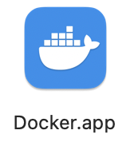
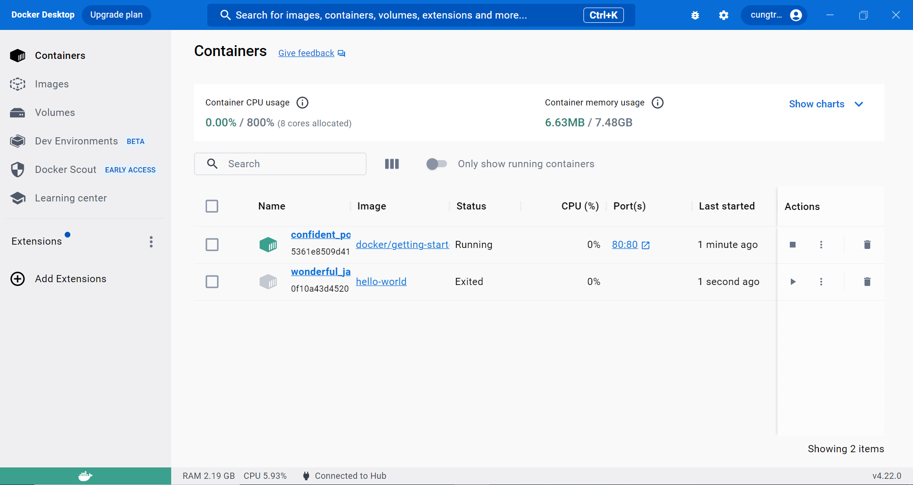
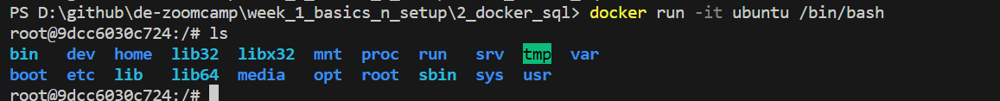
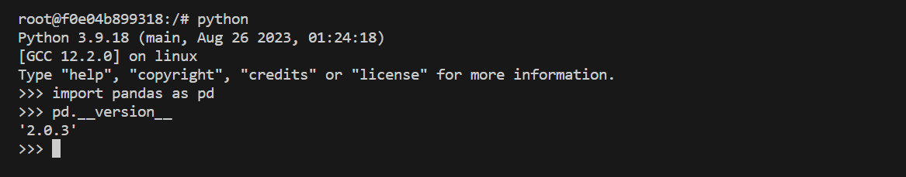
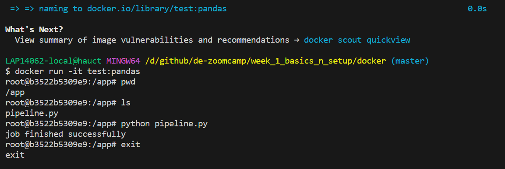

### Introduction
# Data Engineering Zoomcamp 2023 Week 1: Introduction & Prerequisites

See [README.md](https://github.com/DataTalksClub/data-engineering-zoomcamp/blob/main/week_1_basics_n_setup/README.md) from week 1.

## Table of Contents

* [Docker + Postgres](#user-content-docker--postgres)
  * [Introduction to Docker](#user-content-introduction-to-docker)
  * Ingesting NY Taxi Data to Postgres
  * Connecting to Postgres with Jupyter and Pandas
  * Connecting pdAgmin and Postgres
  * Dockerizing the Ingestion Script
  * Running Postgres and pgAdmin with Docker-Compose
  * SQL Refresher
  * Port Mapping and Networks in Docker (Bonus)
* GCP + Terraform
  * Introduction to GCP
  * Introduction to Terraform Concepts & GCP Pre-Requisites
  * Workshop: Creating GCP Infrastructure with Terraform
  * Setting up the environment on cloud VM
* See also

## Docker + Postgres

### Introduction to Docker

See [DE Zoomcamp 1.2.1 - Introduction to Docker](https://www.youtube.com/watch?v=EYNwNlOrpr0).

.

Download, install and start [Docker Desktop](https://www.docker.com/products/docker-desktop/).

Change to `docker`, this is our working directory now.

Try running a container by running: `$ docker run -d -p 80:80 docker/getting-started`.

Run also this command: `$ docker run hello-world`.

You should see this in your terminal.

``` bash
$ docker run hello-world

Hello from Docker!
This message shows that your installation appears to be working correctly.

To generate this message, Docker took the following steps:
 1. The Docker client contacted the Docker daemon.
 2. The Docker daemon pulled the "hello-world" image from the Docker Hub.
    (arm64v8)
 3. The Docker daemon created a new container from that image which runs the
    executable that produces the output you are currently reading.
 4. The Docker daemon streamed that output to the Docker client, which sent it
    to your terminal.

To try something more ambitious, you can run an Ubuntu container with:
 $ docker run -it ubuntu bash

Share images, automate workflows, and more with a free Docker ID:
 https://hub.docker.com/

For more examples and ideas, visit:
 https://docs.docker.com/get-started/
```

Inside **Docker Desktop**, we should see two new containers.

.

To install Ubuntu, run this command, after that type `ls` to check the directories in the container:
``` bash
$ docker run -it ubuntu
```



To quit Ubuntu, enter `exit`.

To install Python 3.9 et open the Python shell, run the commande `$ docker run -it python:3.9`. But this way of doing
things is discouraged since the Python shell does not allow installing other libraries.

But, a more efficient way to install Python with pandas already installed is with a `Dockerfile`.

<div class="formalpara-title">

**File `Dockerfile`**

</div>

``` txt
FROM python:3.9

RUN pip install pandas

ENTRYPOINT [ "bash" ]
```

Then, in the same directory as the `Dockerfile`, run the following two commands:

``` bash
$ docker build -t test:pandas .
$ docker run -it test:pandas
```

After run both above scripts, you check in your terminal whether pandas is installed.


Now let’s create in the same directory a `pipeline.py` file with the following instructions:

<div class="formalpara-title">

**File `pipeline.py`**

</div>

``` python
import pandas as pd

# some fancy stuff with pandas
print('job finished successfully')
```

Let’s add instructions to the `Dockerfile` file.

<div class="formalpara-title">

**File `Dockerfile`**

</div>

``` txt
FROM python:3.9

RUN pip install pandas

WORKDIR /app
COPY pipeline.py pipeline.py

ENTRYPOINT [ "bash" ]
```

Then, let’s re-run the same two commands `build` and `run`, and check the result:


Now let’s add instructions to the `pipeline.py` file.

<div class="formalpara-title">

**File `pipeline.py`**

</div>

``` python
import sys
import pandas as pd

print(sys.argv)
day = sys.argv[1]

print(f'job finished successfully for day = f{day}')
```

Next, let’s modify the `Dockerfile`.

<div class="formalpara-title">

**File `Dockerfile`**

</div>

``` txt
FROM python:3.9

RUN pip install pandas

WORKDIR /app
COPY pipeline.py pipeline.py

ENTRYPOINT [ "python", "pipeline.py" ]
```

Then, let’s restart the `build` and the `run`.

``` bash
$ docker build -t test:pandas .
$ docker run -it test:pandas 2021-10-15
['pipeline.py', '2021-10-15']
job finished successfully for day = f2021-10-15
$
```

<div class="note">

**Reminder about Docker CLI**

The `docker ps` command only shows running containers by default. To see all containers, use the `-a` (or `--all`) flag.

See [docker ps](https://docs.docker.com/engine/reference/commandline/ps/).

To stop one or more running containers:

``` bash
$ docker stop [OPTIONS] CONTAINER [CONTAINER...]
```

See [docker stop](https://docs.docker.com/engine/reference/commandline/stop/).

</div>

