### Introduction
# Data Engineering Zoomcamp 2023 Week 1: Introduction & Prerequisites

See [README.md](https://github.com/DataTalksClub/data-engineering-zoomcamp/blob/main/week_1_basics_n_setup/README.md) from week 1.

## Table of Contents

* [Docker + Postgres](#user-content-docker--postgres)
  * [Introduction to Docker](#user-content-introduction-to-docker)
  * Ingesting NY Taxi Data to Postgres
  * Connecting to Postgres with Jupyter and Pandas
  * Connecting pdAgmin and Postgres
  * Dockerizing the Ingestion Script
  * Running Postgres and pgAdmin with Docker-Compose
  * SQL Refresher
  * Port Mapping and Networks in Docker (Bonus)
* GCP + Terraform
  * Introduction to GCP
  * Introduction to Terraform Concepts & GCP Pre-Requisites
  * Workshop: Creating GCP Infrastructure with Terraform
  * Setting up the environment on cloud VM
* See also

## Docker + Postgres

### Introduction to Docker

See [DE Zoomcamp 1.2.1 - Introduction to Docker](https://www.youtube.com/watch?v=EYNwNlOrpr0).

.

Download, install and start [Docker Desktop](https://www.docker.com/products/docker-desktop/).

Change to `docker`, this is our working directory now.

Try running a container by running: `$ docker run -d -p 80:80 docker/getting-started`.

Run also this command: `$ docker run hello-world`.

You should see this in your terminal.

``` bash
$ docker run hello-world

Hello from Docker!
This message shows that your installation appears to be working correctly.

To generate this message, Docker took the following steps:
 1. The Docker client contacted the Docker daemon.
 2. The Docker daemon pulled the "hello-world" image from the Docker Hub.
    (arm64v8)
 3. The Docker daemon created a new container from that image which runs the
    executable that produces the output you are currently reading.
 4. The Docker daemon streamed that output to the Docker client, which sent it
    to your terminal.

To try something more ambitious, you can run an Ubuntu container with:
 $ docker run -it ubuntu bash

Share images, automate workflows, and more with a free Docker ID:
 https://hub.docker.com/

For more examples and ideas, visit:
 https://docs.docker.com/get-started/
```

Inside **Docker Desktop**, we should see two new containers.

.

To install Ubuntu, run this command, after that type `ls` to check the directories in the container:
``` bash
$ docker run -it ubuntu
```


To quit Ubuntu, enter `exit`.

To install Python 3.9 et open the Python shell, run the commande `$ docker run -it python:3.9`. But this way of doing
things is discouraged since the Python shell does not allow installing other libraries.

But, a more efficient way to install Python with pandas already installed is with a `Dockerfile`.

<div class="formalpara-title">

**File `Dockerfile`**

</div>

``` txt
FROM python:3.9

RUN pip install pandas

ENTRYPOINT [ "bash" ]
```

Then, in the same directory as the `Dockerfile`, run the following two commands:

``` bash
$ docker build -t test:pandas .
$ docker run -it test:pandas
```

After run both above scripts, you check in your terminal whether pandas is installed.


Now let’s create in the same directory a `pipeline.py` file with the following instructions:

<div class="formalpara-title">

**File `pipeline.py`**

</div>

``` python
import pandas as pd

# some fancy stuff with pandas
print('job finished successfully')
```

Let’s add instructions to the `Dockerfile` file.

<div class="formalpara-title">

**File `Dockerfile`**

</div>

``` txt
FROM python:3.9

RUN pip install pandas

WORKDIR /app
COPY pipeline.py pipeline.py

ENTRYPOINT [ "bash" ]
```

Then, let’s re-run the same two commands `build` and `run`, and check the result:


Now let’s add instructions to the `pipeline.py` file.

<div class="formalpara-title">

**File `pipeline.py`**

</div>

``` python
import sys
import pandas as pd

print(sys.argv)
day = sys.argv[1]

print(f'job finished successfully for day = f{day}')
```

Next, let’s modify the `Dockerfile`.

<div class="formalpara-title">

**File `Dockerfile`**

</div>

``` txt
FROM python:3.9

RUN pip install pandas

WORKDIR /app
COPY pipeline.py pipeline.py

ENTRYPOINT [ "python", "pipeline.py" ]
```

Then, let’s restart the `build` and the `run`.

``` bash
$ docker build -t test:pandas .
$ docker run -it test:pandas 2021-10-15
['pipeline.py', '2021-10-15']
job finished successfully for day = f2021-10-15
$
```

<div class="note">

**Reminder about Docker CLI**

The `docker ps` command only shows running containers by default. To see all containers, use the `-a` (or `--all`) flag.

See [docker ps](https://docs.docker.com/engine/reference/commandline/ps/).

To stop one or more running containers:

``` bash
$ docker stop [OPTIONS] CONTAINER [CONTAINER...]
```

See [docker stop](https://docs.docker.com/engine/reference/commandline/stop/).

</div>

### Ingesting NY Taxi Data to Postgres
The purpose of this task is to extract data, which is a table of information about trips, from the dataset on the [tlc-trip](https://www.nyc.gov/site/tlc/about/tlc-trip-record-data.page) page and then inject the data into the PostgreSQL database

We will use a docker image of postgres. See [postgres](https://hub.docker.com/_/postgres) on DockerHub for more
information.

To start a postgres instance, run this command:

``` bash
$ mkdir ny_taxi_postgres_data
$ docker run -it \
  -e POSTGRES_USER="root" \
  -e POSTGRES_PASSWORD="root" \
  -e POSTGRES_DB="ny_taxi" \
  -v $(pwd)/ny_taxi_postgres_data:/var/lib/postgresql/data \
  -p 5432:5432 \
  postgres:13
```

You should see in the terminal `database system is ready to accept connections`.

Next, open an other terminal window, and install [pgcli](https://www.pgcli.com/).

If you are using Windows, you can run the `$ pip install pgcli` command.

After install pgcli, open a new terminal, type `pgcli -h localhost -p 5432 -u root -d ny_taxi` to connect to our recent database.The password is `root`.

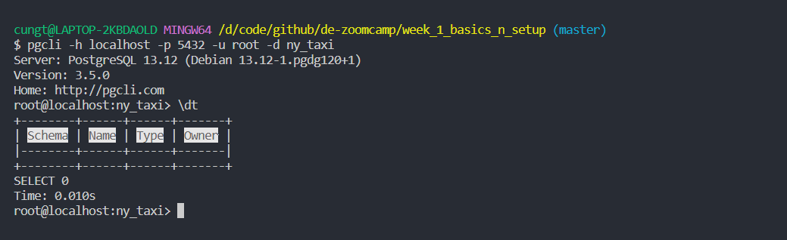

Now, install the classic Jupyter Notebook with:

``` bash
pip install notebook
```

See [Install Jupyter](https://jupyter.org/install.html) for more information.

To run the notebook:

``` bash
jupyter notebook
```

Choose the `Python 3 (ipykernel)`.

We will use the data from [TLC Trip Record Data](https://www.nyc.gov/site/tlc/about/tlc-trip-record-data.page),
especially data on :

* <https://d37ci6vzurychx.cloudfront.net/trip-data/yellow_tripdata_2021-01.parquet> for Yellow Taxi Trip Records
  (PARQUET) for January 2021.
* <https://d37ci6vzurychx.cloudfront.net/misc/taxi+_zone_lookup.csv> for Taxi Zone Loopup Table (CSV).
* But it’s better to use data from Google Drive: <https://drive.google.com/uc?id=1p2y79m_q9rPM48cEYwQdrk6XVCTFSyRA>.

So in jupyter add the following statements:

``` python
import pandas as pd
pd.__version__

# Choose one of below
## Parquet method
!wget https://d37ci6vzurychx.cloudfront.net/trip-data/yellow_tripdata_2021-01.parquet
!pip install pyarrow
df = pd.read_parquet('yellow_tripdata_2021-01.parquet')

## gz file method
!wget https://github.com/DataTalksClub/nyc-tlc-data/releases/download/yellow/yellow_tripdata_2021-01.csv.gz
df = pd.read_csv('yellow_tripdata_2021-01.csv.gz', compression='gzip', header=0, sep=',', quotechar='"')

# Google drive method
url_code = '1p2y79m_q9rPM48cEYwQdrk6XVCTFSyRA'
os.system(f'gdown {url_code}')
df = pd.read_csv('yellow_tripdata_2021-01.csv', nrows=100)

df.info(verbose=True, show_counts=True)
"""
<class 'pandas.core.frame.DataFrame'>
RangeIndex: 1369765 entries, 0 to 1369764
Data columns (total 18 columns):
 #   Column                 Non-Null Count    Dtype
---  ------                 --------------    -----
 0   VendorID               1271413 non-null  float64
 1   tpep_pickup_datetime   1369765 non-null  object
 2   tpep_dropoff_datetime  1369765 non-null  object
 3   passenger_count        1271413 non-null  float64
 4   trip_distance          1369765 non-null  float64
 5   RatecodeID             1271413 non-null  float64
 6   store_and_fwd_flag     1271413 non-null  object
 7   PULocationID           1369765 non-null  int64
 8   DOLocationID           1369765 non-null  int64
 9   payment_type           1271413 non-null  float64
 10  fare_amount            1369765 non-null  float64
 11  extra                  1369765 non-null  float64
 12  mta_tax                1369765 non-null  float64
 13  tip_amount             1369765 non-null  float64
 14  tolls_amount           1369765 non-null  float64
 15  improvement_surcharge  1369765 non-null  float64
 16  total_amount           1369765 non-null  float64
 17  congestion_surcharge   1369765 non-null  float64
dtypes: float64(13), int64(2), object(3)
memory usage: 188.1+ MB
"""
```
The structure of these files is described in le [data-dictionary](https://www.nyc.gov/assets/tlc/downloads/pdf/data_dictionary_trip_records_yellow.pdf).

We must convert the "date" fields to "timestamp" in the following way.

``` python
df = pd.read_csv("yellow_head.csv")
df.tpep_pickup_datetime = pd.to_datetime(df.tpep_pickup_datetime)
df.tpep_dropoff_datetime = pd.to_datetime(df.tpep_dropoff_datetime)
```

We get the SQL schema like this:

``` python
print(pd.io.sql.get_schema(df, name="yellow_taxi_data"))
"""
CREATE TABLE "yellow_taxi_data" (
"Unnamed: 0" INTEGER,
  "VendorID" REAL,
  "tpep_pickup_datetime" TIMESTAMP,
  "tpep_dropoff_datetime" TIMESTAMP,
  "passenger_count" REAL,
  "trip_distance" REAL,
  "RatecodeID" REAL,
  "store_and_fwd_flag" TEXT,
  "PULocationID" INTEGER,
  "DOLocationID" INTEGER,
  "payment_type" REAL,
  "fare_amount" REAL,
  "extra" REAL,
  "mta_tax" REAL,
  "tip_amount" REAL,
  "tolls_amount" REAL,
  "improvement_surcharge" REAL,
  "total_amount" REAL,
  "congestion_surcharge" REAL
)
"""
```
We will use [SQLALchemy](https://www.sqlalchemy.org/). This tool is normally already installed with anaconda. But if you
don’t have anaconda installed, just run the command `$ pip install sqlalchemy`.

But to load all rather large data, it would be better to partition it.

``` python
df_iter = pd.read_csv('yellow_tripdata_2021-01.csv', iterator=True, chunksize=100000)
df.tpep_pickup_datetime = pd.to_datetime(df.tpep_pickup_datetime)
df.tpep_dropoff_datetime = pd.to_datetime(df.tpep_dropoff_datetime)

df = next(df_iter)
len(df)
# 100000
```

To create the table in postgres:

``` python
df.head(0).to_sql(name='yellow_taxi_data', con=engine, if_exists='replace')
```

We check if the table has actually been created in postgres.

``` bash
$ pgcli -h localhost -p 5432 -u root -d ny_taxi
Password for root:
Server: PostgreSQL 13.9 (Debian 13.9-1.pgdg110+1)
Version: 3.5.0
Home: http://pgcli.com
root@localhost:ny_taxi> \dt
+--------+------------------+-------+-------+
| Schema | Name             | Type  | Owner |
|--------+------------------+-------+-------|
| public | yellow_taxi_data | table | root  |
+--------+------------------+-------+-------+
SELECT 1
Time: 0.032s
root@localhost:ny_taxi> \d yellow_taxi_data

+-----------------------+-----------------------------+-----------+
| Column                | Type                        | Modifiers |
|-----------------------+-----------------------------+-----------|
| index                 | bigint                      |           |
| VendorID              | bigint                      |           |
| tpep_pickup_datetime  | timestamp without time zone |           |
| tpep_dropoff_datetime | timestamp without time zone |           |
| passenger_count       | double precision            |           |
| trip_distance         | double precision            |           |
| RatecodeID            | double precision            |           |
| store_and_fwd_flag    | text                        |           |
| PULocationID          | bigint                      |           |
| DOLocationID          | bigint                      |           |
| payment_type          | bigint                      |           |
| fare_amount           | double precision            |           |
| extra                 | double precision            |           |
| mta_tax               | double precision            |           |
| tip_amount            | double precision            |           |
| tolls_amount          | double precision            |           |
| improvement_surcharge | double precision            |           |
| total_amount          | double precision            |           |
| congestion_surcharge  | double precision            |           |
| airport_fee           | double precision            |           |
+-----------------------+-----------------------------+-----------+
Indexes:
    "ix_yellow_taxi_data_index" btree (index)
```

To load all data, do this:

``` python
%time df.to_sql(name='yellow_taxi_data', con=engine, if_exists='append')
# CPU times: user 3.22 s, sys: 82.7 ms, total: 3.3 s
# Wall time: 8.38 s
#1000
```

Pour vérifier s’il existe la table **yellow_taxi_data** contient toutes les données, faire ceci:

``` bash
root@localhost:ny_taxi> SELECT count(1) FROM yellow_taxi_data;
+--------+
| count  |
|--------|
| 100000 |
+--------+
SELECT 1
Time: 0.045s
root@localhost:ny_taxi>
```
To load all chunk data into the database, do this:

``` python
from time import time

while True:
    t_start = time()
    df = next(df_iter)

    df.tpep_pickup_datetime = pd.to_datetime(df.tpep_pickup_datetime)
    df.tpep_dropoff_datetime = pd.to_datetime(df.tpep_dropoff_datetime)

    df.to_sql(name='yellow_taxi_data', con=engine, if_exists='append')

    t_end = time()

    print('insert another chunk..., took %.3f second' % (t_end - t_start))
"""
inserted another chunk, took 16.199 second
inserted another chunk, took 16.468 second
inserted another chunk, took 15.576 second
inserted another chunk, took 16.555 second
inserted another chunk, took 16.935 second
inserted another chunk, took 16.828 second
inserted another chunk, took 15.195 second
inserted another chunk, took 16.082 second
inserted another chunk, took 15.837 second
inserted another chunk, took 15.499 second
inserted another chunk, took 15.782 second
C:\Users\LAP14062-local\AppData\Local\Temp\ipykernel_10200\2113580993.py:4: DtypeWarning: Columns (6) have mixed types. Specify dtype option on import or set low_memory=False.
  df = next(df_iter)
inserted another chunk, took 16.097 second
inserted another chunk, took 9.861 second
"""
```
It seems that I have an error.

Let’s check the number of rows in the postgres database.

``` bash
root@localhost:ny_taxi> SELECT count(1) FROM yellow_taxi_data;
+---------+
| count   |
|---------|
| 1369765 |
+---------+
SELECT 1
Time: 0.472s
root@localhost:ny_taxi>
```

I have 1369765 rows in the database while the source file contains 1369766. So I am missing one row.

For more details, you can check the code `upload-data.ipynb` on folder `2_docker_sql`
[pgAdmin](https://www.pgadmin.org/) is easier to use than **pgcli**.

Since we already have Docker, we don’t need to install pgAdmin. We only need to use a docker image from pgAdmin.

Go to [pgAdmin 4 (Container)](https://www.pgadmin.org/download/pgadmin-4-container/), or directly to
[pgadmin4](https://www.pgadmin.org/download/pgadmin-4-container/) on DockerHub.

Here is the command to run pgAdmin in Docker.

``` bash
$ docker run -it \
  -e PGADMIN_DEFAULT_EMAIL="admin@admin.com" \
  -e PGADMIN_DEFAULT_PASSWORD="root" \
  -p 8080:80 \
  dpage/pgadmin4
```

Then open the browser to <http://localhost:8080/> and you should see this.


Enter username `admin@admin.com` and password `root`, and you should see this.
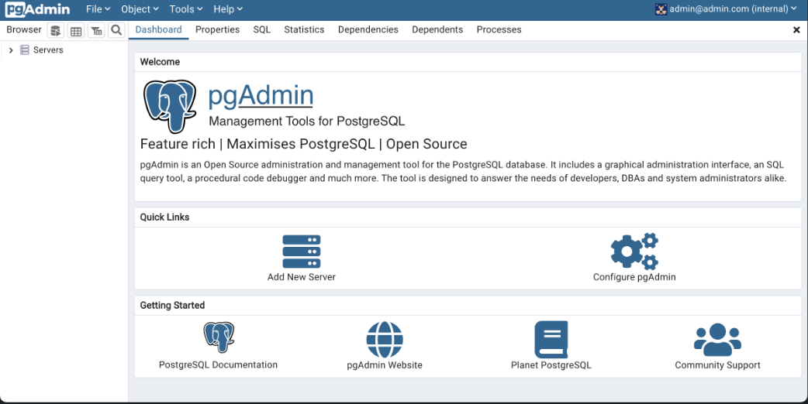


We must then create a server. Click on **Add New Server** and identify the postgres instance located in another
container.

But this will not work since we must ensure that the two containers can communicate with each other. To do this, we will
use **docker network**.

Stop both containers (`Postgres` and `pgAdmin`) and go to [docker network create](https://docs.docker.com/engine/reference/commandline/network_create/).

In a new terminal window, run this command to create a new network:

``` bash
$ docker network create pg-network
$ docker run -it \
  -e POSTGRES_USER="root" \
  -e POSTGRES_PASSWORD="root" \
  -e POSTGRES_DB="ny_taxi" \
  -v $(pwd)/ny_taxi_postgres_data:/var/lib/postgresql/data \
  -p 5432:5432 \
  --network=pg-network \
  --name pg-database \
  postgres:13
```

With pgcli, we can check if our connection is still working and that the data is still present.

``` txt
root@localhost:ny_taxi> SELECT COUNT(1) FROM yellow_taxi_data;
Reconnecting...
Reconnected!
+---------+
| count   |
|---------|
| 1369765 |
+---------+
SELECT 1
Time: 0.305s
root@localhost:ny_taxi>
```

Then run the following command in another terminal window.

``` bash
$ docker run -it \
  -e PGADMIN_DEFAULT_EMAIL="admin@admin.com" \
  -e PGADMIN_DEFAULT_PASSWORD="root" \
  -p 8080:80 \
  --network=pg-network \
  --name pgadmin-2 \
  dpage/pgadmin4
```

Then go to <http://localhost:8080/> again, enter username `admin@admin.com` and password `root`.

Then create a server. Click on **Add New Server**, enter the information as below (still with username `admin@admin.com`
and password `root`), then click the **Save** button.

|                            |                            |
|----------------------------|----------------------------|
| 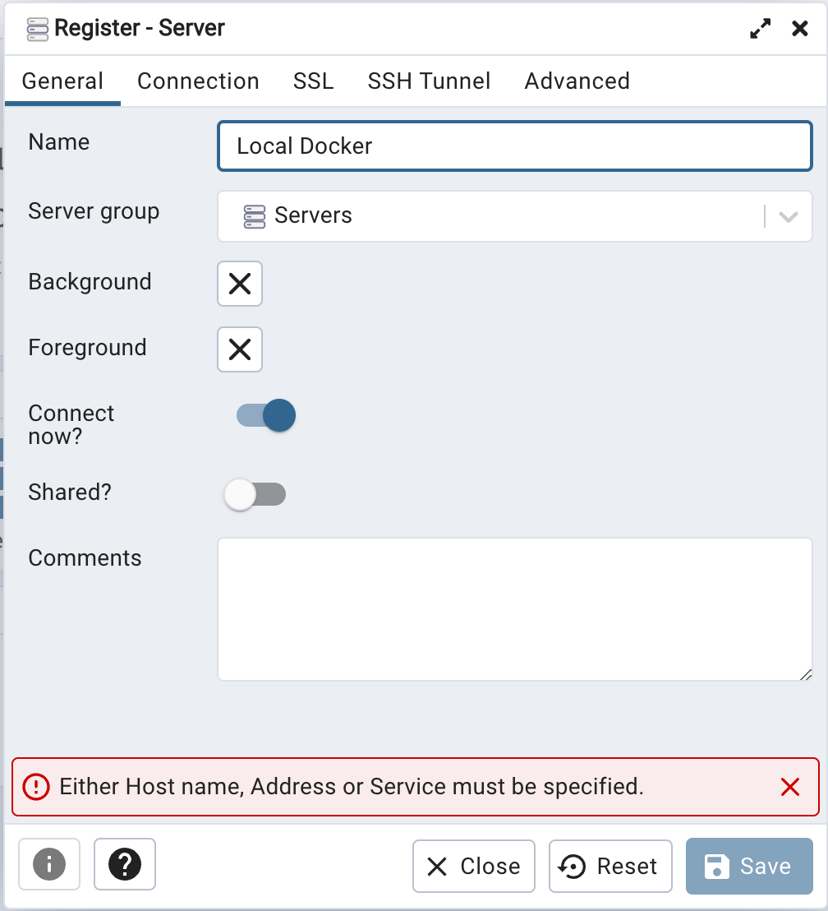 | 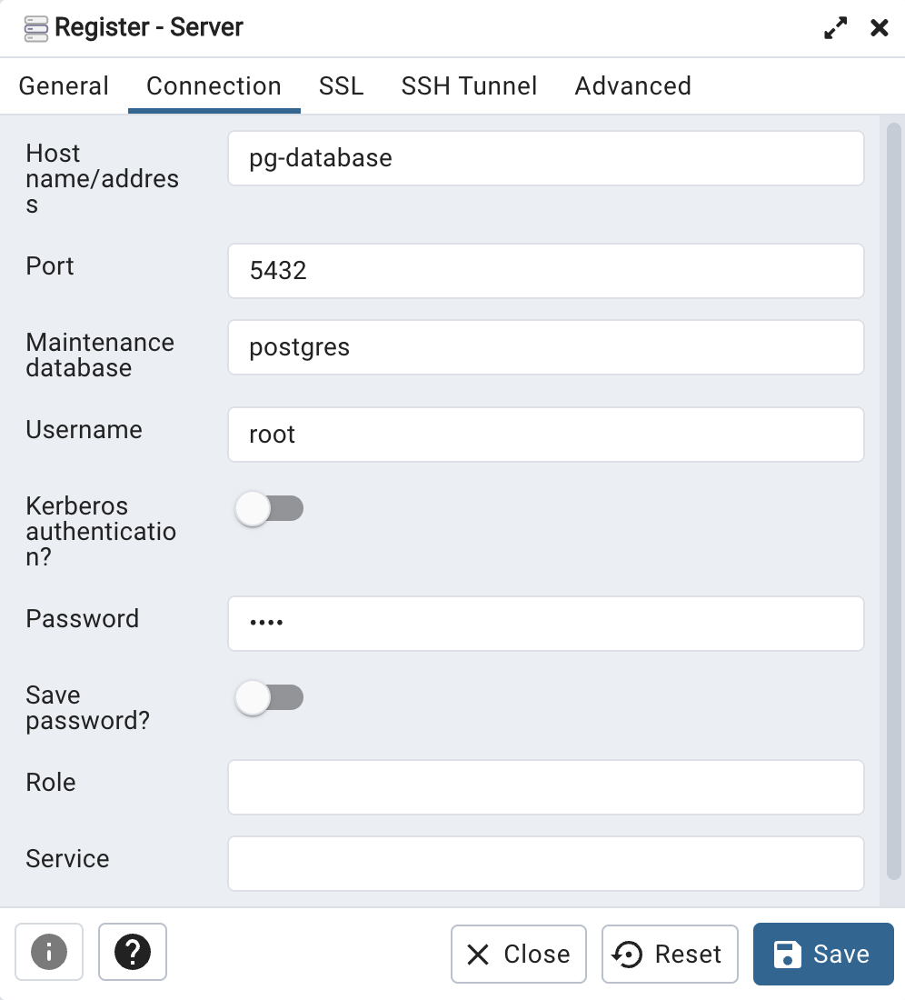 |

In the left menu, click successively on **Server**, **Local Docker**, **Database**, **ny_taxi**, **Schemas**,
**public**, **Tables**, **yellow_taxi_data**. After, right-click and select **View/Edit Data** and **First 100 Rows**.

We should see this after asking to display the first 100 rows of the **yellow_taxi_data** table.

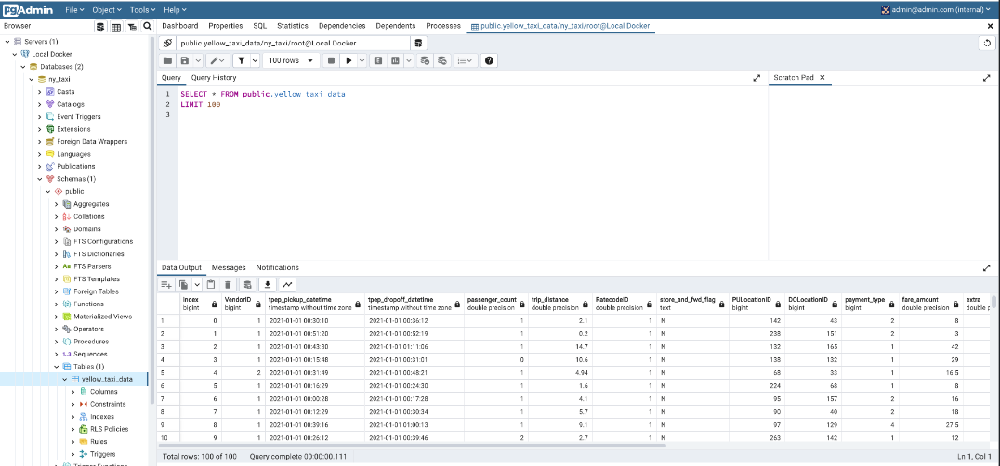

Enter this query `SELECT COUNT(1) FROM yellow_daxi_data;`.

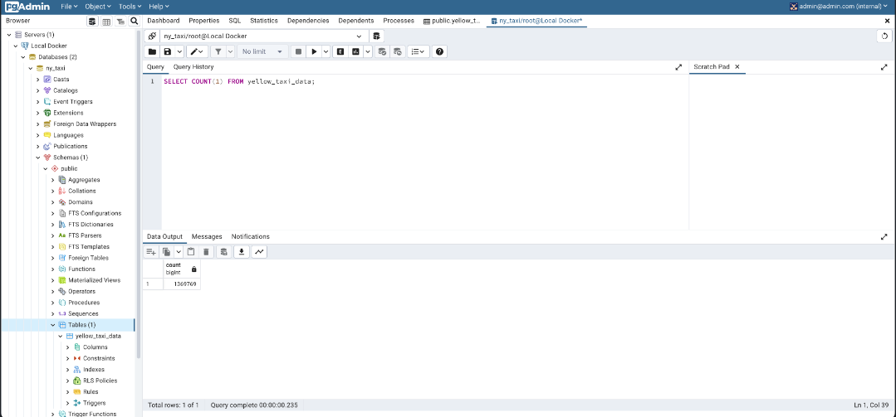

### Dockerizing the Ingestion Script

See [DE Zoomcamp 1.2.4 - Dockerizing the Ingestion Script](https://www.youtube.com/watch?v=B1WwATwf-vY&list=PL3MmuxUbc_hJed7dXYoJw8DoCuVHhGEQb&index=8) on Youtube.

Please check the file `upload-data.py` on folder `2_docker_sql`, you will see this full script:

Note that we will use [argparse](https://docs.python.org/3/library/argparse.html).

<div class="formalpara-title">

**File `upload-data.py`**

</div>

``` python

#!/usr/bin/env python
# coding: utf-8
import os
import argparse

from time import time
import pandas as pd
from sqlalchemy import create_engine

def main(params):
    # Import the params from the input
    user = params.user
    password = params.password
    host = params.host 
    port = params.port 
    db = params.db
    table_name = params.table_name

    # Create engine to connect to pg db
    engine = create_engine(f'postgresql://{user}:{password}@{host}:{port}/{db}')

    # Download the file from Google Drive
    url_code = '1p2y79m_q9rPM48cEYwQdrk6XVCTFSyRA'
    os.system(f'gdown {url_code}')

    # Read the file csv, split into multiple 100000 rows files
    csv_name = 'yellow_tripdata_2021-01.csv'
    df_iter = pd.read_csv(csv_name, iterator=True, chunksize=100000)
    
    # Iterate
    df = next(df_iter)

    # Convert time
    df.tpep_pickup_datetime = pd.to_datetime(df.tpep_pickup_datetime)
    df.tpep_dropoff_datetime = pd.to_datetime(df.tpep_dropoff_datetime)

    # Export data into database, first we get the columns names
    df.head(n=0).to_sql(name=table_name, con=engine, if_exists='replace')

    # Export data
    df.to_sql(name=table_name, con=engine, if_exists='append')

    # Export the rest
    while True:
        try:            
            t_start = time()

            df = next(df_iter)

            df.tpep_pickup_datetime = pd.to_datetime(df.tpep_pickup_datetime)
            df.tpep_dropoff_datetime = pd.to_datetime(df.tpep_dropoff_datetime)
            
            df.to_sql(name=table_name, con=engine, if_exists='append')

            t_end = time()

            print('inserted another chunk, took %.3f second' % (t_end - t_start))
        except StopIteration:
            print("Finished ingesting data into the postgres database")
            break

if __name__ == '__main__':
    parser = argparse.ArgumentParser(description='Ingest CSV data to Postgres')

    parser.add_argument('--user', required=True, help='user name for postgres')
    parser.add_argument('--password', required=True, help='password for postgres')
    parser.add_argument('--host', required=True, help='host for postgres')
    parser.add_argument('--port', required=True, help='port for postgres')
    parser.add_argument('--db', required=True, help='database name for postgres')
    parser.add_argument('--table_name', required=True, help='name of the table where we will write the results to')

    args = parser.parse_args()

    main(args)
```

Before run this script, we need to drop **yellow_taxi_data** table with pgAdmin with this SQL:

``` sql
DROP TABLE yellow_taxi_data;
SELECT COUNT(1) FROM yellow_taxi_data;
-- ERROR:  relation "yellow_taxi_data" does not exist
-- LINE 2: SELECT COUNT(1) FROM yellow_taxi_data;
```

Now, we could run this script `upload-data.py`:

``` bash
$ python3 upload-data.py \
    --user=root \
    --password=root \
    --host=localhost \
    --port=5432 \
    --db=ny_taxi \
    --table_name=yellow_taxi_trips \
```
When the execution is finished, one can check in pgAdmin if the table is complete.

``` sql
SELECT COUNT(1) FROM yellow_taxi_trips;
-- 1369765
```

Now, we will dockerize this ingestion script.

We need to destroy the table in Postgres and adjust the `Dockerfile`.

``` sql
DROP TABLE yellow_taxi_trips;
-- Query returned successfully in 117 msec.
```

<div class="formalpara-title">

**File `Dockerfile`**

</div>

``` txt
FROM python:3.9

RUN apt-get install wget
RUN pip install pandas sqlalchemy psycopg2

WORKDIR /app
COPY upload-data.py upload-data.py

ENTRYPOINT [ "python", "upload-data.py" ]
```

Then, we execute the following command:

``` bash
$ docker build -t taxi_ingest:v001 .
```

Then, we execute the following command:

``` bash
$ docker run -it \
    --network=pg-network \ 
    taxi_ingest:v001 \
      --user=root \
      --password=root \
      --host=pg-database \ 
      --port=5432 \
      --db=ny_taxi \
      --table_name=yellow_taxi_trips \
```

- We should run this thing in the network, and not on the localhost.

- Who need also to use `pd-database`.

Let check again if the data is export to Postgre database

``` sql
SELECT COUNT(1) FROM yellow_taxi_trips;
-- 1369765
```

<div class="note">

Remember that we list the containers with the command `docker ps` and stop containers with the command
`docker kill <CONTAINER_ID>`.

</div>

<div class="note">

**15:15 HTTP server + ipconfig**  
We also mention the possibility of creating your own http server with the commands `python3 -m http.server` and
`ifconfig` (`ipconfig` on windows) then change the URL to search for the source file on our own machine.

</div>

### Running Postgres and pgAdmin with Docker-Compose

See [DE Zoomcamp 1.2.5 - Running Postgres and pgAdmin with Docker-Compose](https://www.youtube.com/watch?v=hKI6PkPhpa0)
on Youtube.

#### Introduction to Docker-Compose

So far we have run several commands to create docker instances, load data, etc. We’re gonna make it all simple using
[docker compose](https://docs.docker.com/compose/).

Compose is a tool for defining and running multi-container Docker applications. With Compose, you use a YAML file to
configure your application’s services. Then, with a single command, you create and start all the services from your
configuration.

#### Installing Docker-Compose

Normally, Docker compose is already installed since it is included in Docker Desktop.

#### Configuration of postgres database and pgadmin in Docker-Compose file

With Docker compose, the images will be installed automatically in the same network.

See
[docker-compose.yaml](2_docker_sql/docker-compose.yaml).

<div class="formalpara-title">

**File `docker-compose.yaml`**

</div>

``` yaml
services:
  pgdatabase:
    image: postgres:13
    environment:
      - POSTGRES_USER=root
      - POSTGRES_PASSWORD=root
      - POSTGRES_DB=ny_taxi
    volumes:
      - "./ny_taxi_postgres_data:/var/lib/postgresql/data:rw"
    ports:
      - "5432:5432"
  pgadmin:
    image: dpage/pgadmin4
    environment:
      - PGADMIN_DEFAULT_EMAIL=admin@admin.com
      - PGADMIN_DEFAULT_PASSWORD=root
    ports:
      - "8080:80"
```
For more details, please check file `docker-compose.yaml` on folder `2_docker_sql`

#### Running the Docker-Compose file
we need to stop the current running containers **pgadmin** et **postgres**.

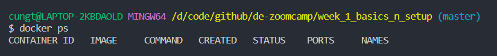

Then run this command:

``` bash
$ docker-compose up
```

Then go to <http://localhost:8080/> again, enter username `admin@admin.com` and password `root`.

Then create a server. Click **Add New Server**, enter the following information, then click the **Save** button.

Tab **General**:

* Name: `Local Docker`

Tab **Connection**:

* Host name: `pgdatabase`
* Port: `5432`
* Username: `root`
* Password: `root`

Let’s check if the database table is correct.

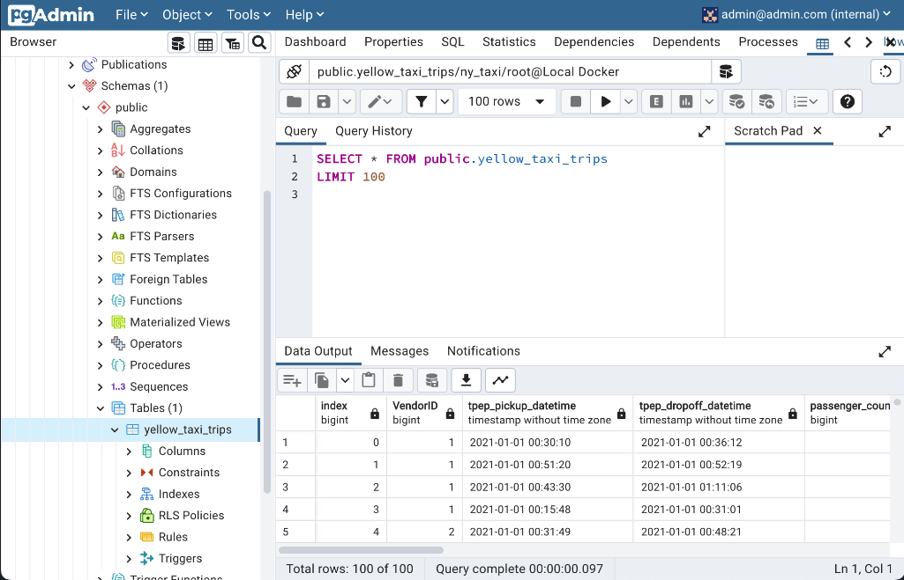


#### Stopping the running containers with Docker-Compose

To stop this running docker compose, just run the command `$ docker-compose down`.

#### Running Docker-Compose in detached mode

You can restart in detached mode, with the command `$ docker-compose up -d`. This way allows us to find the terminal
window and you don’t need to open a new window.

### Port Mapping and Networks in Docker (Bonus)

See [DE Zoomcamp 1.4.2 - Port Mapping and Networks in Docker (Bonus)](https://www.youtube.com/watch?v=tOr4hTsHOzU).

* Docker networks
* Port forwarding to the host environment
* Communicating between containers in the network
* `.dockerignore` file

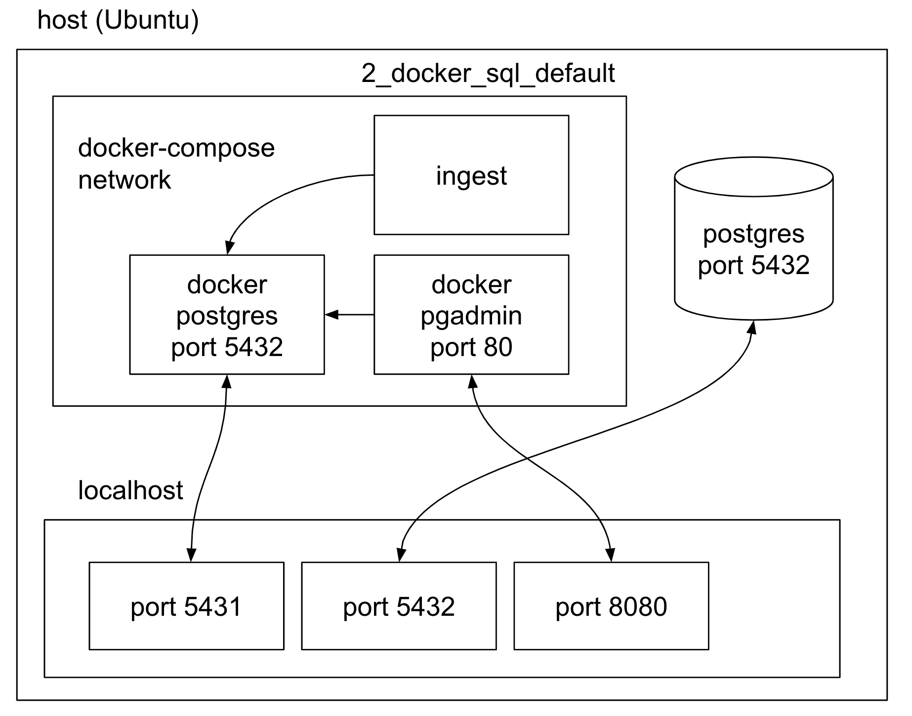

## GCP + Terraform

The code is [here](/1_terraform_gcp/)

### Introduction to Google Cloud Platform

See [DE Zoomcamp 1.1.1 - Introduction to Google Cloud Platform](https://www.youtube.com/watch?v=18jIzE41fJ4) on Youtube.

### Introduction to Terraform Concepts & GCP Pre-Requisites

See [DE Zoomcamp 1.3.1 - Introduction to Terraform Concepts & GCP Pre-Requisites](https://www.youtube.com/watch?v=Hajwnmj0xfQ) on Youtube and [1_terraform_overview.md](1_terraform_gcp/1_terraform_overview.md) on GitHub.

* What is Terraform?
  * [Terraform](https://www.terraform.io/) is a tool for build, change, and destroy infrastructure.
  * Open-source tool by HashiCorp, used for provisioning infrastructure resources.
  * Supports DevOps best practices for change management.
  * Managing configuration files in source control to maintain an ideal provisioning state for testing and production
    environments.

* What is IaC?
  * Infrastructure-as-Code.
  * Build, change, and manage your infrastructure in a safe, consistent, and repeatable way by defining resource
    configurations that you can version, reuse, and share.

* Some advantages
  * Infrastructure lifecycle management.
  * Version control commits.
  * Very useful for stack-based deployments, and with cloud providers such as AWS, GCP, Azure, K8S.
  * State-based approach to track resource changes throughout deployments.

See [Install Terraform](https://developer.hashicorp.com/terraform/downloads) and [Install Terraform
CLI](https://developer.hashicorp.com/terraform/tutorials/gcp-get-started/install-cli).


I opened my free GCP account with \$300 credit to spend within 90 days.

I was asked for my credit card. But it was clearly indicated :  
**No autocharge after free trial ends**  
We ask you for your credit card to make sure you are not a robot. You won’t be charged unless you manually upgrade to a
paid account.

Go to the [Google Cloud Console](https://console.cloud.google.com/welcome).

I created the project ny-rides-hauct (for DataTalks.Club Data Engineering Zoomcamp).

|                                   |                                    |
|-----------------------------------|------------------------------------|
|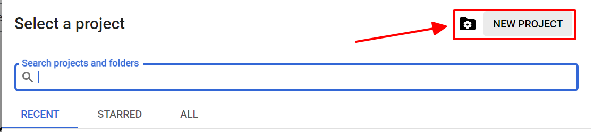|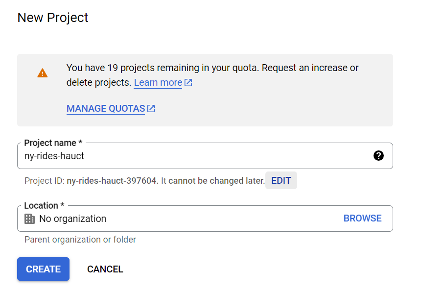 |

Select the ny-rides-hauct project and go to the left menu `IAM & Admin`, then `Service Accounts`.


We must then click on **+ CREATE SERVICE ACCOUNT** located at the top.

See [Understanding service accounts"](https://cloud.google.com/iam/docs/understanding-service-accounts).

Enter **ny-rides-hauct** in the **Service account name** field, then click on **CREATE AND CONTINUE** button.

Select `Viewer` in the **Role** field, then click the **DONE** button.


