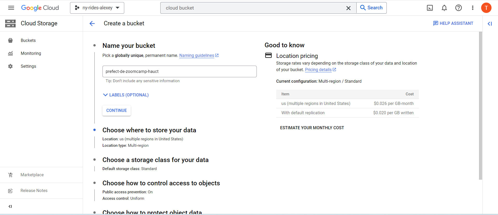
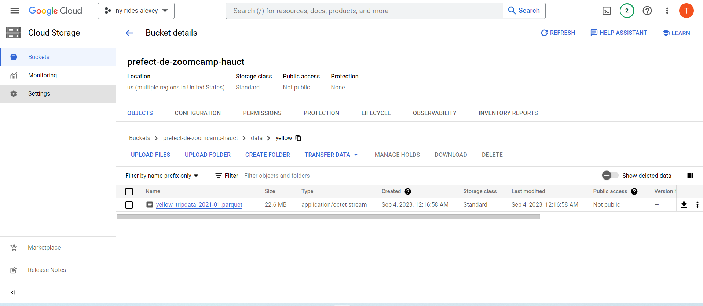

# Data Engineering Zoomcamp 2023 Week 2: Workflow Orchestration

See [README.md](https://github.com/DataTalksClub/data-engineering-zoomcamp/tree/main/week_2_workflow_orchestration) for week 2 
from DataTalksClub GitHub repo.

Below are my notes from week 2.

## Contents

- 2.0 Data Lake
- 2.1 Introduction to Workflow Orchestration
- 2.2 Introduction to Prefect concepts
- 2.3 ETL with GCP & Prefect
- 2.4 From Google Cloud Storage to Big Query
- 2.5 Parametrizing Flow & Deployments
- 2.6 Schedules and Docker Storage with Infrastructure
- 2.7 Prefect Cloud and Additional Resources

## 2.0 Data Lake

See [DE Zoomcamp 2.1.1 - Data Lake](https://www.youtube.com/watch?v=W3Zm6rjOq70) on Youtube.

### What is a Data Lake?


### Data Lake vs Data Warehouse


### How did Data Lake start?

- Companies realized the value of data
- Store and access data quickly
- Cannot always define structure of data
- Usefulness of data being realized later in the project lifecycle
- Increase in data scientists
- R&D on data products
- Need for Cheap storage of Big data

### ETL vs ELT

- Extract Transform and Load (ETL) vs Extract Load and Transform (ELT)
- ETL is mainly used for a small amount of data whereas ELT is used for large amounts of data
- ELT provides data lake support (Schema on read)

### Gotchas of Data Lake

- Converting into Data Swamp
- No versioning
- Incompatible schemas for same data without versioning
- No metadata associated
- Joins not possible

### Cloud provider Data Lake

- GCP - cloud storage
- AWS - S3
- AZURE - AZURE BLOB


## Introduction to Workflow Orchestration

See [DE Zoomcamp 2.2.1 - Introduction to Workflow Orchestration](https://www.youtube.com/watch?v=8oLs6pzHp68) on
Youtube.


- [Luigi](https://github.com/spotify/luigi) (prefered tool of Alexdry…​)
- [Apache Airflow](https://airflow.apache.org/) (most popular)
- [Prefect](https://www.prefect.io/)


## Introduction to Prefect concepts

See [DE Zoomcamp 2.2.2 - Introduction to Prefect concepts](https://www.youtube.com/watch?v=jAwRCyGLKOY) on Youtube and
[GitHub repository](https://github.com/discdiver/prefect-zoomcamp)

### Setup environment

Our working directory now is `demos`.

Let’s first create a conda environment. We need a python requirements file.

<div class="formalpara-title">

**File `requirements.txt`**

</div>

``` txt
pandas
pydantic
prefect
prefect-sqlalchemy
prefect-gcp[cloud_storage]
protobuf
pyarrow
pandas-gbq
psycopg2-binary
sqlalchemy
```

Use conda to create a working environment `de-zoomcamp`

``` bash
conda create -n de-zoomcamp python=3.9
conda activate de-zoomcamp
pip install -r requirements.txt
```

### Ingestion without prefect

<div class="formalpara-title">

**File `ingest-data.py`**

</div>

``` python
#!/usr/bin/env python
## coding: utf-8
import os
import argparse
from time import time
import pandas as pd
from sqlalchemy import create_engine

def ingest_data(user, password, host, port, db, table_name, csv_url):

    # the backup files are gzipped, and it's important to keep the correct extension
    # for pandas to be able to open the file
    if csv_url.endswith('.csv.gz'):
        csv_name = 'yellow_tripdata_2021-01.csv.gz'
    else:
        csv_name = 'output.csv'

    os.system(f"wget {csv_url} -O {csv_name}")
    postgres_url = f'postgresql://{user}:{password}@{host}:{port}/{db}'
    engine = create_engine(postgres_url)

    df_iter = pd.read_csv(csv_name, iterator=True, chunksize=100000)

    df = next(df_iter)

    df.tpep_pickup_datetime = pd.to_datetime(df.tpep_pickup_datetime)
    df.tpep_dropoff_datetime = pd.to_datetime(df.tpep_dropoff_datetime)

    df.head(n=0).to_sql(name=table_name, con=engine, if_exists='replace')

    df.to_sql(name=table_name, con=engine, if_exists='append')

    while True:

        try:
            t_start = time()

            df = next(df_iter)

            df.tpep_pickup_datetime = pd.to_datetime(df.tpep_pickup_datetime)
            df.tpep_dropoff_datetime = pd.to_datetime(df.tpep_dropoff_datetime)

            df.to_sql(name=table_name, con=engine, if_exists='append')

            t_end = time()

            print('inserted another chunk, took %.3f second' % (t_end - t_start))

        except StopIteration:
            print("Finished ingesting data into the postgres database")
            break

if __name__ == '__main__':
    user = "root"
    password = "root"
    host = "localhost"
    port = "5432"
    db = "ny_taxi"
    table_name = "yellow_taxi_trips"
    csv_url = "https://github.com/DataTalksClub/nyc-tlc-data/releases/download/yellow/yellow_tripdata_2021-01.csv.gz"

    ingest_data(user, password, host, port, db, table_name, csv_url)
```

I started Docker Desktop and executed these commands.

``` bash
docker run -d \
  -e POSTGRES_USER="root" \
  -e POSTGRES_PASSWORD="root" \
  -e POSTGRES_DB="ny_taxi" \
  -v d:/code/github/de-zoomcamp/week_2_workflow_orchestration/demos/ny_taxi_postgres_data:/var/lib/postgresql/data \
  -p 5432:5432 \
  postgres:13
```

Then, I executed the python program.

``` bash
python ingest_data.py
```

I then opened pgcli.

``` bash
pgcli -h localhost -p 5432 -u root -d ny_taxi
```

And I ran these sql queries.

``` txt
Password for root:
Server: PostgreSQL 13.12 (Debian 13.9-1.pgdg110+1)
Version: 3.5.0
Home: http://pgcli.com
root@localhost:ny_taxi> \dt
+--------+-------------------+-------+-------+
| Schema | Name              | Type  | Owner |
|--------+-------------------+-------+-------|
| public | yellow_taxi_trips | table | root  |
+--------+-------------------+-------+-------+
SELECT 1
Time: 0.037s
root@localhost:ny_taxi> select count(1) FROM yellow_taxi_trips;
+---------+
| count   |
|---------|
| 1369765 |
+---------+
SELECT 1
Time: 4.728s (4 seconds), executed in: 4.723s (4 seconds)
root@localhost:ny_taxi> drop table yellow_taxi_trips;
You're about to run a destructive command.
Do you want to proceed? (y/n): y
Your call!
DROP TABLE
Time: 0.066s
root@localhost:ny_taxi>
```

`Ctrl+D` to quit pgcli.

### Ingestion with prefect
First of all, run on your working terminal (`de-zoomcamp` environment):
```bash
prefect server start
```


Enter the link on your web browser `http://127.0.0.1:4200` to get used to Prefect UI


Then, you will need to create a block for sql connection (you can find more information here [Blocks on Prefect](https://docs.prefect.io/latest/concepts/blocks/)), click on button 'Blocks' on the left and apply this configuration:

Write or select these parameters :

- **Block Name**: postgres-connector
- **Driver**: SyncDriver
- **The driver name to use**: postgresql+psycopg2
- **The name of the database to use**: ny_taxi
- **Username**: root
- **Password**: root
- **Host**: localhost
- **Port**: 5432

|                                          |                                          |
|------------------------------------------|------------------------------------------|
|  |  |
|------------------------------------------|------------------------------------------|
|  |  |

Next, I started Docker Desktop and executed these commands to run PostgreSQL on Docker.

``` bash
docker run -d \
  -e POSTGRES_USER="root" \
  -e POSTGRES_PASSWORD="root" \
  -e POSTGRES_DB="ny_taxi" \
  -v d:/code/github/de-zoomcamp/week_2_workflow_orchestration/demos/ny_taxi_postgres_data:/var/lib/postgresql/data \
  -p 5432:5432 \
  postgres:13
```

**Note**: On your `pgcli` terminal, run `\dt` to list all your database name. 
If you have one, run 
```sql 
DROP TABLE yellow_taxi_trips
``` 
to erase the table.
We need to do this because we want to recheck the ingesting flow on Prefect
and the result is we don't have any tables


Now, we run the ingesting python script, i modified some to use Prefect.

See [ingest-data-flow.py](demos/ingest-data-flow.py)

<div class="formalpara-title">

**File `ingest_data_flow.py`**

</div>

``` python
#!/usr/bin/env python
## coding: utf-8
import os
import argparse
from time import time
import pandas as pd
from sqlalchemy import create_engine
from prefect import flow, task
from prefect.tasks import task_input_hash
from datetime import timedelta
from prefect_sqlalchemy import SqlAlchemyConnector


@task(log_prints=True, tags=["extract"], cache_key_fn=task_input_hash, cache_expiration=timedelta(days=1))
def extract_data(url: str):
    # the backup files are gzipped, and it's important to keep the correct extension
    # for pandas to be able to open the file
    if url.endswith('.csv.gz'):
        csv_name = 'yellow_tripdata_2021-01.csv.gz'
    else:
        csv_name = 'output.csv'

    os.system(f"wget {url} -O {csv_name}")

    df_iter = pd.read_csv(csv_name, iterator=True, chunksize=100000)

    df = next(df_iter)

    df.tpep_pickup_datetime = pd.to_datetime(df.tpep_pickup_datetime)
    df.tpep_dropoff_datetime = pd.to_datetime(df.tpep_dropoff_datetime)

    return df

@task(log_prints=True)
def transform_data(df):
    print(f"pre: missing passenger count: {df['passenger_count'].isin([0]).sum()}")
    df = df[df['passenger_count'] != 0]
    print(f"post: missing passenger count: {df['passenger_count'].isin([0]).sum()}")
    return df

@task(log_prints=True, retries=3)
def load_data(table_name, df):
    connection_block = SqlAlchemyConnector.load("postgres-connector")
    with connection_block.get_connection(begin=False) as engine:
        df.head(n=0).to_sql(name=table_name, con=engine, if_exists='replace')
        df.to_sql(name=table_name, con=engine, if_exists='append')

@flow(name="Subflow", log_prints=True)
def log_subflow(table_name: str):
    print(f"Logging Subflow for: {table_name}")

@flow(name="Ingest Data")
def main_flow(table_name: str = "yellow_taxi_trips"):

    csv_url = "https://github.com/DataTalksClub/nyc-tlc-data/releases/download/yellow/yellow_tripdata_2021-01.csv.gz"
    log_subflow(table_name)
    raw_data = extract_data(csv_url)
    data = transform_data(raw_data)
    load_data(table_name, data)

if __name__ == '__main__':
    main_flow(table_name = "yellow_taxi_trips")
```

This code snippet defines an ETL (Extract, Transform, Load) workflow using the Prefect library in Python:

1. `extract_data`: This is the first task in the workflow. It takes a URL as input and downloads the CSV file from that URL. If the URL ends with `.csv.gz`, it keeps the `.csv.gz` extension in the filename; otherwise, it names the file `output.csv`. It then reads the data from this CSV file into a pandas DataFrame, converts the `tpep_pickup_datetime` and `tpep_dropoff_datetime` columns to datetime format, and returns this DataFrame.

2. `transform_data`: This is the second task. It takes the DataFrame from the `extract_data` task, prints the number of rows with `passenger_count` equal to 0, removes these rows from the DataFrame, then prints the number of rows with `passenger_count` equal to 0 again to ensure they have been removed. It then returns the transformed DataFrame.

3. `load_data`: This is the final task. It takes a table name and the transformed DataFrame from the `transform_data` task. It then connects to a PostgreSQL database using the Prefect `SqlAlchemyConnector`, creates a new table (or replaces an existing table if it already exists) in the database with the structure of the DataFrame, and then adds the data from the DataFrame to this table.

4. `log_subflow`: This is a subflow defined inside the `main_flow`. It simply prints a message about logging the subflow for a specific table.

5. `main_flow`: This is the main flow. It defines a default URL to download data from, then calls `log_subflow` with the `table_name` passed in, then calls `extract_data`, `transform_data`, and `load_data` sequentially, passing the data between the tasks.

6. `if __name__ == '__main__':`: This is the starting point of the program. If this script is run directly (for example, by running `python script.py` from the command line), it will call `main_flow` with `table_name="yellow_taxi_trips"`.

Run `ingest-data-flow,py` and check whether the data is upload to database
```python
cungt@LAPTOP-2KBDAOLD MINGW64 /d/code/github/de-zoomcamp/week_2_workflow_orchestration/demos (master)
$ python ingest-data-flow.py
17:57:40.254 | INFO    | prefect.engine - Created flow run 'zircon-collie' for flow 'Ingest Data'
17:57:40.534 | INFO    | Flow run 'zircon-collie' - Created subflow run 'spiritual-dalmatian' for flow 'Subflow'
17:57:40.613 | INFO    | Flow run 'spiritual-dalmatian' - Logging Subflow for: yellow_taxi_trips
17:57:40.680 | INFO    | Flow run 'spiritual-dalmatian' - Finished in state Completed()
17:57:40.699 | INFO    | Flow run 'zircon-collie' - Created task run 'extract_data-0' for task 'extract_data'
17:57:40.699 | INFO    | Flow run 'zircon-collie' - Executing 'extract_data-0' immediately...
17:57:40.777 | INFO    | Task run 'extract_data-0' - Finished in state Cached(type=COMPLETED)
17:57:41.000 | INFO    | Flow run 'zircon-collie' - Created task run 'transform_data-0' for task 'transform_data'
17:57:41.000 | INFO    | Flow run 'zircon-collie' - Executing 'transform_data-0' immediately...
17:57:41.089 | INFO    | Task run 'transform_data-0' - pre: missing passenger count: 1973
17:57:41.095 | INFO    | Task run 'transform_data-0' - post: missing passenger count: 0
17:57:41.148 | INFO    | Task run 'transform_data-0' - Finished in state Completed()
17:57:41.173 | INFO    | Flow run 'zircon-collie' - Created task run 'load_data-0' for task 'load_data'
17:57:41.184 | INFO    | Flow run 'zircon-collie' - Executing 'load_data-0' immediately...
17:57:41.436 | INFO    | Task run 'load_data-0' - Created a new engine.
17:57:41.495 | INFO    | Task run 'load_data-0' - Created a new connection.
17:57:50.252 | INFO    | Task run 'load_data-0' - Finished in state Completed()
17:57:50.302 | INFO    | Flow run 'zircon-collie' - Finished in state Completed('All states completed.')
(de-zoomcamp) 
```

I then opened pgcli.

``` bash
pgcli -h localhost -p 5432 -u root -d ny_taxi
```
Check whether the data is ingested
```bash
$ pgcli -h localhost -U root -d ny_taxi
Server: PostgreSQL 13.12 (Debian 13.12-1.pgdg120+1)
Version: 3.5.0
Home: http://pgcli.com
root@localhost:ny_taxi> \dt
+--------+-------------------+-------+-------+
| Schema | Name              | Type  | Owner |
|--------+-------------------+-------+-------|
| public | yellow_taxi_trips | table | root  |
+--------+-------------------+-------+-------+
SELECT 1
Time: 0.019s
root@localhost:ny_taxi> SELECT COUNT(*) FROM yellow_taxi_trips
+-------+
| count |
|-------|
| 98027 |
+-------+
SELECT 1
Time: 0.041s
root@localhost:ny_taxi>
```
Look like everything is well done. Let's close the pgcli and Prefect

## ETL with GCP & Prefect

See [DE Zoomcamp 2.2.3 - ETL with GCP & Prefect](https://www.youtube.com/watch?v=W-rMz_2GwqQ) on Youtube and the
[source code](https://github.com/discdiver/prefect-zoomcamp/tree/main/flows/02_gcp).

### Start Prefect Orion

Our working dir now is `prefect_gcp`, and active `de-zoomcamp` environment (if not created yet, please run `conda create -n de-zoomcamp python=3.9`, you will run `activate de-zoomcamp` and `pip install -r requirements.txt`)

Start Prefect Orion.

``` bash
cd prefect_gcp
conda activate de-zoomcamp
prefect server start
```

You should see in the terminal this.

``` txt
 ___ ___ ___ ___ ___ ___ _____    ___  ___ ___ ___  _  _
| _ \ _ \ __| __| __/ __|_   _|  / _ \| _ \_ _/ _ \| \| |
|  _/   / _|| _|| _| (__  | |   | (_) |   /| | (_) | .` |
|_| |_|_\___|_| |___\___| |_|    \___/|_|_\___\___/|_|\_|

Configure Prefect to communicate with the server with:

    prefect config set PREFECT_API_URL=http://127.0.0.1:4200/api

View the API reference documentation at http://127.0.0.1:4200/docs

Check out the dashboard at http://127.0.0.1:4200
```

Check out the dashboard at <http://127.0.0.1:4200>

### Create and run the program 

Firstly, for Windows user like me, you need to create a location to save the parquet files.
In my case, it will be `.\prefect_gcp\data\yellow`.

Now create the file `etl_web_to_gcs.py` in folder `.\prefect_gcp`

<div class="formalpara-title">

**File `etl_web_to_gcs.py`**

</div>

```python
import os
from pathlib import Path
import pandas as pd
from prefect import flow, task
from prefect_gcp.cloud_storage import GcsBucket
from random import randint


@task(retries=3)
def fetch(dataset_url: str) -> pd.DataFrame:
    """Read taxi data from web into pandas DataFrame"""
    # if randint(0, 1) > 0:
    #     raise Exception

    df = pd.read_csv(dataset_url)
    return df


@task(log_prints=True)
def clean(df: pd.DataFrame) -> pd.DataFrame:
    """Fix dtype issues"""
    df["tpep_pickup_datetime"] = pd.to_datetime(df["tpep_pickup_datetime"])
    df["tpep_dropoff_datetime"] = pd.to_datetime(df["tpep_dropoff_datetime"])
    print(df.head(2))
    print(f"columns: {df.dtypes}")
    print(f"rows: {len(df)}")
    return df

@task()
def write_local(df: pd.DataFrame, color: str, dataset_file: str) -> Path:
    """Write DataFrame out locally as parquet file"""
    Path(f"data/{color}").mkdir(parents=True, exist_ok=True)
    path = Path(f"data/{color}/{dataset_file}.parquet")
    df.to_parquet(path, compression="gzip")
    return path

@flow()
def etl_web_to_gcs() -> None:
    """The main ETL function"""
    color = "yellow"
    year = 2021
    month = 1
    dataset_file = f"{color}_tripdata_{year}-{month:02}"
    dataset_url = f"https://github.com/DataTalksClub/nyc-tlc-data/releases/download/{color}/{dataset_file}.csv.gz"

    df = fetch(dataset_url)
    df_clean = clean(df)
    path = write_local(df_clean, color, dataset_file)
    
if __name__ == "__main__":
    etl_web_to_gcs()
```

Run the code 

``` bash
python 02_gcp/etl_web_to_gcs.py
```

You should see a new file created in `.\prefect_gcp\data\yellow`. This is our data file, in parquet form.


### Create a Bucket

Go to [Gougle Cloud Console](https://console.cloud.google.com/).

In the **ny-rides-alexey** project, select **Cloud Storage**, and select **Buckets**. I uses a bucket named **prefect-de-zoomcamp-hauct**.



Inside Orion, select **Blocks** at the left menu, choose the block **GCS Bucket** and click **Add +** button. Complete
the form with:

- Block Name: zoom-gcs

- Name of the bucket: prefect-de-zoomcamp-hauct


### Save credentials

Under **Gcp Credentials**, click on **Add +** button to create a **GCP Credentials** with these informations:

- Block Name: zoom-gcp-creds


### Create service account

On **Google Cloud Console**, select **IAM & Admin**, and **Service Accounts**. Then click on **+ CREATE SERVICE
ACCOUNT** with these informations:

- Service account details: zoom-de-service-account


Click on **CREATE AND CONTINUE** button.

Give the roles **BigQuery Admin** and **Storage Admin**.


Click on **CONTINUE** button.

Click on **DONE** button.

### Add the new key to the service account

Then, add a key on it. Click on **ADD KEY +** button, select **CREATE A NEW KEY**, select **JSON** and click on
**CREATE** button.

|                                 |                                 |                                |
|---------------------------------|---------------------------------|--------------------------------|
|  |  | |

A private key (`ny-rides-alexey-396910-77e7f5a18eb8.json`) is saved to my computer.

Move this json file under `C:/Users/cungt/.gc/` directory.

### Return to our bucket and create it

Open `ny-rides-alexey-396910-77e7f5a18eb8.json` and copy to this field on **zoom-gcp-creds**


When returning to the Orion form to create the **GCS Bucket**, which is called **zoom-gcs**, make sure the **Gcp
Credentials** field says **zoom-gcp-creds**.


### Modify our python program

We then obtain a fragment of code to insert into our python code. Which allows us to add the `write_gcs` method to
`etl_web_to_gcs.py`.


<div class="formalpara-title">

**File `etl_web_to_gcs.py`**

</div>

``` python
from pathlib import Path
import pandas as pd
from prefect import flow, task
from prefect_gcp.cloud_storage import GcsBucket
from random import randint


@task(retries=3)
def fetch(dataset_url: str) -> pd.DataFrame:
    """Read taxi data from web into pandas DataFrame"""
    # if randint(0, 1) > 0:
    #     raise Exception

    df = pd.read_csv(dataset_url)
    return df


@task(log_prints=True)
def clean(df: pd.DataFrame) -> pd.DataFrame:
    """Fix dtype issues"""
    df["tpep_pickup_datetime"] = pd.to_datetime(df["tpep_pickup_datetime"])
    df["tpep_dropoff_datetime"] = pd.to_datetime(df["tpep_dropoff_datetime"])
    print(df.head(2))
    print(f"columns: {df.dtypes}")
    print(f"rows: {len(df)}")
    return df

@task()
def write_local(df: pd.DataFrame, color: str, dataset_file: str) -> Path:
    """Write DataFrame out locally as parquet file"""
    Path(f"data/{color}").mkdir(parents=True, exist_ok=True)
    path = Path(f"data/{color}/{dataset_file}.parquet")
    df.to_parquet(path, compression="gzip")
    return path

@task
def write_gcs(path: Path) -> None:
    """Upload local parquet file to GCS"""
    gcs_block = GcsBucket.load("zoom-gcs")
    # normalize the path to use forward slashes
    normalized_path = path.as_posix()
    gcs_block.upload_from_path(from_path=path, to_path=normalized_path)
    return

@flow()
def etl_web_to_gcs() -> None:
    """The main ETL function"""
    color = "yellow"
    year = 2021
    month = 1
    dataset_file = f"{color}_tripdata_{year}-{month:02}"
    dataset_url = f"https://github.com/DataTalksClub/nyc-tlc-data/releases/download/{color}/{dataset_file}.csv.gz"

    df = fetch(dataset_url)
    df_clean = clean(df)
    path = write_local(df_clean, color, dataset_file)
    write_gcs(path)
    
if __name__ == "__main__":
    etl_web_to_gcs()
```

### Run the python program again

Let’s run the python program again.

``` bash
python etl_web_to_gcs.py
```

``` txt
$ python etl_web_to_gcs.py
23:14:51.160 | INFO    | prefect.engine - Created flow run 'icy-adder' for flow 'etl-web-to-gcs'
23:14:51.361 | INFO    | Flow run 'icy-adder' - Created task run 'fetch-0' for task 'fetch'
23:14:51.361 | INFO    | Flow run 'icy-adder' - Executing 'fetch-0' immediately...
D:\code\github\de-zoomcamp\week_2_workflow_orchestration\prefect_gcp\etl_web_to_gcs.py:15: DtypeWarning: Columns (6) have mixed types. Specify dtype option on import or set low_memory=False.
  df = pd.read_csv(dataset_url)
23:15:17.459 | INFO    | Task run 'fetch-0' - Finished in state Completed()
23:15:17.494 | INFO    | Flow run 'icy-adder' - Created task run 'clean-0' for task 'clean'
23:15:17.495 | INFO    | Flow run 'icy-adder' - Executing 'clean-0' immediately...
23:15:19.207 | INFO    | Task run 'clean-0' -    VendorID tpep_pickup_datetime  ... total_amount  congestion_surcharge
0       1.0  2021-01-01 00:30:10  ...         11.8                   2.5
1       1.0  2021-01-01 00:51:20  ...          4.3                   0.0

[2 rows x 18 columns]
23:15:19.209 | INFO    | Task run 'clean-0' - columns: VendorID                        float64
tpep_pickup_datetime     datetime64[ns]
tpep_dropoff_datetime    datetime64[ns]
passenger_count                 float64
trip_distance                   float64
RatecodeID                      float64
store_and_fwd_flag               object
PULocationID                      int64
DOLocationID                      int64
payment_type                    float64
fare_amount                     float64
extra                           float64
mta_tax                         float64
tip_amount                      float64
tolls_amount                    float64
improvement_surcharge           float64
total_amount                    float64
congestion_surcharge            float64
dtype: object
23:15:19.212 | INFO    | Task run 'clean-0' - rows: 1369765
23:15:19.258 | INFO    | Task run 'clean-0' - Finished in state Completed()
23:15:19.294 | INFO    | Flow run 'icy-adder' - Created task run 'write_local-0' for task 'write_local'
23:15:19.296 | INFO    | Flow run 'icy-adder' - Executing 'write_local-0' immediately...
23:15:22.420 | INFO    | Task run 'write_local-0' - Finished in state Completed()
23:15:22.454 | INFO    | Flow run 'icy-adder' - Created task run 'write_gcs-0' for task 'write_gcs'
23:15:22.455 | INFO    | Flow run 'icy-adder' - Executing 'write_gcs-0' immediately...
23:15:22.742 | INFO    | Task run 'write_gcs-0' - Getting bucket 'prefect-de-zoomcamp-hauct'.
23:15:23.781 | INFO    | Task run 'write_gcs-0' - Uploading from WindowsPath('D:/code/github/de-zoomcamp/week_2_workflow_orchestration/prefect_gcp/data/yellow/yellow_tripdata_2021-01.parquet') to the bucket 'prefect-de-zoomcamp-hauct' path 'D:\\code\\github\\de-zoomcamp\\week_2_workflow_orchestration\\prefect_gcp\\data\\yellow\\yellow_tripdata_2021-01.parquet'.
23:15:44.581 | INFO    | Task run 'write_gcs-0' - Finished in state Completed()
23:15:44.626 | INFO    | Flow run 'icy-adder' - Finished in state Completed('All states completed.')
(de-zoomcamp)
```

### Bucket is created!

By checking on Google Cloud, we should see our bucket of 20.7 Mb. Congratulation!



## 2.4 From Google Cloud Storage to Big Query

See [DE Zoomcamp 2.2.4 - From Google Cloud Storage to Big Query](https://www.youtube.com/watch?v=Cx5jt-V5sgE) on
Youtube.

Our working directory now is `prefect_bq`.

Now let’s create another python program to load our data into the Google Cloud Storage (GCS) to Big Query.

<div class="formalpara-title">

**File `etl_gcs_to_bq.py`**

</div>

``` python
from pathlib import Path
import pandas as pd
from prefect import flow, task
from prefect_gcp.cloud_storage import GcsBucket
from prefect_gcp import GcpCredentials


@task(retries=3)
def extract_from_gcs(color: str, year: int, month: int) -> Path:
    """Download trip data from GCS"""
    gcs_path = f"data/{color}/{color}_tripdata_{year}-{month:02}.parquet"
    gcs_block = GcsBucket.load("zoom-gcs")
    gcs_block.get_directory(from_path=gcs_path, local_path=f"./")
    return Path(f"./{gcs_path}")


@task()
def transform(path: Path) -> pd.DataFrame:
    """Data cleaning example"""
    df = pd.read_parquet(path)
    print(f"pre: missing passenger count: {df['passenger_count'].isna().sum()}")
    df["passenger_count"].fillna(0, inplace=True)
    print(f"post: missing passenger count: {df['passenger_count'].isna().sum()}")
    return df


@flow()
def etl_gcs_to_bq():
    """Main ETL flow to load data into Big Query"""
    color = "yellow"
    year = 2021
    month = 1

    path = extract_from_gcs(color, year, month)
    df = transform(path)


if __name__ == "__main__":
    etl_gcs_to_bq()
```

Run this file.

``` bash
python etl_gcs_to_bq.py
```

We should have something like this.

``` txt
00:47:47.682 | INFO    | prefect.engine - Created flow run 'merciful-kudu' for flow 'etl-gcs-to-bq'
00:47:47.913 | INFO    | Flow run 'merciful-kudu' - Created task run 'extract_from_gcs-0' for task 'extract_from_gcs'
00:47:47.915 | INFO    | Flow run 'merciful-kudu' - Executing 'extract_from_gcs-0' immediately...
00:47:49.279 | INFO    | Task run 'extract_from_gcs-0' - Downloading blob named data/yellow/yellow_tripdata_2021-01.parquet from the prefect-de-zoomcamp-hauct bucket to D:\code\github\de-zoomcamp\week_2_workflow_orchestration\prefect_bq\data/yellow/yellow_tripdata_2021-01.parquet
00:48:14.828 | INFO    | Task run 'extract_from_gcs-0' - Finished in state Completed()
00:48:14.868 | INFO    | Flow run 'merciful-kudu' - Created task run 'transform-0' for task 'transform'
00:48:14.870 | INFO    | Flow run 'merciful-kudu' - Executing 'transform-0' immediately...
pre: missing passenger count: 98352
post: missing passenger count: 0
00:48:15.347 | INFO    | Task run 'transform-0' - Finished in state Completed()
00:48:15.396 | INFO    | Flow run 'merciful-kudu' - Finished in state Completed('All states completed.')
```

Go to **Google Cloud Console**, select **Big Query**, click on **+ ADD DATA** button.

|                                    |                                    |
|------------------------------------|------------------------------------|
|||

The field **Create table from** should be set to **Google Cloud Storage**.

On **Select the file from GCS bucket**, click on **BROWSE** and select the `.parquet` file.

Under **Destination** section, click on **CREATE NEW DATASET** with the field **Dataset ID** equal to **dezoomcamp**. Then click on **CREATE DATASET** button.

Still under **Destination** section, name the table **rides**.


Then click on **CREATE TABLE** button.

Select the table **rides**, open a new Query tab, and run this query:

``` sql
SELECT count(1) FROM `ny-rides-alexey-396910.dezoomcamp.rides`;
```


``` sql
DELETE FROM `ny-rides-alexey-396910.dezoomcamp.rides` WHERE true;
```

You should see **This statement removed 1,369,765 rows from rides.**


Back to our code, and add a function to write to BigQuery.

<div class="formalpara-title">

**File `etl_gcs_to_bq.py.py`**

</div>

```python
from pathlib import Path
import pandas as pd
from prefect import flow, task
from prefect_gcp.cloud_storage import GcsBucket
from prefect_gcp import GcpCredentials


@task(retries=3)
def extract_from_gcs(color: str, year: int, month: int) -> Path:
    """Download trip data from GCS"""
    gcs_path = f"data/{color}/{color}_tripdata_{year}-{month:02}.parquet"
    gcs_block = GcsBucket.load("zoom-gcs")
    gcs_block.get_directory(from_path=gcs_path, local_path=f"./")
    return Path(f"./{gcs_path}")


@task()
def transform(path: Path) -> pd.DataFrame:
    """Data cleaning example"""
    df = pd.read_parquet(path)
    print(f"pre: missing passenger count: {df['passenger_count'].isna().sum()}")
    df["passenger_count"].fillna(0, inplace=True)
    print(f"post: missing passenger count: {df['passenger_count'].isna().sum()}")
    return df

@task()
def write_bq(df: pd.DataFrame) -> None:
    """Write DataFrame to BiqQuery"""

    gcp_credentials_block = GcpCredentials.load("zoom-gcp-creds")

    df.to_gbq(
        destination_table="dezoomcamp.rides",
        project_id="ny-rides-alexey-396910",
        credentials=gcp_credentials_block.get_credentials_from_service_account(),
        chunksize=500_000,
        if_exists="append",
    )

@flow()
def etl_gcs_to_bq():
    """Main ETL flow to load data into Big Query"""
    color = "yellow"
    year = 2021
    month = 1

    path = extract_from_gcs(color, year, month)
    df = transform(path)
    write_bq(df)

if __name__ == "__main__":
    etl_gcs_to_bq()
```

See [prefect_gcp.credentials](https://prefecthq.github.io/prefect-gcp/credentials/) for more information about handling
GCP credentials.

See also [pandas.DataFrame.to_gbq](https://pandas.pydata.org/docs/reference/api/pandas.DataFrame.to_gbq.html) for more
information about `.to_gbq` method.

Note Let’s run this program.

``` bash
python etl_gcs_to_bq.py
```

We should see this.

``` txt
$ python etl_gcs_to_bq.py
15:26:09.304 | INFO    | prefect.engine - Created flow run 'thundering-mink' for flow 'etl-gcs-to-bq'
15:26:09.514 | INFO    | Flow run 'thundering-mink' - Created task run 'extract_from_gcs-0' for task 'extract_from_gcs'
15:26:09.515 | INFO    | Flow run 'thundering-mink' - Executing 'extract_from_gcs-0' immediately...
15:26:10.871 | INFO    | Task run 'extract_from_gcs-0' - Downloading blob named data/yellow/yellow_tripdata_2021-01.parquet from the prefect-de-zoomcamp-hauct bucket to D:\code\github\de-zoomcamp\week_2_workflow_orchestration\prefect_bq\data/yellow/yellow_tripdata_2021-01.parquet
15:26:35.343 | INFO    | Task run 'extract_from_gcs-0' - Finished in state Completed()
15:26:35.382 | INFO    | Flow run 'thundering-mink' - Created task run 'transform-0' for task 'transform'
15:26:35.384 | INFO    | Flow run 'thundering-mink' - Executing 'transform-0' immediately...
pre: missing passenger count: 98352
post: missing passenger count: 0
15:26:35.781 | INFO    | Task run 'transform-0' - Finished in state Completed()
15:26:35.821 | INFO    | Flow run 'thundering-mink' - Created task run 'write_bq-0' for task 'write_bq'
15:26:35.822 | INFO    | Flow run 'thundering-mink' - Executing 'write_bq-0' immediately...
15:27:18.455 | INFO    | Task run 'write_bq-0' - Finished in state Completed()
15:27:18.502 | INFO    | Flow run 'thundering-mink' - Finished in state Completed('All states completed.')
(de-zoomcamp) 
```

Now, return to query interface on Google Cloud and run this query.

``` sql
SELECT count(1) FROM `ny-rides-alexey-396910.dezoomcamp.rides`;
```

This should return 1369765.

Now, run this query to remove all rows.

``` sql
DELETE FROM `ny-rides-alexey-396910.dezoomcamp.rides` WHERE true;
```

## 2.5 Parametrizing Flow & Deployments

See [DE Zoomcamp 2.2.5 - Parametrizing Flow & Deployments with ETL into GCS
flow](https://www.youtube.com/watch?v=QrDxPjX10iw) on Youtube.

We will see in this section:

- Parametrizing the script from your flow (rather then hard coded)
- Parameter validation with Pydantic
- Creating a deployment locally
- Setting up Prefect Agent
- Running the flow
- Notifications

### Parametrizing the script from your flow

Our working directory now is `prefect_deployments`.

Create a new file `parameterized_flow.py` with script parametrized.

<div class="formalpara-title">

**File `parameterized_flow.py`**

</div>

``` python
from pathlib import Path
import pandas as pd
from prefect import flow, task
from prefect_gcp.cloud_storage import GcsBucket
from random import randint


@task(retries=3)
def fetch(dataset_url: str) -> pd.DataFrame:
    """Read taxi data from web into pandas DataFrame"""
    # if randint(0, 1) > 0:
    #     raise Exception

    df = pd.read_csv(dataset_url)
    return df


@task(log_prints=True)
def clean(df: pd.DataFrame) -> pd.DataFrame:
    """Fix dtype issues"""
    df["tpep_pickup_datetime"] = pd.to_datetime(df["tpep_pickup_datetime"])
    df["tpep_dropoff_datetime"] = pd.to_datetime(df["tpep_dropoff_datetime"])
    print(df.head(2))
    print(f"columns: {df.dtypes}")
    print(f"rows: {len(df)}")
    return df

@task()
def write_local(df: pd.DataFrame, color: str, dataset_file: str) -> Path:
    """Write DataFrame out locally as parquet file"""
    Path(f"data/{color}").mkdir(parents=True, exist_ok=True)
    path = Path(f"data/{color}/{dataset_file}.parquet")
    df.to_parquet(path, compression="gzip")
    return path

@task
def write_gcs(path: Path) -> None:
    """Upload local parquet file to GCS"""
    gcs_block = GcsBucket.load("zoom-gcs")
    # normalize the path to use forward slashes
    normalized_path = path.as_posix()
    gcs_block.upload_from_path(from_path=path, to_path=normalized_path)
    return

@flow()
def etl_web_to_gcs(month: int, year: int, color: str) -> None:
    """The main ETL function"""
    dataset_file = f"{color}_tripdata_{year}-{month:02}"
    dataset_url = f"https://github.com/DataTalksClub/nyc-tlc-data/releases/download/{color}/{dataset_file}.csv.gz"

    df = fetch(dataset_url)
    df_clean = clean(df)
    path = write_local(df_clean, color, dataset_file)
    write_gcs(path)
    
@flow()
def etl_parent_flow( 
    months: list[int] = [1, 2], year: int = 2021, color: str = "yellow"
):
    for month in months:
        etl_web_to_gcs(month, year, color)
    
if __name__ == "__main__":
    color = "yellow"
    months = [1, 2, 3]
    year = 2021
    etl_parent_flow(months, year, color)```
```
- Parametrized script.

### Parameter validation with Pydantic

We do nothing with Pydantic in the video…​ But it would be relevant to add this tool in my code. See
[pydantic](https://docs.pydantic.dev/).

There are many ways to create a deployment, but we will use
[CLI](https://docs.prefect.io/concepts/deployments/#create-a-deployment-on-the-cli). In a futur vide, we will see how to
deploy with python script.

See [Deployments overview](https://docs.prefect.io/concepts/deployments/#deployments-overview) for more information.

<div class="note">

Make sure Prefect Orion is running. If not, then run these commands.

``` bash
conda activate de-zoomcamp
prefect server start
```

Check out the dashboard at <http://127.0.0.1:4200>.

### Creating a deployment locally

Open a new terminal window and execute this command to create a deployment file.

``` bash
prefect deployment build parameterized_flow.py:etl_parent_flow -n "Parameterized ETL"
```

A deployment model `etl_parent_flow-deployment.yaml` is created.

### Running the flow

``` bash
prefect deployment apply etl_parent_flow-deployment.yaml
```


Go to the Prefect Orion UI. We should see the deployment model is there.

|                                         |                                         |
|-----------------------------------------|-----------------------------------------|
|||

Click on **Quick run** button.

Select **Flow Runs** in the left menu. Orion UI should indicate that our run is in **Scheduled** state. In my case, I
see **Late** state.

The **Scheduled** state indicates that our flow a ready to be run but we have no agent picking of this run.

Select **Work Pools** in the left menu.

A agent is a very lightly python process that is living in my executing environment.


### Setting up Prefect Agent

Now start the agent.

``` bash
prefect agent start -q 'default'
```

We will see this below terminal window.

``` txt
cungt@LAPTOP-2KBDAOLD MINGW64 /d/code/github/de-zoomcamp/week_2_workflow_orchestration/prefect_deployments (master)
$ prefect agent start -q 'default'
Starting v2.12.1 agent with ephemeral API...

  ___ ___ ___ ___ ___ ___ _____     _   ___ ___ _  _ _____
 | _ \ _ \ __| __| __/ __|_   _|   /_\ / __| __| \| |_   _|
 |  _/   / _|| _|| _| (__  | |    / _ \ (_ | _|| .` | | |
 |_| |_|_\___|_| |___\___| |_|   /_/ \_\___|___|_|\_| |_|


Agent started! Looking for work from queue(s): default...
16:40:42.039 | INFO    | prefect.agent - Submitting flow run 'bc00f831-e3ae-4404-867f-2451460aca53'
16:40:42.195 | INFO    | prefect.infrastructure.process - Opening process 'warm-rooster'...
16:40:42.222 | INFO    | prefect.agent - Completed submission of flow run 'bc00f831-e3ae-4404-867f-2451460aca53'
C:\Users\cungt\anaconda3\envs\de-zoomcamp\lib\runpy.py:127: RuntimeWarning: 'prefect.engine' found in sys.modules after import of package 'prefect', but prior to execution of 'prefect.engine'; this may result in unpredictable behaviour
  warn(RuntimeWarning(msg))
16:40:46.715 | INFO    | Flow run 'warm-rooster' - Downloading flow code from storage at 'D:\\code\\github\\de-zoomcamp\\week_2_workflow_orchestration\\prefect_deployments'
16:40:47.047 | INFO    | Flow run 'warm-rooster' - Created subflow run 'gifted-puffin' for flow 'etl-web-to-gcs'
16:40:47.146 | INFO    | Flow run 'gifted-puffin' - Created task run 'fetch-0' for task 'fetch'
16:40:47.147 | INFO    | Flow run 'gifted-puffin' - Executing 'fetch-0' immediately...
parameterized_flow.py:14: DtypeWarning: Columns (6) have mixed types. Specify dtype option on import or set low_memory=False.
  df = pd.read_csv(dataset_url)
16:41:12.890 | INFO    | Task run 'fetch-0' - Finished in state Completed()
16:41:12.929 | INFO    | Flow run 'gifted-puffin' - Created task run 'clean-0' for task 'clean'
16:41:12.930 | INFO    | Flow run 'gifted-puffin' - Executing 'clean-0' immediately...
16:41:14.666 | INFO    | Task run 'clean-0' -    VendorID tpep_pickup_datetime  ... total_amount  congestion_surcharge
0       1.0  2021-01-01 00:30:10  ...         11.8                   2.5
1       1.0  2021-01-01 00:51:20  ...          4.3                   0.0

[2 rows x 18 columns]
16:41:14.668 | INFO    | Task run 'clean-0' - columns: VendorID                        float64 
tpep_pickup_datetime     datetime64[ns]
tpep_dropoff_datetime    datetime64[ns]
passenger_count                 float64
trip_distance                   float64
RatecodeID                      float64
store_and_fwd_flag               object
PULocationID                      int64
DOLocationID                      int64
payment_type                    float64
fare_amount                     float64
extra                           float64
mta_tax                         float64
tip_amount                      float64
tolls_amount                    float64
improvement_surcharge           float64
total_amount                    float64
congestion_surcharge            float64
dtype: object
16:41:14.669 | INFO    | Task run 'clean-0' - rows: 1369765
16:41:14.718 | INFO    | Task run 'clean-0' - Finished in state Completed()
16:41:14.756 | INFO    | Flow run 'gifted-puffin' - Created task run 'write_local-0' for task 'write_local'
16:41:14.757 | INFO    | Flow run 'gifted-puffin' - Executing 'write_local-0' immediately...   
16:41:17.796 | INFO    | Task run 'write_local-0' - Finished in state Completed()
16:41:17.831 | INFO    | Flow run 'gifted-puffin' - Created task run 'write_gcs-0' for task 'write_gcs'
16:41:17.832 | INFO    | Flow run 'gifted-puffin' - Executing 'write_gcs-0' immediately...     
16:41:18.111 | INFO    | Task run 'write_gcs-0' - Getting bucket 'prefect-de-zoomcamp-hauct'.
16:41:19.111 | INFO    | Task run 'write_gcs-0' - Uploading from WindowsPath('data/yellow/yellow_tripdata_2021-01.parquet') to the bucket 'prefect-de-zoomcamp-hauct' path 'data/yellow/yellow_tripdata_2021-01.parquet'.
16:41:40.364 | INFO    | Task run 'write_gcs-0' - Finished in state Completed()
16:41:40.439 | INFO    | Flow run 'gifted-puffin' - Finished in state Completed('All states completed.')
16:41:40.552 | INFO    | Flow run 'warm-rooster' - Created subflow run 'classic-harrier' for flow 'etl-web-to-gcs'
16:41:40.659 | INFO    | Flow run 'classic-harrier' - Created task run 'fetch-0' for task 'fetch'
16:41:40.660 | INFO    | Flow run 'classic-harrier' - Executing 'fetch-0' immediately...       
parameterized_flow.py:14: DtypeWarning: Columns (6) have mixed types. Specify dtype option on import or set low_memory=False.
  df = pd.read_csv(dataset_url)
16:42:06.225 | INFO    | Task run 'fetch-0' - Finished in state Completed()
16:42:06.265 | INFO    | Flow run 'classic-harrier' - Created task run 'clean-0' for task 'clean'
16:42:06.267 | INFO    | Flow run 'classic-harrier' - Executing 'clean-0' immediately...       
16:42:07.970 | INFO    | Task run 'clean-0' -    VendorID tpep_pickup_datetime  ... total_amount  congestion_surcharge
0       1.0  2021-02-01 00:40:47  ...         12.3                   2.5
1       1.0  2021-02-01 00:07:44  ...         13.3                   0.0

[2 rows x 18 columns]
16:42:07.972 | INFO    | Task run 'clean-0' - columns: VendorID                        float64 
tpep_pickup_datetime     datetime64[ns]
tpep_dropoff_datetime    datetime64[ns]
passenger_count                 float64
trip_distance                   float64
RatecodeID                      float64
store_and_fwd_flag               object
PULocationID                      int64
DOLocationID                      int64
payment_type                    float64
fare_amount                     float64
extra                           float64
mta_tax                         float64
tip_amount                      float64
tolls_amount                    float64
improvement_surcharge           float64
total_amount                    float64
congestion_surcharge            float64
dtype: object
16:42:07.973 | INFO    | Task run 'clean-0' - rows: 1371708
16:42:08.018 | INFO    | Task run 'clean-0' - Finished in state Completed()
16:42:08.059 | INFO    | Flow run 'classic-harrier' - Created task run 'write_local-0' for task 'write_local'
16:42:08.060 | INFO    | Flow run 'classic-harrier' - Executing 'write_local-0' immediately... 
16:42:11.052 | INFO    | Task run 'write_local-0' - Finished in state Completed()
16:42:11.087 | INFO    | Flow run 'classic-harrier' - Created task run 'write_gcs-0' for task 'write_gcs'
16:42:11.088 | INFO    | Flow run 'classic-harrier' - Executing 'write_gcs-0' immediately...   
16:42:11.362 | INFO    | Task run 'write_gcs-0' - Getting bucket 'prefect-de-zoomcamp-hauct'.
16:42:12.360 | INFO    | Task run 'write_gcs-0' - Uploading from WindowsPath('data/yellow/yellow_tripdata_2021-02.parquet') to the bucket 'prefect-de-zoomcamp-hauct' path 'data/yellow/yellow_tripdata_2021-02.parquet'.
16:42:33.430 | INFO    | Task run 'write_gcs-0' - Finished in state Completed()
16:42:33.506 | INFO    | Flow run 'classic-harrier' - Finished in state Completed('All states completed.')
16:42:33.556 | INFO    | Flow run 'warm-rooster' - Finished in state Completed('All states completed.')
16:42:34.203 | INFO    | prefect.infrastructure.process - Process 'warm-rooster' exited cleanly
```

And in the Orion UI, we see that the run is completed.


### Notifications

We can setup a notification.

Go to the Orion UI, select **Notifications** and create a notification.


Quit the terminal window with `Ctrl+C`.

We should also delete the file created in the bucket.


## 2.6 Schedules and Docker Storage with Infrastructure

See [DE Zoomcamp 2.2.6 - Schedules & Docker Storage with Infrastructure](https://www.youtube.com/watch?v=psNSzqTsi-s) on
Youtube.

We will see in this section:

- Scheduling a deployment
- Flow code storage
- Running tasks in Docker

<div class="note">

From here, we continue working on `prefect_deployments` directory , this contains these files and folders:

``` txt
~/week_2_workflow_orchestration/prefect_deployments/__pycache__
~/week_2_workflow_orchestration/prefect_deployments/data
~/week_2_workflow_orchestration/prefect_deployments/.prefectignore
~/week_2_workflow_orchestration/prefect_deployments/etl_parent_flow-deployment.yaml
~/week_2_workflow_orchestration/prefect_deployments/parameterized_flow.py
~/week_2_workflow_orchestration/prefect_deployments/docker-requirements.txt
~/week_2_workflow_orchestration/prefect_deployments/Dockerfile
```
</div>

### Scheduling a deployment

See [Schedules](https://docs-v1.prefect.io/core/concepts/schedules.html) for more information.

Make sure that Prefect Orion UI is started.

``` bash
conda activate de-zoomcamp
prefect server start
prefect deployment build parameterized_flow.py:etl_parent_flow -n etl2 --cron "0 0 * * *" -a
```

We should see this in the terminal window.

``` txt
$ prefect deployment build parameterized_flow.py:etl_parent_flow -n etl2 --cron "0 0 * * *" -a 
Found flow 'etl-parent-flow'
Deployment YAML created at 
'D:\code\github\de-zoomcamp\week_2_workflow_orchestration\prefect_deployments\etl_parent_flow-deploymen
t.yaml'.
Deployment storage None does not have upload capabilities; no files uploaded.  Pass 
--skip-upload to suppress this warning.
Deployment 'etl-parent-flow/etl2' successfully created with id 
'e3db432c-02de-4550-86a3-5ccc452b6e98'.

To execute flow runs from this deployment, start an agent that pulls work from the 'default' 
work queue:
$ prefect agent start -q 'default'
(de-zoomcamp)
```

We should see this on the Orion UI.


The link <https://crontab.guru/#0_0_*_*_*> tells us *At 00:00.* and the next at 2023-09-05 00:00:00.

We can obtain help on prefect command.

``` bash
prefect deployment --help
prefect deployment build --help
prefect deployment apply --help
```

For example:

``` txt
$ prefect deployment --help

 Usage: prefect deployment [OPTIONS] COMMAND [ARGS]...

 Commands for working with deployments.

╭─ Options ───────────────────────────────────────────────────────────────────────────────────╮
│ --help          Show this message and exit.                                                 │
╰─────────────────────────────────────────────────────────────────────────────────────────────╯
╭─ Commands ──────────────────────────────────────────────────────────────────────────────────╮
│ apply               Create or update a deployment from a YAML file.                         │
│ build               Generate a deployment YAML from /path/to/file.py:flow_function          │
│ delete              Delete a deployment.                                                    │
│ inspect             View details about a deployment.                                        │
│ ls                  View all deployments or deployments for specific flows.                 │
│ pause-schedule      Pause schedule of a given deployment.                                   │
│ resume-schedule     Resume schedule of a given deployment.                                  │
│ run                 Create a flow run for the given flow and deployment.                    │
│ set-schedule        Set schedule for a given deployment.                                    │
╰─────────────────────────────────────────────────────────────────────────────────────────────╯
```

### Flow code storage

Let’s make a `Dockerfile`.

<div class="formalpara-title">

**File `~/prefect_deployments/Dockerfile`**

</div>

``` txt
FROM prefecthq/prefect:2.7.7-python3.9

COPY docker-requirements.txt .

RUN pip install -r docker-requirements.txt --trusted-host pypi.python.org --no-cache-dir

COPY . /opt/prefect/deployments
RUN mkdir -p /opt/prefect/deployments/data/yellow
```

<div class="formalpara-title">

**File `~/prefect_deployments/docker-requirements.txt`**

</div>

``` text
pandas
prefect
prefect-sqlalchemy
prefect-gcp[cloud_storage]
protobuf
pyarrow
pandas-gbq
```

Now let build this docker image.

``` bash
docker image build -t cungtronghau/prefect:dezoomcamp .
```
Note that `cungtronghau` is my dockerhub username.

After creating the image, you will want to push that image to your dockerhub.

Make sure you are already logged to dockerhub.

``` bash
docker image push cungtronghau/prefect:dezoomcamp
```

Go to the Orion UI, select **Blocks** in the right menu, click the **+** button to add a **Docker Container** with these
information:

- **Block Name**: zoom
- **Type (Optional)** \> The type of infrastructure: docker-container
- **Image (Optional)** \> Tag of a Docker image to use: cungtronghau/prefect:dezoomcamp
- **ImagePullPolicy (Optional)**: ALWAYS
- **Auto Remove (Optional)**: ON

Then click on **Create** button.


Note that it is also possible to create a DockerContainer block from python.

``` python
from prefect.infrastructure.docker import DockerContainer

## alternative to creating DockerContainer block in the UI
docker_block = DockerContainer(
    image="cungtronghau/prefect:dezoomcamp",  # insert your image here
    image_pull_policy="ALWAYS",
    auto_remove=True,
)

docker_block.save("dezoomcamp", overwrite=True)
```

We already know how to create a deployment file from command line. Now, we will create a deployment file from python.

**File `docker_deploy.py`**

</div>

``` python
from prefect.deployments import Deployment
from parameterized_flow import etl_parent_flow
from prefect.infrastructure.docker import DockerContainer

docker_block = DockerContainer.load("dezoomcamp")

docker_dep = Deployment.build_from_flow(
    flow=etl_parent_flow,
    name="docker-flow",
    infrastructure=docker_block,
)

if __name__ == "__main__":
    docker_dep.apply()
```

Then, execute this script with this command.

``` bash
python docker_deploy.py
```

Go to the Orion UI, select **Deployments** in the the menu. We should see the **docker-flow**. Click on it.


See a list of available profiles:

``` bash
prefect profile ls
```


``` bash
prefect config set PREFECT_API_URL="http://127.0.0.1:4200/api"
```

Now the docker interface could communicate with the Orion server.

``` bash
prefect agent start -q default
```

### Running tasks in Docker

Now we could run our flow from Orion UI or from command line. Here is how to do with command line.

``` bash
prefect deployment run etl-parent-flow/docker-flow -p "months=[1,2]"
```
