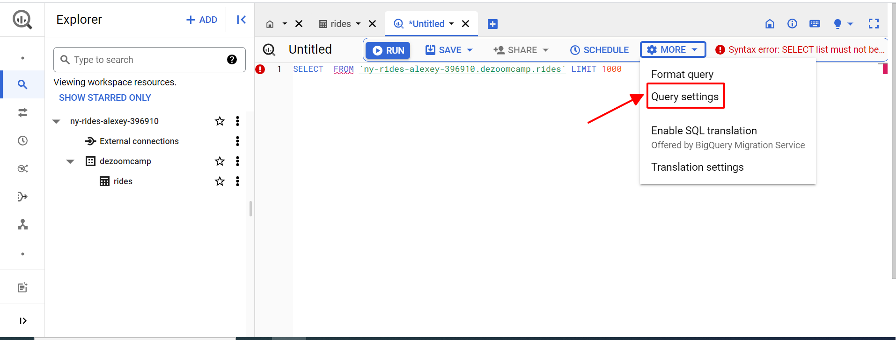
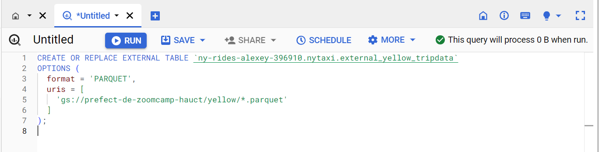
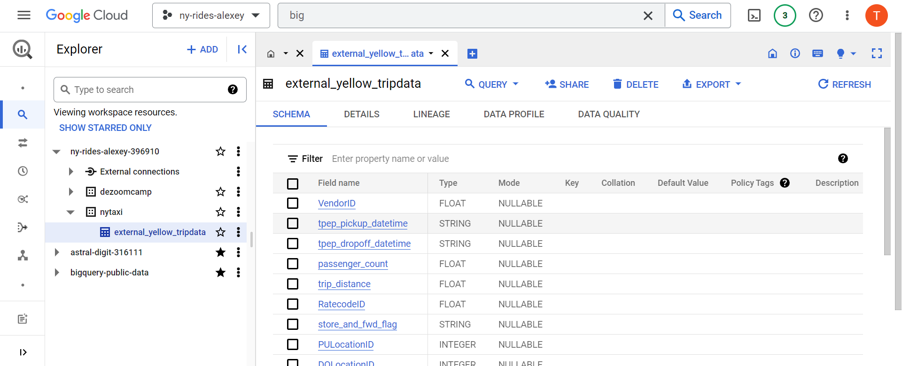

# Week 3: Data Warehouse and BigQuery

See [week_3\_data_warehouse](https://github.com/DataTalksClub/data-engineering-zoomcamp/tree/main/week_3_data_warehouse)
on GitHub.

Youtube videos:

- [DE Zoomcamp 3.1.1 - Data Warehouse and BigQuery](https://www.youtube.com/watch?v=jrHljAoD6nM)
- [DE Zoomcamp 3.1.2 - Partioning and Clustering](https://www.youtube.com/watch?v=-CqXf7vhhDs)
- [DE Zoomcamp 3.2.1 - BigQuery Best Practices](https://www.youtube.com/watch?v=k81mLJVX08w)
- [DE Zoomcamp 3.2.2 - Internals of BigQuery](https://www.youtube.com/watch?v=eduHi1inM4s)
- [DE Zoomcamp 3.3.1 - BigQuery Machine Learning](https://www.youtube.com/watch?v=B-WtpB0PuG4)
- [DE Zoomcamp 3.3.2 - BigQuery Machine Learning Deployment](https://www.youtube.com/watch?v=BjARzEWaznU)

Basic SQL:

- [BigQuery](https://github.com/DataTalksClub/data-engineering-zoomcamp/blob/main/week_3_data_warehouse/big_query.sql)
- [External
  Table](https://github.com/DataTalksClub/data-engineering-zoomcamp/blob/main/week_3_data_warehouse/big_query_hw.sql)
- [BigQuery
  ML](https://github.com/DataTalksClub/data-engineering-zoomcamp/blob/main/week_3_data_warehouse/big_query_ml.sql)

## Concepts

### OLAP vs OLTP

**OLTP** systems are designed to handle large volumes of transactional data involving multiple users.

**OLAP** system is designed to process large amounts of data quickly, allowing users to analyze multiple data dimensions
in tandem. Teams can use this data for decision-making and problem-solving.

|   | **OLTP**  | **OLAP**  |
|---------------------|---------------------------------------------------------------------------------------------------|-----------------------------------------------------------------------------------|
| Purpose | Control and run essential business operations in real time  | Plan, solve problems, support decisions, discover hidden insights |
| Data updates  | Short, fast updates initiated by user | Data periodically refreshed with scheduled, long-running batch jobs |
| Database design | Normalized databases for efficiency | Denormalized databases for analysis |
| Space requirements  | Generally small if historical data is archived  | Generally large due to aggregating large datasets |
| Backup and recovery | Regular backups required to ensure business continuity and meet legal and governance requirements | Lost data can be reloaded from OLTP database as needed in lieu of regular backups |
| Productivity  | Increases productivity of end users | Increases productivity of business managers, data analysts, and executives  |
| Data view | Lists day-to-day business transactions  | Multi-dimensional view of enterprise data |
| User examples | Customer-facing personnel, clerks, online shoppers  | Knowledge workers such as data analysts, business analysts, and executives  |

### What is a data wahehouse

- OLAP solution
- Used for reporting and data analysis

See also [The Data Warehouse Toolkit 3rd
Edition](https://www.kimballgroup.com/data-warehouse-business-intelligence-resources/books/data-warehouse-dw-toolkit/)
by Ralph Kimball and Margy Ross.

## BigQuery

### Overwiew

BigQuery is a fully managed enterprise data warehouse that helps you manage and analyze your data with built-in features
like machine learning, geospatial analysis, and business intelligence.

- Serverless data warehouse
  - There are no servers to manage or database software to install
- Software as well as infrastructure including
  - **scalability** and **high-availability**
- Built-in features like
  - machine learning
  - geospatial analysis
  - business intelligence
- BigQuery maximizes flexibility by separating the compute engine that analyzes your data from your storage
- On demand pricing
  - 1 TB of data processed is \$5
- Flat rate pricing
  - Based on number of pre requested slots
  - 100 slots → \$2,000/month = 400 TB data processed on demand pricing

See [What is BigQuery?](https://cloud.google.com/bigquery/docs/introduction) for more information.

### Query Settings

Click on MORE button, select Query Settings. In the Resource management section, we should disable Use cached results.



To create the table, you will need to download and upload your data from local to your Google Bucket.
Run the script `web_to_gcs.py`.
``` bash
python web_to_gcs.py
```

<div class="formalpara-title">

**File `web_to_gcs.py`**

</div>

``` python
import io
import os
import requests
import pandas as pd
from google.cloud import storage

"""
Pre-reqs: 
1. `pip install pandas pyarrow google-cloud-storage`
2. Set GOOGLE_APPLICATION_CREDENTIALS to your project/service-account key
3. Set GCP_GCS_BUCKET as your bucket or change default value of BUCKET
"""

# services = ['fhv','green','yellow']
init_url = 'https://github.com/DataTalksClub/nyc-tlc-data/releases/download/'
# switch out the bucketname
BUCKET = os.environ.get("GCP_GCS_BUCKET", "prefect-de-zoomcamp-hauct")


def upload_to_gcs(bucket, object_name, local_file):
    """
    Ref: https://cloud.google.com/storage/docs/uploading-objects#storage-upload-object-python
    """
    # # WORKAROUND to prevent timeout for files > 6 MB on 800 kbps upload speed.
    # # (Ref: https://github.com/googleapis/python-storage/issues/74)
    storage.blob._MAX_MULTIPART_SIZE = 5 * 1024 * 1024  # 5 MB
    storage.blob._DEFAULT_CHUNKSIZE = 5 * 1024 * 1024  # 5 MB

    client = storage.Client()
    bucket = client.bucket(bucket)
    blob = bucket.blob(object_name)
    blob.upload_from_filename(local_file)

def web_to_gcs(year, service):
    # We just need first half of a year, which is from January to June
    for i in range(6):
        # sets the month part of the file_name string
        month = '0'+str(i+1)
        month = month[-2:]

        # csv file_name
        file_name = f"{service}_tripdata_{year}-{month}.csv.gz"

        # download it using requests via a pandas df
        request_url = f"{init_url}{service}/{file_name}"
        r = requests.get(request_url)
        open(file_name, 'wb').write(r.content)
        print(f"Local: {file_name}")

        # read it back into a parquet file
        df = pd.read_csv(file_name, compression='gzip')
        ### Fix dtype issues ###
        df["tpep_pickup_datetime"] = pd.to_datetime(df["tpep_pickup_datetime"])
        df["tpep_dropoff_datetime"] = pd.to_datetime(df["tpep_dropoff_datetime"])

        file_name = file_name.replace('.csv.gz', '.parquet')
        df.to_parquet(file_name, engine='pyarrow')
        
        # upload it to gcs
        upload_to_gcs(BUCKET, f"{service}/{file_name}", file_name)
        print(f"GCS: {service}/{file_name}")


web_to_gcs('2019', 'yellow')
```

**IMPORTANT NOTE**: You will need to edit your own GCP_GCS_BUCKET to have the data correctly input

``` text
$ python web_to_gcs.py
Local: yellow_tripdata_2019-01.csv.gz
GCS: yellow/yellow_tripdata_2019-01.parquet
Local: yellow_tripdata_2019-02.csv.gz
GCS: yellow/yellow_tripdata_2019-02.parquet
Local: yellow_tripdata_2019-03.csv.gz
GCS: yellow/yellow_tripdata_2019-03.parquet
Local: yellow_tripdata_2019-04.csv.gz
GCS: yellow/yellow_tripdata_2019-04.parquet
Local: yellow_tripdata_2019-05.csv.gz
GCS: yellow/yellow_tripdata_2019-05.parquet
Local: yellow_tripdata_2019-06.csv.gz
GCS: yellow/yellow_tripdata_2019-06.parquet
```

After the process is done, Go to `Big Query`, run the SQL scrip in file `big_query.sql` to create the table `external_yellow_tripdata` , on dataset `nytaxi` of project `ny-rides-alexey-396910`.

**File `big_query.sql`**

``` sql
-- Creating external table referring to gcs path
CREATE OR REPLACE EXTERNAL TABLE `ny-rides-alexey-396910.nytaxi.external_yellow_tripdata`
OPTIONS (
  format = 'PARQUET',
  uris = [
    'gs://prefect-de-zoomcamp-hauct/yellow/*.parquet'
  ]
);
```



We will have our dataset created from now on



### BigQuery Partition

A partitioned table is divided into segments, called partitions, that make it easier to manage and query your data. By
dividing a large table into smaller partitions, you can improve query performance and control costs by reducing the
number of bytes read by a query. You partition tables by specifying a partition column which is used to segment the
table.

- Time-unit column
- Ingestion time (`_PARTITIONTIME`)
- Integer range partitioning
- When using Time unit or ingestion time
  - Daily (Default)
  - Hourly
  - Monthly or yearly
- Number of partitions limit is 4000

See [Introduction to partitioned tables](https://cloud.google.com/bigquery/docs/partitioned-tables) for more
information.

**Partition in BigQuery**


**File `big_query.sql`**

``` sql
-- Create a non partitioned table from external table
CREATE OR REPLACE TABLE ny-rides-alexey-396910.nytaxi.yellow_tripdata_non_partitoned AS
SELECT * FROM ny-rides-alexey-396910.nytaxi.external_yellow_tripdata;

-- Create a partitioned table from external table
CREATE OR REPLACE TABLE ny-rides-alexey-396910.nytaxi.yellow_tripdata_partitoned
PARTITION BY
  DATE(tpep_pickup_datetime) AS
SELECT * FROM ny-rides-alexey-396910.nytaxi.external_yellow_tripdata;
```
