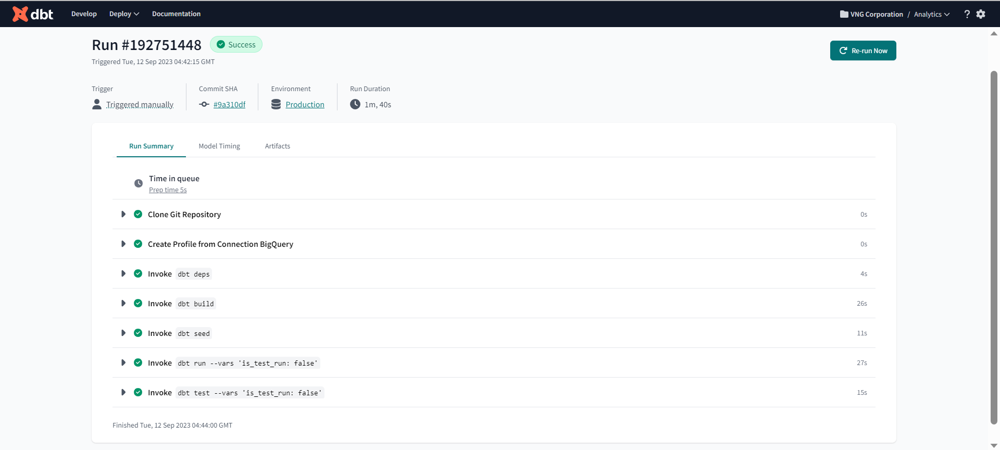

# Week 4: Analytics Engineering

This week, we’ll dive into Analytics Engineering.

We’ll cover:

- Basics of analytics engineering
- [dbt Labs](https://www.linkedin.com/company/dbtlabs/) (data build tool)
- Testing and documenting
- Deployment to the cloud and locally
- Visualizing the data with Google Data Studio and [Metabase](https://www.linkedin.com/company/metabase/)

**Goal**: Transforming the data loaded in DWH to Analytical Views developing a [dbt
project](https://github.com/DataTalksClub/data-engineering-zoomcamp/blob/main/week_4_analytics_engineering/taxi_rides_ny/README.md).


# Materials

See
[week_4\_analytics_engineering](https://github.com/DataTalksClub/data-engineering-zoomcamp/tree/main/week_4_analytics_engineering)
on GitHub and
[slides](https://docs.google.com/presentation/d/1xSll_jv0T8JF4rYZvLHfkJXYqUjPtThA/edit?usp=sharing&ouid=114544032874539580154&rtpof=true&sd=true)

Youtube videos:

- [DE Zoomcamp 4.1.1 - Analytics Engineering Basics](https://www.youtube.com/watch?v=uF76d5EmdtU)
- [DE Zoomcamp 4.1.2 - What is dbt](https://www.youtube.com/watch?v=4eCouvVOJUw)
- [DE Zoomcamp 4.2.1 - Start Your dbt Project: BigQuery and dbt Cloud (Alternative
  A)](https://www.youtube.com/watch?v=iMxh6s_wL4Q)
- [DE Zoomcamp 4.2.2 - Start Your dbt Project: Postgres and dbt Core Locally (Alternative
  B)](https://www.youtube.com/watch?v=1HmL63e-vRs)
- [DE Zoomcamp 4.3.1 - Build the First dbt Models](https://www.youtube.com/watch?v=UVI30Vxzd6c) (✦ see note below)
- [DE Zoomcamp 4.3.2 - Testing and Documenting the Project](https://www.youtube.com/watch?v=UishFmq1hLM) (✦ see note
  below)
- [DE Zoomcamp 4.4.1 - Deployment Using dbt Cloud (Alternative A)](https://www.youtube.com/watch?v=rjf6yZNGX8I)
- [DE Zoomcamp 4.4.2 - Deployment Using dbt Locally (Alternative B)](https://www.youtube.com/watch?v=Cs9Od1pcrzM)
- [DE Zoomcamp 4.5.1 - Visualising the data with Google Data Studio (Alternative
  A)](https://www.youtube.com/watch?v=39nLTs74A3E)
- [DE Zoomcamp 4.5.2 - Visualising the data with Metabase (Alternative B)](https://www.youtube.com/watch?v=BnLkrA7a6gM)

**✦ Note**: These videos are shown entirely on dbt cloud IDE but the same steps can be followed locally on the IDE of
your choice.

## Prerequisites

### Datasets

- A running warehouse (BigQuery or postgres)
- A set of running pipelines ingesting the project dataset: Taxi Rides NY dataset
  - Yellow taxi data - Years 2019 and 2020 - first half of years
  - Green taxi data - Years 2019 and 2020 - first half of years
- Data can be found here: <https://github.com/DataTalksClub/nyc-tlc-data>

### Setting up dbt for using BigQuery (Alternative A - preferred)

You will need to create a dbt cloud account using [this link](https://www.getdbt.com/signup/) and connect to your
warehouse [following these
instructions](https://docs.getdbt.com/docs/dbt-cloud/cloud-configuring-dbt-cloud/cloud-setting-up-bigquery-oauth). More
detailed instructions in
[dbt_cloud_setup.md](https://github.com/DataTalksClub/data-engineering-zoomcamp/blob/main/week_4_analytics_engineering/dbt_cloud_setup.md).

### Setting up dbt for using Postgres locally (Alternative B)

As an alternative to the cloud, that require to have a cloud database, you will be able to run the project installing
dbt locally. You can follow the [official dbt documentation](https://docs.getdbt.com/dbt-cli/installation) or use a
docker image from official [dbt repo](https://github.com/dbt-labs/dbt/). You will need to install the latest version
(1.0) with the postgres adapter (dbt-postgres). After local installation you will have to set up the connection to PG in
the `profiles.yml`, you can find the templates
[here](https://docs.getdbt.com/reference/warehouse-profiles/postgres-profile).

## What I did to set my tools

**Note**: For the remainder of these notes, I have chosen to continue (or focus more on) with BigQuery, i.e. alternative
A.

### Setup environment

<div class="formalpara-title">

**File `requirements.txt`**

</div>

``` txt
pandas
pydantic
prefect
prefect-sqlalchemy
prefect-gcp[cloud_storage]
protobuf
pyarrow
pandas-gbq
psycopg2-binary
sqlalchemy
```

Use conda to create a working environment `de-zoomcamp`

``` bash
conda create -n de-zoomcamp python=3.9
conda activate de-zoomcamp
pip install -r requirements.txt
```

Now run the script `web_to_gcs.py` to download the data from [here](https://github.com/DataTalksClub/nyc-tlc-data) (for convinience, we only need first half of each year) and ingest it into Google Bucket.


**File `web_to_gcs.py`**

``` python
from pathlib import Path
import pandas as pd
from prefect import flow, task
from prefect_gcp.cloud_storage import GcsBucket
from random import randint

"""
Pre-reqs: 
1. `pip install pandas pyarrow google-cloud-storage`
2. Set GOOGLE_APPLICATION_CREDENTIALS to your project/service-account key
3. Set GCP_GCS_BUCKET as your bucket or change default value of BUCKET
"""

# services = ['fhv','green','yellow']
init_url = 'https://github.com/DataTalksClub/nyc-tlc-data/releases/download/'
# switch out the bucketname
BUCKET = os.environ.get("GCP_GCS_BUCKET", "prefect-de-zoomcamp-hauct")

@task(retries=3, log_prints=True)
def fetch(dataset_url: str) -> pd.DataFrame:
    df = pd.read_csv(dataset_url, compression='gzip')
    return df

@task(log_prints=True)
def clean(color: str, df: pd.DataFrame) -> pd.DataFrame:
    """
    yellow 2019
    VendorID                   int64
    tpep_pickup_datetime      object (green=lpep_pickup_datetime)
    tpep_dropoff_datetime     object (green=lpep_dropoff_datetime)
    passenger_count            int64
    trip_distance            float64
    RatecodeID                 int64
    store_and_fwd_flag        object
    PULocationID               int64
    DOLocationID               int64
    payment_type               int64
    fare_amount              float64
    extra                    float64
    mta_tax                  float64
    tip_amount               float64
    tolls_amount             float64
    improvement_surcharge    float64
    total_amount             float64
    congestion_surcharge     float64

    yellow 2020
    VendorID                 float64 (2019=int64)
    tpep_pickup_datetime      object (green=lpep_pickup_datetime)
    tpep_dropoff_datetime     object (green=lpep_dropoff_datetime)
    passenger_count          float64 (2019=int64)
    trip_distance            float64
    RatecodeID               float64 (2019=int64)
    store_and_fwd_flag        object
    PULocationID               int64
    DOLocationID               int64
    payment_type             float64 (2019=int64)
    fare_amount              float64
    extra                    float64
    mta_tax                  float64
    tip_amount               float64
    tolls_amount             float64
    improvement_surcharge    float64
    total_amount             float64
    congestion_surcharge     float64

    green 2019
    VendorID                   int64
    lpep_pickup_datetime      object
    lpep_dropoff_datetime     object
    store_and_fwd_flag        object
    RatecodeID                 int64
    PULocationID               int64
    DOLocationID               int64
    passenger_count            int64
    trip_distance            float64
    fare_amount              float64
    extra                    float64
    mta_tax                  float64
    tip_amount               float64
    tolls_amount             float64
    ehail_fee                float64
    improvement_surcharge    float64
    total_amount             float64
    payment_type               int64
    trip_type                  int64
    congestion_surcharge     float64

    green 2020
    VendorID                 float64 (2019=int64)
    lpep_pickup_datetime      object
    lpep_dropoff_datetime     object
    store_and_fwd_flag        object
    RatecodeID               float64 (2019=int64)
    PULocationID               int64
    DOLocationID               int64
    passenger_count          float64 (2019=int64)
    trip_distance            float64
    fare_amount              float64
    extra                    float64
    mta_tax                  float64
    tip_amount               float64
    tolls_amount             float64
    ehail_fee                float64
    improvement_surcharge    float64
    total_amount             float64
    payment_type             float64 (2019=int64)
    trip_type                float64 (2019=int64)
    congestion_surcharge     float64
    """

    if color == "yellow":
        """Fix dtype issues"""
        df["tpep_pickup_datetime"] = pd.to_datetime(df["tpep_pickup_datetime"])
        df["tpep_dropoff_datetime"] = pd.to_datetime(df["tpep_dropoff_datetime"])

    if color == "green":
        """Fix dtype issues"""
        df["lpep_pickup_datetime"] = pd.to_datetime(df["lpep_pickup_datetime"])
        df["lpep_dropoff_datetime"] = pd.to_datetime(df["lpep_dropoff_datetime"])
        df["trip_type"] = df["trip_type"].astype('Int64')

    if color == "yellow" or color == "green":
        df["VendorID"] = df["VendorID"].astype('Int64')
        df["RatecodeID"] = df["RatecodeID"].astype('Int64')
        df["PULocationID"] = df["PULocationID"].astype('Int64')
        df["DOLocationID"] = df["DOLocationID"].astype('Int64')
        df["passenger_count"] = df["passenger_count"].astype('Int64')
        df["payment_type"] = df["payment_type"].astype('Int64')

    print(f"rows: {len(df)}")
    return df

@task(log_prints=True)
def write_local(color: str, year: str, month:str) -> str:
    file_name = f"{color}_tripdata_{year}-{month}.csv.gz"

    # download it using requests via a pandas df
    request_url = f"{init_url}{color}/{file_name}"
    r = requests.get(request_url)
    open(file_name, 'wb').write(r.content)
    print(f"Local: {file_name}")
    return file_name

@task(log_prints=True)
def upload_to_gcs(bucket: str, object_name: str, local_file: str) -> None:
    """
    Ref: https://cloud.google.com/storage/docs/uploading-objects#storage-upload-object-python
    """
    # # WORKAROUND to prevent timeout for files > 6 MB on 800 kbps upload speed.
    # # (Ref: https://github.com/googleapis/python-storage/issues/74)
    storage.blob._MAX_MULTIPART_SIZE = 5 * 1024 * 1024  # 5 MB
    storage.blob._DEFAULT_CHUNKSIZE = 5 * 1024 * 1024  # 5 MB

    client = storage.Client()
    bucket = client.bucket(bucket)
    blob = bucket.blob(object_name)
    blob.upload_from_filename(local_file)

@flow()
def etl_web_to_gcs() -> None:
    """The main ETL function"""
    colors = ["yellow", "green"]
    years = ['2019', '2020']

    for color in colors:
        for year in years:
            # Only take first half of a year
            for i in range(6):
                month = '0'+str(i+1)
                month = month[-2:] 

                dataset_url = write_local(color, year, month)

                df = fetch(dataset_url)
                df_clean = clean(color, df)

                dataset_url = dataset_url.replace('.csv.gz', '.parquet')
                df_clean.to_parquet(dataset_url, engine='pyarrow')

                upload_to_gcs(BUCKET, f"data/{color}/{dataset_url}", dataset_url)
                print(f"GCS: {color}/{dataset_url}")

if __name__ == "__main__":
    etl_web_to_gcs()
```

**Note**: Please make sure you 've already set your project id on Google CLI and set your GCP Bucket & GCP Credentials on Prefect UI. If not, check week 2


After running nicely done, we will have our data on Google Bucket


Then, in BigQuery, I created the tables `yellow_tripdata` and `green_tripdata` like this.


I now see the two tables under `trips_data_all`.


To check if everything is correct, I counted the number of rows of each of the tables.

``` sql
SELECT COUNT(*) FROM `ny-rides-alexey-396910.trips_data_all.yellow_tripdata`;
--- 61,306,914

SELECT COUNT(*) FROM `ny-rides-alexey-396910.trips_data_all.green_tripdata`;
--- 4,523,925
```

**IMPORTANT NOTE:**: Sometime the table created on BigQuery doesn't have same schema as parquet on Google Bucket , so you need to re-create a copy table, with edited schema. For example, use this sql script

```SQL
CREATE TABLE `ny-rides-alexey-396910.trips_data_all.yellow_tripdata_copy` AS
SELECT
  VendorID,
  TIMESTAMP_SECONDS(CAST(tpep_pickup_datetime/1000000000 AS INT64)) AS tpep_pickup_datetime,
  TIMESTAMP_SECONDS(CAST(tpep_dropoff_datetime/1000000000 AS INT64)) AS tpep_dropoff_datetime,
  passenger_count,
  trip_distance,				
  RatecodeID,
  store_and_fwd_flag,
  PULocationID,
  DOLocationID,
  payment_type,
  fare_amount,
  extra,
  mta_tax,
  tip_amount,
  tolls_amount,
  improvement_surcharge,
  total_amount,
  congestion_surcharge
FROM
  `ny-rides-alexey-396910.trips_data_all.yellow_tripdata`;
```

### Setting up dbt with BigQuery (Alternative A)

On September 8, 2023, I created a free dbt account with BigQuery. Then I followed the instructions in this file
([dbt_cloud_setup.md](https://github.com/DataTalksClub/data-engineering-zoomcamp/blob/main/week_4_analytics_engineering/dbt_cloud_setup.md)).

In order to connect we need the service account JSON file generated from bigquery:

**Step 1**: Open the [BigQuery credential wizard](https://console.cloud.google.com/apis/credentials/wizard) to create a
service account in your taxi project

- **Select an API**: BigQuery API
- **What data will you be accessing?**: Application data
- **Are you planning to use this API with Compute Engine…​?** No, I’n not using them
- **Service account details**: dbt-service-account
- **Service account ID**: dbt-service-account (Email address:
  <dbt-service-account@hopeful-summer-375416.iam.gserviceaccount.com>)
- **Service account description**: Service account for dbt cloud
- **Role**: BigQuery Data Editor
- **Role**: BigQuery Job User
- **Role**: BigQuery User
- **Role**: BigQuery Admin

Click on **DONE** button.

I reuse the json file (`ny-rides-alexey-396910-e520f0a301d7.json`) created in the previous weeks.

Go to web page [dbt](https://www.getdbt.com/), login your dbt account and select `BigQuery` connection, upload your json file here

|                                     |                                          |
|-------------------------------------|------------------------------------------|
||     |

## Introduction to analytics engineering

### What is Analytics Engineering?

Roles in a data team:

- Data Engineer: Prepares and maintain the infrastructure the data team needs.
- Analytics Engineer: Introduces the good software engineering practices to the efforts of data analysts and data
  scientists
- Data Analyst: Uses data to answer questions and solve problems.

Tooling:

1. Data Loading
2. Data Storing (Cloud data warehouses like [Snowflake](https://www.snowflake.com/en/),
    [Bigquery](https://cloud.google.com/bigquery), [Redshift](https://aws.amazon.com/fr/redshift/))
3. Data modelling (Tools like dbt or Dataform)
4. Data presentation (BI tools like google data studio, [Looker](https://www.looker.com/), [Mode](https://mode.com/) or
    Tableau)

### Data Modelling concepts

In the ELP approach, we will transform the data once the date is already in the data warehouse.

<table>
<tr><td>

</td><td>

</td></tr>
</table>

**ETL vs ELT**

- ETL
  - Slightly more stable and compliant data analysis
  - Higher storage and compute costs
- ELT
  - Faster and more flexible data analysis.
  - Lower cost and lower maintenance

### Kimball’s Dimensional Modeling

- Objective
  - Deliver data understandable to the business users
  - Deliver fast query performance
- Approach
  - Prioritise user understandability and query performance over non redundant data (3NF)
- Other approaches
  - Bill Inmon
  - Data vault

### Elements of Dimensional Modeling

- Facts tables
  - Measurements, metrics or facts
  - Corresponds to a business *process*
  - "verbs"
- Dimensions tables
  - Corresponds to a business *entity*
  - Provides context to a business process
  - "nouns"


### Architecture of Dimensional Modeling

- Stage Area
  - Contains the raw data
  - Not meant to be exposed to everyone
- Processing area
  - From raw data to data models
  - Focuses in efficiency
  - Ensuring standards
- Presentation area
  - Final presentation of the data
  - Exposure to business stakeholder

## What is dbt?

[dbt](https://docs.getdbt.com/docs/introduction) is a transformation tool that allows anyone that knows SQL to deploy
analytics code following software engineering best practices like modularity, portability, CI/CD, and documentation.

### How does dbt work?


- Each model is:
  - A `*.sql` file
  - Select statement, no DDL (*Data Definition Language*) or DML (*Data Manipulation Language*)
  - A file that dbt will compile and run in our DWH (*Data warehouse*)

### How to use dbt?

- **dbt Core**: Open-source project that allows the data transformation.
  - Builds and runs a dbt project (.sql and .yml files)
  - Includes SQL compilation logic, macros and database adapters
  - Includes a CLI (*Command Line Interface*) interface to run dbt commands locally
  - Opens source and free to use
- **dbt Cloud**: SaaS (*Software As A Service*) application to develop and manage dbt projects.
  - Web-based IDE (*Integrated Development Environment*) to develop, run and test a dbt project
  - Jobs orchestration
  - Logging and Alerting
  - Integrated documentation
  - Free for individuals (one developer seat)

### How are we going to use dbt?

- **BigQuery (Alternative A)**:
  - Development using cloud IDE
  - No local installation of dbt core
- **Postgres (Alternative B)**:
  - Development using a local IDE of your choice.
  - Local installation of dbt core connecting to the Postgres database
  - Running dbt models through the CLI

At the end, our project will look like this.


## Starting a dbt project

### Create a new dbt project

dbt provides an [starter project](https://github.com/dbt-labs/dbt-starter-project) with all the basic folders and files.

**Starter project structure**

``` txt
taxi_rides_ny/
  analyses/
  macros/
  models/example/
  snapshots/
  seeds/
  tests/
  .gitignore
  README.md
  dbt_project.yml
```

**Example of `dbt_project.yml`**

``` yaml
name: 'taxi_rides_ny'
version: '1.0.0'
config-version: 2

# This setting configures which "profile" dbt uses for this project.
profile: 'pg-dbt-workshop'  # Using Postgres + dbt core (locally) (Alternative B)
profile: 'default'          # Using BigQuery + dbt cloud (Alternative A)

# These configuration specify where dbt should look for different types of files.
# The `source-paths` config, for example, states that models in this project can be
# found in the "models/" directory. You probably win't need to change these!
model-paths: ["models"]
analysis-paths: ["analyses"]
test-paths: ["tests"]
seed-paths: ["seeds"]
macro-paths: ["macros"]
snapshot-paths: ["snapshots"]

target-path: "target"  # directory which will store compiled SQL files
clean-targets:         # directories to be removed by `dbt clean`
    - "target"
    - "dbt_packages"

# Configuring models
# Full decumentation: https://docs.getdbt.com/reference/model-configs

# In this example config, we tell dbt to build all models in the example/ directory
# as tables. These settings can be overridden in the individual model files
# using the `{{ config(...) }}` macro.
models:
    taxi_rides_ny:
        # Applies to all files under models/.../
        staging:
            materialized: view
        core:
            materialized: table
vars:
    payment_type_values: [1, 2, 3, 4, 5, 6]
```

See [About dbt projects](https://docs.getdbt.com/docs/build/projects) for more.

## With the CLI

### Using BigQuery + dbt cloud (Alternative A)

On Google Cloud, under BigQuery section, we should have these datasets. Under `trips_data_all`, we should see
`green_tripdata` and `yellow_tripdata`.


On DBT UI, our working respo is `week_4_taxi-rides-ny`, and we also need to click on **Initialize your project** button. All of necessary folders are created.


To be able to modify the files, you must first create a new branch and switch to it.

We should change `dbt_project.yml` file like this.

**File `dbt_project.yml`**

``` yaml
name: 'taxi_rides_ny'
version: '1.0.0'
config-version: 2

# This setting configures which "profile" dbt uses for this project.
profile: 'pg-dbt-workshop'  # Using Postgres + dbt core (locally) (Alternative B)
profile: 'default'          # Using BigQuery + dbt cloud (Alternative A)

# These configuration specify where dbt should look for different types of files.
# The `source-paths` config, for example, states that models in this project can be
# found in the "models/" directory. You probably win't need to change these!
model-paths: ["models"]
analysis-paths: ["analyses"]
test-paths: ["tests"]
seed-paths: ["seeds"]
macro-paths: ["macros"]
snapshot-paths: ["snapshots"]

target-path: "target"  # directory which will store compiled SQL files
clean-targets:         # directories to be removed by `dbt clean`
    - "target"
    - "dbt_packages"

# Configuring models
# Full decumentation: https://docs.getdbt.com/reference/model-configs

# In this example config, we tell dbt to build all models in the example/ directory
# as tables. These settings can be overridden in the individual model files
# using the `{{ config(...) }}` macro.
models:
    taxi_rides_ny:
        # Applies to all files under models/.../
        staging:
            materialized: view
        core:
            materialized: table
vars:
    payment_type_values: [1, 2, 3, 4, 5, 6]
```

- Name of the project: `taxi_rides_ny`.
- Name of the model: `taxi_rides_ny`.

## Build the first dbt models

### Anatomy of a dbt model

**Anatomy of a dbt model**


In dbt, you can combine SQL with [Jinja](https://jinja.palletsprojects.com/), a templating language.

Using Jinja turns our dbt project into a programming environment for SQL, giving you the ability to do things that
aren’t normally possible in SQL (ie. evaluate an expression, variable or function call or print the result into the
template).

See [Jinja and macros](https://docs.getdbt.com/docs/build/jinja-macros) for more.

Materializations are strategies for persisting dbt models in a warehouse. There are four types of materializations built
into dbt. They are:

- table (most common)
- view (most common)
- incremental (useful for data that doesn’t really change every day)
- ephemeral ()

By default, dbt models are materialized as "views". Models can be configured with a different materialization by
supplying the `materialized` configuration parameter.

Materializations can be configured by default in `dbt-project.yml` or directly inside of the model `sql` files.

``` sql
{{ config(materialized='table') }}

select *
from ...
```

See [Materializations](https://docs.getdbt.com/docs/build/materializations) for more.

### The FROM clause of a dbt model

#### Sources

Sources make it possible to name and describe the data loaded into your warehouse by your Extract and Load tools.

- The data loaded to our dwh that we use as sources for our models
- Configuration defined in the yml files in the models folder
- Used with the source macro that will resolve the name to the right schema, plus build the dependencies automatically
- Source freshness can be defined and tested

See [Sources](https://docs.getdbt.com/docs/build/sources) for more.

**Example from file `models/staging/schema.yml`**

``` yaml
sources:
    - name: staging
      database: ny-rides-alexey-396910  # For bigquery
      schema: trips_data_all

      # loaded_at_field: record_loaded_at
      tables:
        - name: green_tripdata
        - name: yellow_tripdata
          freshness:
            error_after: {count: 6, period: hour}
```
Explanation of the DBT configuration in models/staging/schema.yml:

1. `sources`: This keyword signifies the start of the data source definition block.

2. "name: staging": The name of the source is specified as "staging".

3. "database: ny-rides-alexey-396910": This refers to the name of the database where the source data is stored. In this case, the data resides in a BigQuery project named "ny-rides-alexey-396910".

4. "schema: trips_data_all": This indicates the schema (or dataset in BigQuery's terminology) which houses the tables pertaining to this source.

5. "tables": Lists the tables that are part of the "staging" source. 
   - "name: green_tripdata": Defines a table in the source named "green_tripdata".
   - "name: yellow_tripdata": Specifies another table called "yellow_tripdata" within the source.

6. "freshness": This section relates to the "freshness" test for the data.
   - "error_after: {count: 6, period: hour}": This line sets a freshness constraint for the "yellow_tripdata" table. If the data in this table hasn't been updated in the last 6 hours, DBT will generate an error when executing the freshness test (`dbt source freshness`).

In summary, this configuration sets up a data source named "staging" from the BigQuery database "ny-rides-alexey-396910" and schema "trips_data_all". Within this source, two tables, "green_tripdata" and "yellow_tripdata", are identified. A freshness test is established for the "yellow_tripdata" table, requiring updates at least every 6 hours. Otherwise, DBT will flag this as an error during testing.


The code below keeps only the first row of duplicates with the condition `where rn = 1`. See [4 Ways to Check for
Duplicate Rows in SQL Server](https://database.guide/4-ways-to-check-for-duplicate-rows-in-sql-server/).

**Example from file `models/staging/stg_green_tripdata.sql`**

``` sql
with tripdata as
(
  select *,
    row_number() over(partition by vendorid, lpep_pickup_datetime) as rn
  from {{ source('staging','green_tripdata') }}
  where vendorid is not null
)
```

#### Seeds

Seeds are CSV files in your dbt project (typically in your `seeds` directory), that dbt can load into your data
warehouse using the `dbt seed` command.

- CSV files stored in our repository under the seed folder
- Benefits of version controlling
- Equivalent to a copy command
- Recommended for data that doesn’t change frequently
- Runs with `dbt seed -s file_name`

See [Seeds](https://docs.getdbt.com/docs/build/seeds) for more.

**Example `taxi_zone_loopup.csv`**

``` csv
"locationid","borough","zone","service_name"
...
```

**Example `models/core/dim_zones.sql`**

``` sql
select
    locationid,
    borough,
    zone,
    replace(service_zone,'Boro','Green') as service_zone
from {{ ref('taxi_zone_lookup') }}
```

#### Ref

The most important function in dbt is `ref()`; it’s impossible to build even moderately complex models without it.
`ref()` is how you reference one model within another. This is a very common behavior, as typically models are built to
be "stacked" on top of one another.

- Macro to reference the underlying tables and views that were building the data warehouse
- Run the same code in any environment, it will resolve the correct schema for you
- Dependencies are built automatically

See [ref](https://docs.getdbt.com/reference/dbt-jinja-functions/ref) for more.

**dbt model (`models/core/fact_trips.sql`)**

``` sql
with green_data as (
    select *,
        'Green' as service_type
    from {{ ref('stg_green_tripdata') }}
)
```

This model will be translated in compiled code.

**Compiled code**

``` sql
with green_data as (
    select *,
        'Green' as service_type
    from "production"."dbt_aboisvert"."stg_green_tripdata"
),
```

### Create our first dbt model

Create these folders and files under the dbt project `taxi_rides_ny` :

- `models/core`
- `models/staging`
  - `schema.yml`
  - `stg_green_tripdata.sql`

**File `models/staging/schema.yml`**

``` yaml
version: 2

sources:
    - name: staging
      # database: taxi-rides-ny-339813
      database: hopeful-summer-375416
      schema: trips_data_all

      tables:
        - name: green_tripdata
        - name: yellow_tripdata
```

**File `models/staging/stg_green_tripdata.sql`**

``` txt
{{ config(materialized="view") }}

select * from {{ source('staging', 'green_tripdata') }}
limit 100
```


Now, we can run this model with one of these following commands:

``` bash
dbt run  # Builds models in your target database.
dbt run --select stg_green_tripdata  # Builds a specific model.
dbt run --select stg_green_tripdata+  # Builds a specific model and its children.
dbt run --select +stg_green_tripdata  # Builds a specific model and its ancestors.
dbt run --select +stg_green_tripdata+  # Builds a specific model and its children and ancestors.
```

This is what appears in dbt Cloud after running the command `dbt run`.


Then we modify the query `models/staging/stg_green_tripdata.sql` by indicating the columns.

**File `models/staging/stg_green_tripdata.sql`**

``` txt
{{ config(materialized="view") }}

select
    -- identifiers
    cast(vendorid as integer) as vendorid,
    cast(ratecodeid as integer) as ratecodeid,
    cast(pulocationid as integer) as  pickup_locationid,
    cast(dolocationid as integer) as dropoff_locationid,

    -- timestamps
    cast(lpep_pickup_datetime as timestamp) as pickup_datetime,
    cast(lpep_dropoff_datetime as timestamp) as dropoff_datetime,

    -- trip info
    store_and_fwd_flag,
    cast(passenger_count as integer) as passenger_count,
    cast(trip_distance as numeric) as trip_distance,
    cast(trip_type as integer) as trip_type,

    -- payment info
    cast(fare_amount as numeric) as fare_amount,
    cast(extra as numeric) as extra,
    cast(mta_tax as numeric) as mta_tax,
    cast(tip_amount as numeric) as tip_amount,
    cast(tolls_amount as numeric) as tolls_amount,
    cast(ehail_fee as numeric) as ehail_fee,
    cast(improvement_surcharge as numeric) as improvement_surcharge,
    cast(total_amount as numeric) as total_amount,
    cast(payment_type as integer) as payment_type,
    cast(congestion_surcharge as numeric) as congestion_surcharge

from {{ source('staging', 'green_tripdata') }}
limit 100
```

Then we go to BigQuery and we see that the view `stg_green_tripdata` is created.


### Macros

[Macros](https://docs.getdbt.com/docs/build/jinja-macros#macros) in Jinja are pieces of code that can be reused multiple
times – they are analogous to "functions" in other programming languages, and are extremely useful if you find yourself
repeating code across multiple models. Macros are defined in `.sql` files, typically in your `macros` directory
([docs](https://docs.getdbt.com/reference/project-configs/macro-paths)).

- Use control structures (e.g. if statements and for loops) in SQL
- Use environment variables in your dbt project for production deployments
- Operate on the results of one query to generate another query
- Abstract snippets of SQL into reusable macros — these are analogous to functions in most programming languages.

Create these folders and files under `taxi_rides_ny`:

- `macros`
  - `get_payment_type_description.sql`

**Definition of the macro (`macros/get_payment_type_description.sql`)**

``` sql
{#
    This macro returns the description of the payment_type
#}



    case {{ payment_type }}
        when 1 then 'Credit card'
        when 2 then 'Cash'
        when 3 then 'No charge'
        when 4 then 'Dispute'
        when 5 then 'Unknown'
        when 6 then 'Voided trip'
    end


```

**Usage of the macro (`models/staging/stg_green_tripdata.sql`)**

``` sql
{{ config(materialized="view") }}

select
    -- identifiers
    cast(vendorid as integer) as vendorid,
    cast(ratecodeid as integer) as ratecodeid,
    cast(pulocationid as integer) as  pickup_locationid,
    cast(dolocationid as integer) as dropoff_locationid,

    -- timestamps
    cast(lpep_pickup_datetime as timestamp) as pickup_datetime,
    cast(lpep_dropoff_datetime as timestamp) as dropoff_datetime,

    -- trip info
    store_and_fwd_flag,
    cast(passenger_count as integer) as passenger_count,
    cast(trip_distance as numeric) as trip_distance,
    cast(trip_type as integer) as trip_type,

    -- payment info
    cast(fare_amount as numeric) as fare_amount,
    cast(extra as numeric) as extra,
    cast(mta_tax as numeric) as mta_tax,
    cast(tip_amount as numeric) as tip_amount,
    cast(tolls_amount as numeric) as tolls_amount,
    cast(ehail_fee as numeric) as ehail_fee,
    cast(improvement_surcharge as numeric) as improvement_surcharge,
    cast(total_amount as numeric) as total_amount,
    cast(payment_type as integer) as payment_type,
    cast(congestion_surcharge as numeric) as congestion_surcharge,

    -- payment type description
    {{ get_payment_type_description('payment_type') }} as payment_type_description

from {{ source('staging', 'green_tripdata') }}
limit 100
```

Then run the command on dbt terminal

``` bash
dbt run --select stg_green_tripdata
```

After that, check your table on Big Query, you will see new column added


### Packages

dbt *packages* are in fact standalone dbt projects, with models and macros that tackle a specific problem area. As a dbt
user, by adding a package to your project, the package’s models and macros will become part of your own project

- Like libraries in other programming languages
- Standalone dbt projects, with models and macros that tackle a specific problem area.
- By adding a package to your project, the package’s models and macros will become part of your own project.
- Imported in the `packages.yml` file and imported by running `dbt deps`
- A list of useful packages can be find in [dbt package hub](https://hub.getdbt.com/).

See [Packages](https://docs.getdbt.com/docs/build/packages) for more.

**Specifications of the packages to import in the project (`packages.yml`)**

``` yaml
packages:
  - package: dbt-labs/dbt_utils
    version: 0.8.0
```

We should see this logs and a lot of folders and files created under `dbt_packages/dbt_utils`.

<table>
<tr><td>

</td><td>

</td></tr>
</table>

Let’s go back to the model.

**Usage of a macro from a package (`models/staging/stg_green_tripdata.sql`).**

**Usage of the packages (`models/staging/stg_green_tripdata.sql`)**

``` sql
{{ config(materialized="view") }}

select
    -- identifiers
    {{ dbt_utils.generate_surrogate_key(['vendorid', 'lpep_pickup_datetime']) }} as tripid,
    cast(vendorid as integer) as vendorid,
    cast(ratecodeid as integer) as ratecodeid,
    cast(pulocationid as integer) as  pickup_locationid,
    cast(dolocationid as integer) as dropoff_locationid,

    -- timestamps
    cast(lpep_pickup_datetime as timestamp) as pickup_datetime,
    cast(lpep_dropoff_datetime as timestamp) as dropoff_datetime,

    -- trip info
    store_and_fwd_flag,
    cast(passenger_count as integer) as passenger_count,
    cast(trip_distance as numeric) as trip_distance,
    cast(trip_type as integer) as trip_type,

    -- payment info
    cast(fare_amount as numeric) as fare_amount,
    cast(extra as numeric) as extra,
    cast(mta_tax as numeric) as mta_tax,
    cast(tip_amount as numeric) as tip_amount,
    cast(tolls_amount as numeric) as tolls_amount,
    cast(ehail_fee as numeric) as ehail_fee,
    cast(improvement_surcharge as numeric) as improvement_surcharge,
    cast(total_amount as numeric) as total_amount,
    cast(payment_type as integer) as payment_type,
    cast(congestion_surcharge as numeric) as congestion_surcharge,

    -- payment type description
    {{ get_payment_type_description('payment_type') }} as payment_type_description

from {{ source('staging', 'green_tripdata') }}
limit 100
```

`generate_surrogate_key` is a macro within the `dbt_utils` package that helps create a unique surrogate key based on one or more fields in a record. This macro employs a hashing algorithm to produce a unique value for each record based on the provided fields. This unique key is typically used in fact and dimension tables in a data warehouse architecture.

Here the compiled code.

**File `target/compiled/taxi_rides_ny/models/staging/stg_green_tripdata.sql`.**

``` sql
select
    -- identifiers
    to_hex(md5(cast(coalesce(cast(vendorid as
    string
), '') || '-' || coalesce(cast(lpep_pickup_datetime as
    string
), '') as
    string
))) as tripid,
    cast(vendorid as integer) as vendorid,
    cast(ratecodeid as integer) as ratecodeid,
...
```

Now, let’s run this with this command.

``` bash
dbt run --select stg_green_tripdata
```

After that, check on  Big Query, you will see a new column created


### Variables

dbt provides a mechanism, [variables](https://docs.getdbt.com/reference/dbt-jinja-functions/var), to provide data to
models for compilation. Variables can be used to [configure
timezones](https://github.com/dbt-labs/snowplow/blob/0.3.9/dbt_project.yml#L22), [avoid hardcoding table
names](https://github.com/dbt-labs/quickbooks/blob/v0.1.0/dbt_project.yml#L23) or otherwise provide data to models to
configure how they are compiled.

- Variables are useful for defining values that should be used across the project
- With a macro, dbt allows us to provide data to models for compilation
- To use a variable we use the `{{ var('…​') }}` function
- Variables can defined in two ways:
  - In the `dbt_project.yml` file
  - On the command line

See [Project variables](https://docs.getdbt.com/docs/build/project-variables) for more.

**Global variable we define under `dbt_project.yml`.**

``` yaml
vars:
  payment_type_values: [1, 2, 3, 4, 5, 6]
```

**Variable whose value we can change via CLI (`models/staging/stg_green_tripdata.sql`).**

``` sql
from {{ source('staging', 'green_tripdata') }}
where vendorid is not null

-- dbt build --m <model.sql> --var 'is_test_run: false'


  limit 100


```

Then, we can run the model.

``` bash
dbt build --model stg_green_tripdata --vars 'is_test_run: false'
```

We make the same changes for `models/staging/stg_yellow_tripdata.sql`.

**File `models/staging/stg_yellow_tripdata.sql`**

``` sql
{{ config(materialized='view') }}

select
   -- identifiers
    {{ dbt_utils.generate_surrogate_key(['vendorid', 'tpep_pickup_datetime']) }} as tripid,
    cast(vendorid as integer) as vendorid,
    cast(ratecodeid as integer) as ratecodeid,
    cast(pulocationid as integer) as  pickup_locationid,
    cast(dolocationid as integer) as dropoff_locationid,

    -- timestamps
    cast(tpep_pickup_datetime as timestamp) as pickup_datetime,
    cast(tpep_dropoff_datetime as timestamp) as dropoff_datetime,

    -- trip info
    store_and_fwd_flag,
    cast(passenger_count as integer) as passenger_count,
    cast(trip_distance as numeric) as trip_distance,
    -- yellow cabs are always street-hail
    1 as trip_type,

    -- payment info
    cast(fare_amount as numeric) as fare_amount,
    cast(extra as numeric) as extra,
    cast(mta_tax as numeric) as mta_tax,
    cast(tip_amount as numeric) as tip_amount,
    cast(tolls_amount as numeric) as tolls_amount,
    cast(0 as numeric) as ehail_fee,
    cast(improvement_surcharge as numeric) as improvement_surcharge,
    cast(total_amount as numeric) as total_amount,
    cast(payment_type as integer) as payment_type,
    cast(congestion_surcharge as numeric) as congestion_surcharge,
    {{ get_payment_type_description('payment_type') }} as payment_type_description,

from {{ source('staging', 'yellow_tripdata') }}
where vendorid is not null

-- dbt build --m <model.sql> --var 'is_test_run: false'


  limit 100



```
Now use `dbt run` because we have two models…​

``` bash
dbt run --vars 'is_test_run: false'
```

We should see this log and `stg_yellow_tripdata` created in BigQuery (we need to refresh the page).


### Seeds

The dbt [seed](https://docs.getdbt.com/reference/commands/seed) command will load `csv` files located in the seed-paths
directory of your dbt project into your data warehouse.

In our dbt cloud, create `seeds` folder, create the file `seeds/taxi_zone_lookup.csv` and paste in it the content of
that [csv file](https://raw.githubusercontent.com/DataTalksClub/data-engineering-zoomcamp/main/week_4_analytics_engineering/taxi_rides_ny/data/taxi_zone_lookup.csv).

After, run the command `dbt seed` to create table `taxi_zone_lookup` in BigQuery. We should have 265 lines.

We need to specify the data types of the csv file in `dbt_project.yml`.

**File `dbt_project.yml`**

``` yaml
seeds:
    taxi_rides_ny:
        taxi_zone_lookup:
            +column_types:
                locationid: numeric
```

If we slightly modify data (for example, change `1,"EWR","Newark Airport","EWR"` for `1,"NEWR","Newark Airport","EWR"`)
in the csv file, we can run the following command:

``` bash
dbt seed --full-refresh
```

We can see the change in the BigQuery table `taxi_zone_loopup`.


Then, create the file `models/core/dim_zones.sql`.

**File `models/core/dim_zones.sql`**

``` sql
{{ config(materialized='table') }}


select
    locationid,
    borough,
    zone,
    replace(service_zone,'Boro','Green') as service_zone
from {{ ref('taxi_zone_lookup') }}
```

Ideally, we want everything in the directory to be tables to have efficient queries.


Now, create the model `models/core/fact_trips.sql`.

**File `models/core/fact_trips.sql`**

``` sql
{{ config(materialized='table') }}

with green_data as (
    select *,
        'Green' as service_type
    from {{ ref('stg_green_tripdata') }}
),

yellow_data as (
    select *,
        'Yellow' as service_type
    from {{ ref('stg_yellow_tripdata') }}
),

trips_unioned as (
    select * from green_data
    union all
    select * from yellow_data
),

dim_zones as (
    select * from {{ ref('dim_zones') }}
    where borough != 'Unknown'
)
select
    trips_unioned.tripid,
    trips_unioned.vendorid,
    trips_unioned.service_type,
    trips_unioned.ratecodeid,
    trips_unioned.pickup_locationid,
    pickup_zone.borough as pickup_borough,
    pickup_zone.zone as pickup_zone,
    trips_unioned.dropoff_locationid,
    dropoff_zone.borough as dropoff_borough,
    dropoff_zone.zone as dropoff_zone,
    trips_unioned.pickup_datetime,
    trips_unioned.dropoff_datetime,
    trips_unioned.store_and_fwd_flag,
    trips_unioned.passenger_count,
    trips_unioned.trip_distance,
    trips_unioned.trip_type,
    trips_unioned.fare_amount,
    trips_unioned.extra,
    trips_unioned.mta_tax,
    trips_unioned.tip_amount,
    trips_unioned.tolls_amount,
    trips_unioned.ehail_fee,
    trips_unioned.improvement_surcharge,
    trips_unioned.total_amount,
    trips_unioned.payment_type,
    trips_unioned.payment_type_description,
    trips_unioned.congestion_surcharge
from trips_unioned
inner join dim_zones as pickup_zone
on trips_unioned.pickup_locationid = pickup_zone.locationid
inner join dim_zones as dropoff_zone
on trips_unioned.dropoff_locationid = dropoff_zone.locationid
```

We have this.


The `dbt run` command will create everything, except the seeds. we also want to run the seeds, we will use `dbt build`

<table>
<tr><td>

</td><td>

</td></tr>
</table>

The command `dbt build --select fast_trips` will only run the model `fact_trips`.

The command `dbt build --select +fast_trips` will run everything that `fact_trips` need. dbt already konws the
dependencies.

## Testing and documenting dbt models

### Tests

Tests are assertions you make about your models and other resources in your dbt project (e.g. sources, seeds and
snapshots). When you run dbt test, dbt will tell you if each test in your project passes or fails.

- Assumptions that we make about our data
- Tests in dbt are essentially a `select` sql query
- These assumptions get compiled to sql that returns the amount of failing records
- Test are defined on a column in the .yml file
- dbt provides basic tests to check if the column values are:
  - Unique
  - Not null
  - Accepted values
  - A foreign key to another table
- You can create your custom tests as queries

See [Tests](https://docs.getdbt.com/docs/build/tests) for more.

**Definition of basic tests in the .yml files (`models/staging/schema.yml`)**

``` yaml
sources:
    - name: staging
      database: ny-rides-alexey-396910  # For bigquery
      schema: trips_data_all

      # loaded_at_field: record_loaded_at
      tables:
        - name: green_tripdata
        - name: yellow_tripdata

models:
    - name: stg_green_tripdata
      description: >
        Trip made by green taxis, also known as boro taxis and street-hail liveries.
        Green taxis may respond to street hails,but only in the areas indicated in green on the
        map (i.e. above W 110 St/E 96th St in Manhattan and in the boroughs).
        The records were collected and provided to the NYC Taxi and Limousine Commission (TLC) by
        technology service providers. 
      columns:
          - name: tripid
            description: Primary key for this table, generated with a concatenation of vendorid+pickup_datetime
            tests:
                - unique:
                    severity: warn
                - not_null:
                    severity: warn
          - name: VendorID 
            description: > 
                A code indicating the TPEP provider that provided the record.
                1= Creative Mobile Technologies, LLC; 
                2= VeriFone Inc.
          - name: pickup_datetime 
            description: The date and time when the meter was engaged.
          - name: dropoff_datetime 
            description: The date and time when the meter was disengaged.
          - name: Passenger_count 
            description: The number of passengers in the vehicle. This is a driver-entered value.
          - name: Trip_distance 
            description: The elapsed trip distance in miles reported by the taximeter.
          - name: Pickup_locationid
            description: locationid where the meter was engaged.
            tests:
              - relationships:
                  to: ref('taxi_zone_lookup')
                  field: locationid
                  severity: warn
          - name: dropoff_locationid 
            description: locationid where the meter was engaged.
            tests:
              - relationships:
                  to: ref('taxi_zone_lookup')
                  field: locationid
          - name: RateCodeID 
            description: >
                The final rate code in effect at the end of the trip.
                  1= Standard rate
                  2=JFK
                  3=Newark
                  4=Nassau or Westchester
                  5=Negotiated fare
                  6=Group ride
          - name: Store_and_fwd_flag 
            description: > 
              This flag indicates whether the trip record was held in vehicle
              memory before sending to the vendor, aka “store and forward,”
              because the vehicle did not have a connection to the server.
                Y= store and forward trip
                N= not a store and forward trip
          - name: Dropoff_longitude 
            description: Longitude where the meter was disengaged.
          - name: Dropoff_latitude 
            description: Latitude where the meter was disengaged.
          - name: Payment_type 
            description: >
              A numeric code signifying how the passenger paid for the trip.
            tests: 
              - accepted_values:
                  values: "{{ var('payment_type_values') }}"
                  severity: warn
                  quote: false
          - name: payment_type_description
            description: Description of the payment_type code
          - name: Fare_amount 
            description: > 
              The time-and-distance fare calculated by the meter.
              Extra Miscellaneous extras and surcharges. Currently, this only includes
              the $0.50 and $1 rush hour and overnight charges.
              MTA_tax $0.50 MTA tax that is automatically triggered based on the metered
              rate in use.
          - name: Improvement_surcharge 
            description: > 
              $0.30 improvement surcharge assessed trips at the flag drop. The
              improvement surcharge began being levied in 2015.
          - name: Tip_amount 
            description: > 
              Tip amount. This field is automatically populated for credit card
              tips. Cash tips are not included.
          - name: Tolls_amount 
            description: Total amount of all tolls paid in trip.
          - name: Total_amount 
            description: The total amount charged to passengers. Does not include cash tips.

    - name: stg_yellow_tripdata
      description: > 
        Trips made by New York City's iconic yellow taxis. 
        Yellow taxis are the only vehicles permitted to respond to a street hail from a passenger in all five
        boroughs. They may also be hailed using an e-hail app like Curb or Arro.
        The records were collected and provided to the NYC Taxi and Limousine Commission (TLC) by
        technology service providers. 
      columns:
          - name: tripid
            description: Primary key for this table, generated with a concatenation of vendorid+pickup_datetime
            tests:
                - unique:
                    severity: warn
                - not_null:
                    severity: warn
          - name: VendorID 
            description: > 
                A code indicating the TPEP provider that provided the record.
                1= Creative Mobile Technologies, LLC; 
                2= VeriFone Inc.
          - name: pickup_datetime 
            description: The date and time when the meter was engaged.
          - name: dropoff_datetime 
            description: The date and time when the meter was disengaged.
          - name: Passenger_count 
            description: The number of passengers in the vehicle. This is a driver-entered value.
          - name: Trip_distance 
            description: The elapsed trip distance in miles reported by the taximeter.
          - name: Pickup_locationid
            description: locationid where the meter was engaged.
            tests:
              - relationships:
                  to: ref('taxi_zone_lookup')
                  field: locationid
                  severity: warn
          - name: dropoff_locationid 
            description: locationid where the meter was engaged.
            tests:
              - relationships:
                  to: ref('taxi_zone_lookup')
                  field: locationid
                  severity: warn
          - name: RateCodeID 
            description: >
                The final rate code in effect at the end of the trip.
                  1= Standard rate
                  2=JFK
                  3=Newark
                  4=Nassau or Westchester
                  5=Negotiated fare
                  6=Group ride
          - name: Store_and_fwd_flag 
            description: > 
              This flag indicates whether the trip record was held in vehicle
              memory before sending to the vendor, aka “store and forward,”
              because the vehicle did not have a connection to the server.
                Y= store and forward trip
                N= not a store and forward trip
          - name: Dropoff_longitude 
            description: Longitude where the meter was disengaged.
          - name: Dropoff_latitude 
            description: Latitude where the meter was disengaged.
          - name: Payment_type 
            description: >
              A numeric code signifying how the passenger paid for the trip.
            tests: 
              - accepted_values:
                  values: "{{ var('payment_type_values') }}"
                  severity: warn
                  quote: false
          - name: payment_type_description
            description: Description of the payment_type code
          - name: Fare_amount 
            description: > 
              The time-and-distance fare calculated by the meter.
              Extra Miscellaneous extras and surcharges. Currently, this only includes
              the $0.50 and $1 rush hour and overnight charges.
              MTA_tax $0.50 MTA tax that is automatically triggered based on the metered
              rate in use.
          - name: Improvement_surcharge 
            description: > 
              $0.30 improvement surcharge assessed trips at the flag drop. The
              improvement surcharge began being levied in 2015.
          - name: Tip_amount 
            description: > 
              Tip amount. This field is automatically populated for credit card
              tips. Cash tips are not included.
          - name: Tolls_amount 
            description: Total amount of all tolls paid in trip.
          - name: Total_amount 
            description: The total amount charged to passengers. Does not include cash tips.
```

**Warnings in the CLI from running `dbt test`.**


### Documentation

- dbt provides a way to generate documentation for your dbt project and render it as a website.
- The documentation for your project includes:
  - **Information about your project**:
    - Model code (both from the `.sql` file and compiled)
    - Model dependencies
    - Sources
    - Auto generated DAG from the ref and source macros
    - Descriptions (from `.yml` file) and tests
  - **Information about your data warehouse (information_schema)**:
    - Column names and data types
    - Table stats like size and rows

- `dbt docs` can also be hosted in dbt cloud

See [About documentation](https://docs.getdbt.com/docs/collaborate/documentation) for more.

**Example from `models/core/schema.yml`**

``` yaml
version: 2

models:
  - name: dim_zones
    description: >
      List of unique zones idefied by locationid.
      Includes the service zone they correspond to (Green or yellow).
  - name: fact_trips
    description: >
      Taxi trips corresponding to both service zones (Green and yellow).
      The table contains records where both pickup and dropoff locations are valid and known zones.
      Each record corresponds to a trip uniquely identified by tripid.

  - name: dm_monthly_zone_revenue
    description: >
      Aggregated table of all taxi trips corresponding to both service zones (Green and yellow) per pickup zone, month and service.
      The table contains monthly sums of the fare elements used to calculate the monthly revenue.
      The table contains also monthly indicators like number of trips, and average trip distance.
    columns:
      - name: revenue_monthly_total_amount
        description: Monthly sum of the the total_amount of the fare charged for the trip per pickup zone, month and service.
        tests:
            - not_null:
                severity: error
```

## Deploying a dbt project

We define a model in this file `models/core/dm_monthly_zone_revenue.sql`.

**File `models/core/dm_monthly_zone_revenue.sql`**

``` sql
{{ config(materialized='table') }}

with trips_data as (
    select * from {{ ref('fact_trips') }}
)
    select
    -- Reveneue grouping
    pickup_zone as revenue_zone,
    -- date_trunc('month', pickup_datetime) as revenue_month,
    -- Note: For BQ use instead: date_trunc(pickup_datetime, month) as revenue_month,
    date_trunc(pickup_datetime, month) as revenue_month,

    service_type,

    -- Revenue calculation
    sum(fare_amount) as revenue_monthly_fare,
    sum(extra) as revenue_monthly_extra,
    sum(mta_tax) as revenue_monthly_mta_tax,
    sum(tip_amount) as revenue_monthly_tip_amount,
    sum(tolls_amount) as revenue_monthly_tolls_amount,
    sum(ehail_fee) as revenue_monthly_ehail_fee,
    sum(improvement_surcharge) as revenue_monthly_improvement_surcharge,
    sum(total_amount) as revenue_monthly_total_amount,
    sum(congestion_surcharge) as revenue_monthly_congestion_surcharge,

    -- Additional calculations
    count(tripid) as total_monthly_trips,
    avg(passenger_count) as avg_montly_passenger_count,
    avg(trip_distance) as avg_montly_trip_distance

    from trips_data
    group by 1,2,3
```

Then, we add another section to define the model inside `models/staging/schema.yml`. This section is used in particular
to document the model and to add tests.

**File `models/staging/schema.yml`**

``` yaml
models:
    - name: stg_green_tripdata
      description: >
        Trip made by green taxis, also known as boro taxis and street-hail liveries.
        Green taxis may respond to street hails,but only in the areas indicated in green on the
        map (i.e. above W 110 St/E 96th St in Manhattan and in the boroughs).
        The records were collected and provided to the NYC Taxi and Limousine Commission (TLC) by
        technology service providers.
      columns:
          - name: tripid
            description: Primary key for this table, generated with a concatenation of vendorid+pickup_datetime
            tests:
                - unique:
                    severity: warn
                - not_null:
                    severity: warn
          - name: VendorID
            description: >
                A code indicating the TPEP provider that provided the record.
                1= Creative Mobile Technologies, LLC;
                2= VeriFone Inc.
          - name: pickup_datetime
            description: The date and time when the meter was engaged.
          - name: dropoff_datetime
            description: The date and time when the meter was disengaged.
          - name: Passenger_count
            description: The number of passengers in the vehicle. This is a driver-entered value.
          - name: Trip_distance
            description: The elapsed trip distance in miles reported by the taximeter.
          - name: Pickup_locationid
            description: locationid where the meter was engaged.
            tests:
              - relationships:
                  to: ref('taxi_zone_lookup')
                  field: locationid
                  severity: warn
          - name: dropoff_locationid
            description: locationid where the meter was engaged.
            tests:
              - relationships:
                  to: ref('taxi_zone_lookup')
                  field: locationid
          - name: RateCodeID
            description: >
                The final rate code in effect at the end of the trip.
                  1= Standard rate
                  2=JFK
                  3=Newark
                  4=Nassau or Westchester
                  5=Negotiated fare
                  6=Group ride
          - name: Store_and_fwd_flag
            description: >
              This flag indicates whether the trip record was held in vehicle
              memory before sending to the vendor, aka “store and forward,”
              because the vehicle did not have a connection to the server.
                Y= store and forward trip
                N= not a store and forward trip
          - name: Dropoff_longitude
            description: Longitude where the meter was disengaged.
          - name: Dropoff_latitude
            description: Latitude where the meter was disengaged.
          - name: Payment_type
            description: >
              A numeric code signifying how the passenger paid for the trip.
            tests:
              - accepted_values:
                  values: "{{ var('payment_type_values') }}"  
                  severity: warn
                  quote: false
          - name: payment_type_description
            description: Description of the payment_type code
          - name: Fare_amount
            description: >
              The time-and-distance fare calculated by the meter.
              Extra Miscellaneous extras and surcharges. Currently, this only includes
              the $0.50 and $1 rush hour and overnight charges.
              MTA_tax $0.50 MTA tax that is automatically triggered based on the metered
              rate in use.
          - name: Improvement_surcharge
            description: >
              $0.30 improvement surcharge assessed trips at the flag drop. The
              improvement surcharge began being levied in 2015.
          - name: Tip_amount
            description: >
              Tip amount. This field is automatically populated for credit card
              tips. Cash tips are not included.
          - name: Tolls_amount
            description: Total amount of all tolls paid in trip.
          - name: Total_amount
            description: The total amount charged to passengers. Does not include cash tips.
```

Then, we add another section to define the model inside `models/staging/schema.yml`. This section is used in particular
to document the model and to add tests.

**File `models/staging/schema.yml`**
```sql
with tripdata as
(
  select *,
    row_number() over(partition by vendorid, lpep_pickup_datetime) as rn
  from {{ source('staging','green_tripdata') }}
  where vendorid is not null
)

select
...
from tripdata
where rn = 1
```

**File `models/staging/stg_yellow_tripdata.sql`**

``` sql
with tripdata as
(
  select *,
    row_number() over(partition by vendorid, tpep_pickup_datetime) as rn
  from {{ source('staging','yellow_tripdata') }}
  where vendorid is not null
)
select
...
from tripdata
where rn = 1
```

Run `dbt build` command and everything should be green.


### What is deployment?

> 0:00/13:56 (4.4.1) Theory

Running dbt in production means setting up a system to run a *dbt job on a schedule*, rather than running dbt commands
manually from the command line.

In addition to setting up a schedule, there are other considerations when setting up dbt to run in production.

- Process of running the models we created in our development environment in a production environment
- Development and later deployment allows us to continue building models and testing them without affecting our
  production environment
- A deployment environment will normally have a different schema in our data warehouse and ideally a different user
- A development - deployment workflow will be something like:
  - Develop in a user branch
  - Open a PR to merge into the main branch
  - Merge the branch to the main branch
  - Run the new models in the production environment using the main branch
  - Schedule the models


See [About deployments](https://docs.getdbt.com/docs/deploy/deployments) for more.

### Running a dbt project in production

- dbt cloud includes a scheduler where to create jobs to run in production
- A single job can run multiple commands
- Jobs can be triggered manually or on schedule
- Each job will keep a log of the runs over time
- Each run will have the logs for each command
- A job could also generate documentation, that could be viewed under the run information
- If dbt source freshness was run, the results can also be viewed at the end of a job

### What is Continuous Integration (CI)?

- CI is the practice of regularly merge development branches into a central repository, after which automated builds and
  tests are run.
- The goal is to reduce adding bugs to the production code and maintain a more stable project.
- dbt allows us to enable CI on pull requests (PR)
- Enabled via webhooks from GitHub or GitLab
- When a PR is ready to be merged, a webhooks is received in dbt Cloud that will enqueue a new run of the specified job.
- The run of the CI job will be against a temporary schema
- No PR will be able to be merged unless the run has been completed successfully

### How to do this with dbt cloud (Alternative A)

In dbt cloud, commit **my-new-branch** and pull request. Next, in my GitHub repository
[taxi_rides_ny](https://github.com/hauct/week_4_taxi-rides-ny.git), I merge this pull request to my **main branch**.

Now go to **Environments** (**Deploy \> Environments**) and click on **Create Environment** button.

Create the new environment with this information:

- **Name**: Production
- **dbt Version**: 1.6 (latest)
- **Dataset**: production

Click on **Save** button.

<table>
<tr><td>

</td><td>

</td></tr>
</table>

Now go to **Jobs** (**Deploy \> Jobs**) and click on **Create New Job** button.

Create the new job with this information:

- **Job Name**: dbt build
- **Environment**: Production
- **dbt Version**: Inherited from Production (1.6 (latest))
- **Target Name**: default
- **Threads**: 4
- **Run Timeout**: 0
- **Generate docs on run**: Selected
- **Commands**:
  - `dbt seed`
  - `dbt run --vars 'is_test_run: false'`
  - `dbt test --vars 'is_test_run: false'`
- **Triggers**:
  - **Run on schedule**: Selected
  - Every day
  - Every 6 hours (starting at modnight UTC)

Under **Continous Integration (CI)** tab, we could select **Run on Pull Request** if we want to.

Click on **Save** button.

Let’s run this by clicking on **Run now** button.

**Run Overview**



We should see :

- **Run Timing** tab showing run steps
- **Model Timing** tab (unfortunately, the diagram does not appear)
- **Artifacts** tab showing all generated files
- **View Documentation** link showing the documentation in a beautiful website.

Under **Run Timing** tab, below the log for `dbt run --vars 'is_test_run: false'`.

✅ **Invoke** `dbt run --vars 'is_test_run: false'`

```txt
04:43:22 2 of 5 START sql view model production.stg_green_tripdata ...................... [RUN]
04:43:22 3 of 5 START sql view model production.stg_yellow_tripdata ..................... [RUN]
04:43:23 3 of 5 OK created sql view model production.stg_yellow_tripdata ................ [CREATE VIEW (0 processed) in 0.76s]
04:43:24 2 of 5 OK created sql view model production.stg_green_tripdata ................. [CREATE VIEW (0 processed) in 1.35s]
04:43:25 1 of 5 OK created sql table model production.dim_zones ......................... [CREATE TABLE (265.0 rows, 14.2 KiB processed) in 2.89s]
04:43:25 4 of 5 START sql table model production.fact_trips ............................. [RUN]
04:43:37 4 of 5 OK created sql table model production.fact_trips ........................ [CREATE TABLE (33.6m rows, 8.5 GiB processed) in 11.55s]
04:43:37 5 of 5 START sql table model production.dm_monthly_zone_revenue ................ [RUN]
04:43:41 5 of 5 OK created sql table model production.dm_monthly_zone_revenue ........... [CREATE TABLE (6.3k rows, 7.3 GiB processed) in 4.09s]
04:43:41  
04:43:41
04:43:41  Finished running 2 view models, 3 table models in 0 hours 0 minutes and 19.06 seconds (19.06s).
04:43:41  
04:43:41
04:43:41  Completed successfully
04:43:41  
04:43:41
04:43:41  Done. PASS=5 WARN=0 ERROR=0 SKIP=0 TOTAL=5
```

Under **Run Timing** tab, below the log for `dbt test --vars 'is_test_run: false'`.

✅ **Invoke** `dbt test --vars 'is_test_run: false'`

```txt
04:43:51 9 of 11 START test relationships_stg_yellow_tripdata_dropoff_locationid__locationid__ref_taxi_zone_lookup_  [RUN]
04:43:52 7 of 11 PASS relationships_stg_green_tripdata_dropoff_locationid__locationid__ref_taxi_zone_lookup_  [PASS in 1.61s]
04:43:52 10 of 11 START test unique_stg_green_tripdata_tripid ........................... [RUN]
04:43:52 5 of 11 PASS not_null_stg_yellow_tripdata_tripid ............................... [PASS in 2.60s]
04:43:52 11 of 11 START test unique_stg_yellow_tripdata_tripid .......................... [RUN]
04:43:53 10 of 11 PASS unique_stg_green_tripdata_tripid ................................. [PASS in 1.91s]
04:43:54 8 of 11 PASS relationships_stg_yellow_tripdata_Pickup_locationid__locationid__ref_taxi_zone_lookup_  [PASS in 3.05s]
04:43:55 9 of 11 PASS relationships_stg_yellow_tripdata_dropoff_locationid__locationid__ref_taxi_zone_lookup_  [PASS in 3.42s]
04:43:57 11 of 11 PASS unique_stg_yellow_tripdata_tripid ................................ [PASS in 4.98s]
04:43:57  
04:43:57
04:43:57  Finished running 11 tests in 0 hours 0 minutes and 9.03 seconds (9.03s).
04:43:57  
04:43:57
04:43:57  Completed successfully
04:43:57  
04:43:57
04:43:57  Done. PASS=11 WARN=0 ERROR=0 SKIP=0 TOTAL=11
```

<table>
<tr><td>

</td><td>

</td></tr>
</table>

Documentation

Go back to dbt cloud, go to **Account Settings**. Select the project **Analytics**. Under **Artifacts**, I could select the previous job.

Click on **Save** button. Now, I have the documentation of the project directly in dbt cloud.


## Visualize data with Looker Studio (Alternative A)

### Looker Studio (Google Data Studio)

Looker Studio, formerly Google Data Studio, is an online tool for converting data into customizable informative reports
and dashboards introduced by Google on March 15, 2016 as part of the enterprise Google Analytics 360 suite. In May 2016,
Google announced a free version of Data Studio for individuals and small teams. See
<https://en.wikipedia.org/wiki/Looker_Studio>.

Go to [Looker Studio](https://lookerstudio.google.com/u/0/) and follow these steps:

- Make sure you are in the correct Google account.
- Create a **Data sources**.
- Select **BigQuery**.
- **Authorize** Looker Studio to connect to your **BigQuery** projects.
- Select the project id `ny-rides-alexey`.
- Select dataset `production`.
- Select table `fact_trips`.
- Click on **CONNECT** button.

<table>
<tr><td>

</td><td>

</td></tr>
</table>

Changes default aggregations. Select **Sum** only for `passenger_count`.

We create 5 charts:

- A time series chart for **Amount of trip per day and service type**.
- Change default data range from **1 January 2019** to **31 December 2020**.
- A scorecard for **Total trips recorded**
- A pie chart for **Service type distribution**.
- A table for **Trips per pickup zone**.
- A stacked column bar for **Trips per month and year**.

You can check the dashboard [here](https://lookerstudio.google.com/s/r0OEwL_h-Sw)


## Advanced knowledge

- [Make a model
  Incremental](https://docs.getdbt.com/docs/building-a-dbt-project/building-models/configuring-incremental-models)
- [Use of tags](https://docs.getdbt.com/reference/resource-configs/tags)
- [Hooks](https://docs.getdbt.com/docs/building-a-dbt-project/hooks-operations)
- [Analysis](https://docs.getdbt.com/docs/building-a-dbt-project/analyses)
- [Snapshots](https://docs.getdbt.com/docs/building-a-dbt-project/snapshots)
- [Exposure](https://docs.getdbt.com/docs/building-a-dbt-project/exposures)
- [Metrics](https://docs.getdbt.com/docs/building-a-dbt-project/metrics)

## Workshop: Maximizing Confidence in Your Data Model Changes with dbt and PipeRider

To learn how to use PipeRider together with dbt for detecting changes in model and data, sign up for a workshop
[here](https://www.eventbrite.com/e/maximizing-confidence-in-your-data-model-changes-with-dbt-and-piperider-tickets-535584366257).

## Useful links

- [Visualizing data with Metabase course](https://www.metabase.com/learn/visualization/)
- [Data Engineer Roadmap 2021](https://github.com/datastacktv/data-engineer-roadmap/blob/master/README.md)


