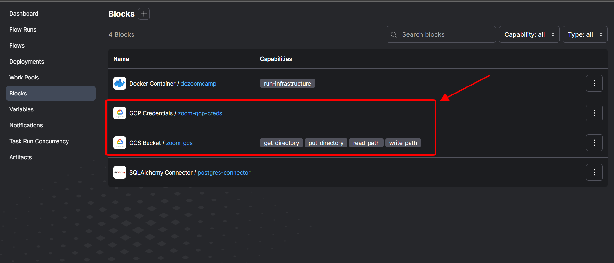
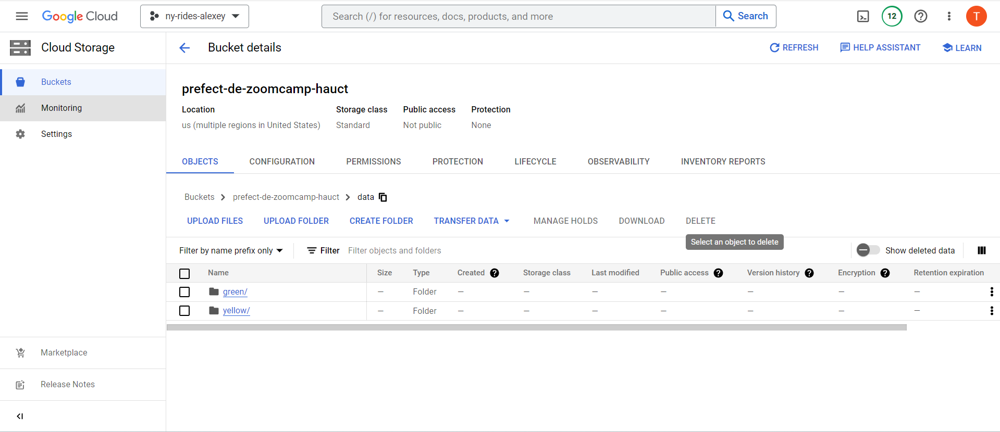
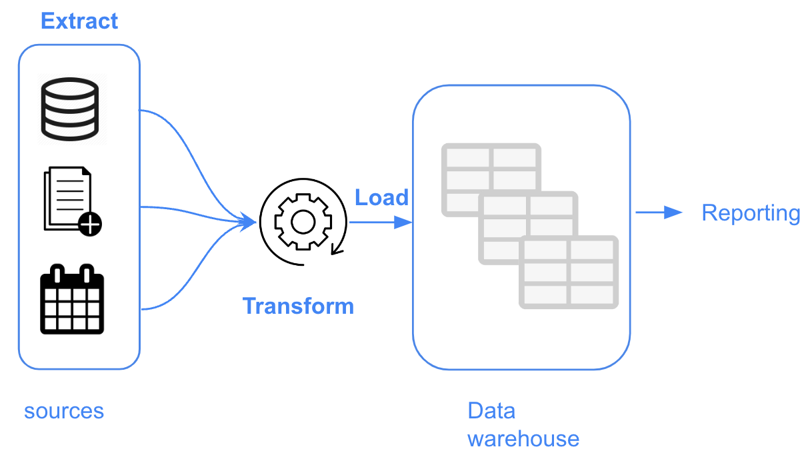
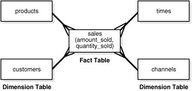

# Week 4: Analytics Engineering

This week, we’ll dive into Analytics Engineering.

We’ll cover:

- Basics of analytics engineering
- [dbt Labs](https://www.linkedin.com/company/dbtlabs/) (data build tool)
- Testing and documenting
- Deployment to the cloud and locally
- Visualizing the data with Google Data Studio and [Metabase](https://www.linkedin.com/company/metabase/)

**Goal**: Transforming the data loaded in DWH to Analytical Views developing a [dbt
project](https://github.com/DataTalksClub/data-engineering-zoomcamp/blob/main/week_4_analytics_engineering/taxi_rides_ny/README.md).


# Materials

See
[week_4\_analytics_engineering](https://github.com/DataTalksClub/data-engineering-zoomcamp/tree/main/week_4_analytics_engineering)
on GitHub and
[slides](https://docs.google.com/presentation/d/1xSll_jv0T8JF4rYZvLHfkJXYqUjPtThA/edit?usp=sharing&ouid=114544032874539580154&rtpof=true&sd=true)

Youtube videos:

- [DE Zoomcamp 4.1.1 - Analytics Engineering Basics](https://www.youtube.com/watch?v=uF76d5EmdtU)
- [DE Zoomcamp 4.1.2 - What is dbt](https://www.youtube.com/watch?v=4eCouvVOJUw)
- [DE Zoomcamp 4.2.1 - Start Your dbt Project: BigQuery and dbt Cloud (Alternative
  A)](https://www.youtube.com/watch?v=iMxh6s_wL4Q)
- [DE Zoomcamp 4.2.2 - Start Your dbt Project: Postgres and dbt Core Locally (Alternative
  B)](https://www.youtube.com/watch?v=1HmL63e-vRs)
- [DE Zoomcamp 4.3.1 - Build the First dbt Models](https://www.youtube.com/watch?v=UVI30Vxzd6c) (✦ see note below)
- [DE Zoomcamp 4.3.2 - Testing and Documenting the Project](https://www.youtube.com/watch?v=UishFmq1hLM) (✦ see note
  below)
- [DE Zoomcamp 4.4.1 - Deployment Using dbt Cloud (Alternative A)](https://www.youtube.com/watch?v=rjf6yZNGX8I)
- [DE Zoomcamp 4.4.2 - Deployment Using dbt Locally (Alternative B)](https://www.youtube.com/watch?v=Cs9Od1pcrzM)
- [DE Zoomcamp 4.5.1 - Visualising the data with Google Data Studio (Alternative
  A)](https://www.youtube.com/watch?v=39nLTs74A3E)
- [DE Zoomcamp 4.5.2 - Visualising the data with Metabase (Alternative B)](https://www.youtube.com/watch?v=BnLkrA7a6gM)

**✦ Note**: These videos are shown entirely on dbt cloud IDE but the same steps can be followed locally on the IDE of
your choice.

## Prerequisites

### Datasets

- A running warehouse (BigQuery or postgres)
- A set of running pipelines ingesting the project dataset: Taxi Rides NY dataset
  - Yellow taxi data - Years 2019 and 2020 - first half of years
  - Green taxi data - Years 2019 and 2020 - first half of years
- Data can be found here: <https://github.com/DataTalksClub/nyc-tlc-data>

### Setting up dbt for using BigQuery (Alternative A - preferred)

You will need to create a dbt cloud account using [this link](https://www.getdbt.com/signup/) and connect to your
warehouse [following these
instructions](https://docs.getdbt.com/docs/dbt-cloud/cloud-configuring-dbt-cloud/cloud-setting-up-bigquery-oauth). More
detailed instructions in
[dbt_cloud_setup.md](https://github.com/DataTalksClub/data-engineering-zoomcamp/blob/main/week_4_analytics_engineering/dbt_cloud_setup.md).

### Setting up dbt for using Postgres locally (Alternative B)

As an alternative to the cloud, that require to have a cloud database, you will be able to run the project installing
dbt locally. You can follow the [official dbt documentation](https://docs.getdbt.com/dbt-cli/installation) or use a
docker image from official [dbt repo](https://github.com/dbt-labs/dbt/). You will need to install the latest version
(1.0) with the postgres adapter (dbt-postgres). After local installation you will have to set up the connection to PG in
the `profiles.yml`, you can find the templates
[here](https://docs.getdbt.com/reference/warehouse-profiles/postgres-profile).

## What I did to set my tools

**Note**: For the remainder of these notes, I have chosen to continue (or focus more on) with BigQuery, i.e. alternative
A.

### Setup environment

<div class="formalpara-title">

**File `requirements.txt`**

</div>

``` txt
pandas
pydantic
prefect
prefect-sqlalchemy
prefect-gcp[cloud_storage]
protobuf
pyarrow
pandas-gbq
psycopg2-binary
sqlalchemy
```

Use conda to create a working environment `de-zoomcamp`

``` bash
conda create -n de-zoomcamp python=3.9
conda activate de-zoomcamp
pip install -r requirements.txt
```

Now run the script `web_to_gcs.py` to download the data from [here](https://github.com/DataTalksClub/nyc-tlc-data) (for convinience, we only need first half of each year) and ingest it into Google Bucket.


**File `web_to_gcs.py`**

``` python
from pathlib import Path
import pandas as pd
from prefect import flow, task
from prefect_gcp.cloud_storage import GcsBucket
from random import randint

"""
Pre-reqs: 
1. `pip install pandas pyarrow google-cloud-storage`
2. Set GOOGLE_APPLICATION_CREDENTIALS to your project/service-account key
3. Set GCP_GCS_BUCKET as your bucket or change default value of BUCKET
"""

# services = ['fhv','green','yellow']
init_url = 'https://github.com/DataTalksClub/nyc-tlc-data/releases/download/'
# switch out the bucketname
BUCKET = os.environ.get("GCP_GCS_BUCKET", "prefect-de-zoomcamp-hauct")

@task(retries=3, log_prints=True)
def fetch(dataset_url: str) -> pd.DataFrame:
    df = pd.read_csv(dataset_url, compression='gzip')
    return df

@task(log_prints=True)
def clean(color: str, df: pd.DataFrame) -> pd.DataFrame:
    """
    yellow 2019
    VendorID                   int64
    tpep_pickup_datetime      object (green=lpep_pickup_datetime)
    tpep_dropoff_datetime     object (green=lpep_dropoff_datetime)
    passenger_count            int64
    trip_distance            float64
    RatecodeID                 int64
    store_and_fwd_flag        object
    PULocationID               int64
    DOLocationID               int64
    payment_type               int64
    fare_amount              float64
    extra                    float64
    mta_tax                  float64
    tip_amount               float64
    tolls_amount             float64
    improvement_surcharge    float64
    total_amount             float64
    congestion_surcharge     float64

    yellow 2020
    VendorID                 float64 (2019=int64)
    tpep_pickup_datetime      object (green=lpep_pickup_datetime)
    tpep_dropoff_datetime     object (green=lpep_dropoff_datetime)
    passenger_count          float64 (2019=int64)
    trip_distance            float64
    RatecodeID               float64 (2019=int64)
    store_and_fwd_flag        object
    PULocationID               int64
    DOLocationID               int64
    payment_type             float64 (2019=int64)
    fare_amount              float64
    extra                    float64
    mta_tax                  float64
    tip_amount               float64
    tolls_amount             float64
    improvement_surcharge    float64
    total_amount             float64
    congestion_surcharge     float64

    green 2019
    VendorID                   int64
    lpep_pickup_datetime      object
    lpep_dropoff_datetime     object
    store_and_fwd_flag        object
    RatecodeID                 int64
    PULocationID               int64
    DOLocationID               int64
    passenger_count            int64
    trip_distance            float64
    fare_amount              float64
    extra                    float64
    mta_tax                  float64
    tip_amount               float64
    tolls_amount             float64
    ehail_fee                float64
    improvement_surcharge    float64
    total_amount             float64
    payment_type               int64
    trip_type                  int64
    congestion_surcharge     float64

    green 2020
    VendorID                 float64 (2019=int64)
    lpep_pickup_datetime      object
    lpep_dropoff_datetime     object
    store_and_fwd_flag        object
    RatecodeID               float64 (2019=int64)
    PULocationID               int64
    DOLocationID               int64
    passenger_count          float64 (2019=int64)
    trip_distance            float64
    fare_amount              float64
    extra                    float64
    mta_tax                  float64
    tip_amount               float64
    tolls_amount             float64
    ehail_fee                float64
    improvement_surcharge    float64
    total_amount             float64
    payment_type             float64 (2019=int64)
    trip_type                float64 (2019=int64)
    congestion_surcharge     float64
    """

    if color == "yellow":
        """Fix dtype issues"""
        df["tpep_pickup_datetime"] = pd.to_datetime(df["tpep_pickup_datetime"])
        df["tpep_dropoff_datetime"] = pd.to_datetime(df["tpep_dropoff_datetime"])

    if color == "green":
        """Fix dtype issues"""
        df["lpep_pickup_datetime"] = pd.to_datetime(df["lpep_pickup_datetime"])
        df["lpep_dropoff_datetime"] = pd.to_datetime(df["lpep_dropoff_datetime"])
        df["trip_type"] = df["trip_type"].astype('Int64')

    if color == "yellow" or color == "green":
        df["VendorID"] = df["VendorID"].astype('Int64')
        df["RatecodeID"] = df["RatecodeID"].astype('Int64')
        df["PULocationID"] = df["PULocationID"].astype('Int64')
        df["DOLocationID"] = df["DOLocationID"].astype('Int64')
        df["passenger_count"] = df["passenger_count"].astype('Int64')
        df["payment_type"] = df["payment_type"].astype('Int64')

    print(f"rows: {len(df)}")
    return df

@task(log_prints=True)
def write_local(color: str, year: str, month:str) -> str:
    file_name = f"{color}_tripdata_{year}-{month}.csv.gz"

    # download it using requests via a pandas df
    request_url = f"{init_url}{color}/{file_name}"
    r = requests.get(request_url)
    open(file_name, 'wb').write(r.content)
    print(f"Local: {file_name}")
    return file_name

@task(log_prints=True)
def upload_to_gcs(bucket: str, object_name: str, local_file: str) -> None:
    """
    Ref: https://cloud.google.com/storage/docs/uploading-objects#storage-upload-object-python
    """
    # # WORKAROUND to prevent timeout for files > 6 MB on 800 kbps upload speed.
    # # (Ref: https://github.com/googleapis/python-storage/issues/74)
    storage.blob._MAX_MULTIPART_SIZE = 5 * 1024 * 1024  # 5 MB
    storage.blob._DEFAULT_CHUNKSIZE = 5 * 1024 * 1024  # 5 MB

    client = storage.Client()
    bucket = client.bucket(bucket)
    blob = bucket.blob(object_name)
    blob.upload_from_filename(local_file)

@flow()
def etl_web_to_gcs() -> None:
    """The main ETL function"""
    colors = ["yellow", "green"]
    years = ['2019', '2020']

    for color in colors:
        for year in years:
            # Only take first half of a year
            for i in range(6):
                month = '0'+str(i+1)
                month = month[-2:] 

                dataset_url = write_local(color, year, month)

                df = fetch(dataset_url)
                df_clean = clean(color, df)

                dataset_url = dataset_url.replace('.csv.gz', '.parquet')
                df_clean.to_parquet(dataset_url, engine='pyarrow')

                upload_to_gcs(BUCKET, f"data/{color}/{dataset_url}", dataset_url)
                print(f"GCS: {color}/{dataset_url}")

if __name__ == "__main__":
    etl_web_to_gcs()
```

**Note**: Please make sure you 've already set your project id on Google CLI and set your GCP Bucket & GCP Credentials on Prefect UI. If not, check week 2




After running nicely done, we will have our data on Google Bucket



Then, in BigQuery, I created the tables `yellow_tripdata` and `green_tripdata` like this.


I now see the two tables under `trips_data_all`.


To check if everything is correct, I counted the number of rows of each of the tables.

``` sql
SELECT COUNT(*) FROM `ny-rides-alexey-396910.trips_data_all.yellow_tripdata`;
--- 61,306,914

SELECT COUNT(*) FROM `ny-rides-alexey-396910.trips_data_all.green_tripdata`;
--- 4,523,925
```

### Setting up dbt with BigQuery (Alternative A)

On September 8, 2023, I created a free dbt account with BigQuery. Then I followed the instructions in this file
([dbt_cloud_setup.md](https://github.com/DataTalksClub/data-engineering-zoomcamp/blob/main/week_4_analytics_engineering/dbt_cloud_setup.md)).

In order to connect we need the service account JSON file generated from bigquery:

**Step 1**: Open the [BigQuery credential wizard](https://console.cloud.google.com/apis/credentials/wizard) to create a
service account in your taxi project

- **Select an API**: BigQuery API
- **What data will you be accessing?**: Application data
- **Are you planning to use this API with Compute Engine…​?** No, I’n not using them
- **Service account details**: dbt-service-account
- **Service account ID**: dbt-service-account (Email address:
  <dbt-service-account@hopeful-summer-375416.iam.gserviceaccount.com>)
- **Service account description**: Service account for dbt cloud
- **Role**: BigQuery Data Editor
- **Role**: BigQuery Job User
- **Role**: BigQuery User
- **Role**: BigQuery Admin

Click on **DONE** button.

I reuse the json file (`ny-rides-alexey-396910-e520f0a301d7.json`) created in the previous weeks.

Go to web page [dbt](https://www.getdbt.com/), login your dbt account and select `BigQuery` connection, upload your json file here

|                                     |                                          |
|-------------------------------------|------------------------------------------|
||     |

## Introduction to analytics engineering

### What is Analytics Engineering?

Roles in a data team:

- Data Engineer: Prepares and maintain the infrastructure the data team needs.
- Analytics Engineer: Introduces the good software engineering practices to the efforts of data analysts and data
  scientists
- Data Analyst: Uses data to answer questions and solve problems.

Tooling:

1. Data Loading
2. Data Storing (Cloud data warehouses like [Snowflake](https://www.snowflake.com/en/),
    [Bigquery](https://cloud.google.com/bigquery), [Redshift](https://aws.amazon.com/fr/redshift/))
3. Data modelling (Tools like dbt or Dataform)
4. Data presentation (BI tools like google data studio, [Looker](https://www.looker.com/), [Mode](https://mode.com/) or
    Tableau)

### Data Modelling concepts

In the ELP approach, we will transform the data once the date is already in the data warehouse.

<table>
<tr><td>

</td><td>

</td></tr>
</table>

**ETL vs ELT**

- ETL
  - Slightly more stable and compliant data analysis
  - Higher storage and compute costs
- ELT
  - Faster and more flexible data analysis.
  - Lower cost and lower maintenance

### Kimball’s Dimensional Modeling

- Objective
  - Deliver data understandable to the business users
  - Deliver fast query performance
- Approach
  - Prioritise user understandability and query performance over non redundant data (3NF)
- Other approaches
  - Bill Inmon
  - Data vault

### Elements of Dimensional Modeling

- Facts tables
  - Measurements, metrics or facts
  - Corresponds to a business *process*
  - "verbs"
- Dimensions tables
  - Corresponds to a business *entity*
  - Provides context to a business process
  - "nouns"



### Architecture of Dimensional Modeling

- Stage Area
  - Contains the raw data
  - Not meant to be exposed to everyone
- Processing area
  - From raw data to data models
  - Focuses in efficiency
  - Ensuring standards
- Presentation area
  - Final presentation of the data
  - Exposure to business stakeholder

## What is dbt?

[dbt](https://docs.getdbt.com/docs/introduction) is a transformation tool that allows anyone that knows SQL to deploy
analytics code following software engineering best practices like modularity, portability, CI/CD, and documentation.

### How does dbt work?


- Each model is:
  - A `*.sql` file
  - Select statement, no DDL (*Data Definition Language*) or DML (*Data Manipulation Language*)
  - A file that dbt will compile and run in our DWH (*Data warehouse*)

### How to use dbt?

- **dbt Core**: Open-source project that allows the data transformation.
  - Builds and runs a dbt project (.sql and .yml files)
  - Includes SQL compilation logic, macros and database adapters
  - Includes a CLI (*Command Line Interface*) interface to run dbt commands locally
  - Opens source and free to use
- **dbt Cloud**: SaaS (*Software As A Service*) application to develop and manage dbt projects.
  - Web-based IDE (*Integrated Development Environment*) to develop, run and test a dbt project
  - Jobs orchestration
  - Logging and Alerting
  - Integrated documentation
  - Free for individuals (one developer seat)

### How are we going to use dbt?

- **BigQuery (Alternative A)**:
  - Development using cloud IDE
  - No local installation of dbt core
- **Postgres (Alternative B)**:
  - Development using a local IDE of your choice.
  - Local installation of dbt core connecting to the Postgres database
  - Running dbt models through the CLI

At the end, our project will look like this.


## Starting a dbt project

### Create a new dbt project

dbt provides an [starter project](https://github.com/dbt-labs/dbt-starter-project) with all the basic folders and files.

**Starter project structure**

``` txt
taxi_rides_ny/
  analyses/
  macros/
  models/example/
  snapshots/
  seeds/
  tests/
  .gitignore
  README.md
  dbt_project.yml
```

**Example of `dbt_project.yml`**

``` yaml
name: 'taxi_rides_ny'
version: '1.0.0'
config-version: 2

# This setting configures which "profile" dbt uses for this project.
profile: 'pg-dbt-workshop'  # Using Postgres + dbt core (locally) (Alternative B)
profile: 'default'          # Using BigQuery + dbt cloud (Alternative A)

# These configuration specify where dbt should look for different types of files.
# The `source-paths` config, for example, states that models in this project can be
# found in the "models/" directory. You probably win't need to change these!
model-paths: ["models"]
analysis-paths: ["analyses"]
test-paths: ["tests"]
seed-paths: ["seeds"]
macro-paths: ["macros"]
snapshot-paths: ["snapshots"]

target-path: "target"  # directory which will store compiled SQL files
clean-targets:         # directories to be removed by `dbt clean`
    - "target"
    - "dbt_packages"

# Configuring models
# Full decumentation: https://docs.getdbt.com/reference/model-configs

# In this example config, we tell dbt to build all models in the example/ directory
# as tables. These settings can be overridden in the individual model files
# using the `{{ config(...) }}` macro.
models:
    taxi_rides_ny:
        # Applies to all files under models/.../
        staging:
            materialized: view
        core:
            materialized: table
vars:
    payment_type_values: [1, 2, 3, 4, 5, 6]
```

See [About dbt projects](https://docs.getdbt.com/docs/build/projects) for more.


