# Week 5: Batch Processing

## Materials

See [Week 5: Batch
Processing](https://github.com/DataTalksClub/data-engineering-zoomcamp/blob/main/week_5_batch_processing) on GitHub.

Youtube videos:

- [DE Zoomcamp 5.1.1 - Introduction to Batch processing](https://www.youtube.com/watch?v=dcHe5Fl3MF8)
- [DE Zoomcamp 5.1.2 - Introduction to Spark](https://www.youtube.com/watch?v=FhaqbEOuQ8U)
- [DE Zoomcamp 5.2.1 - (Optional) Installing Spark on Linux](https://www.youtube.com/watch?v=hqUbB9c8sKg)
- [DE Zoomcamp 5.3.1 - First Look at Spark/PySpark](https://www.youtube.com/watch?v=r_Sf6fCB40c)
- [DE Zoomcamp 5.3.2 - Spark DataFrames](https://www.youtube.com/watch?v=ti3aC1m3rE8)
- [DE Zoomcamp 5.3.3 - (Optional) Preparing Yellow and Green Taxi Data](https://www.youtube.com/watch?v=CI3P4tAtru4)
- [DE Zoomcamp 5.3.4 - SQL with Spark](https://www.youtube.com/watch?v=uAlp2VuZZPY)
- [DE Zoomcamp 5.4.1 - Anatomy of a Spark Cluster](https://www.youtube.com/watch?v=68CipcZt7ZA)
- [DE Zoomcamp 5.4.2 - GroupBy in Spark](https://www.youtube.com/watch?v=9qrDsY_2COo)
- [DE Zoomcamp 5.4.3 - Joins in Spark](https://www.youtube.com/watch?v=lu7TrqAWuH4)
- [DE Zoomcamp 5.5.1 - (Optional) Operations on Spark RDDs](https://www.youtube.com/watch?v=Bdu-xIrF3OM)
- [DE Zoomcamp 5.5.2 - (Optional) Spark RDD mapPartition](https://www.youtube.com/watch?v=k3uB2K99roI)
- [DE Zoomcamp 5.6.1 - Connecting to Google Cloud Storage](https://www.youtube.com/watch?v=Yyz293hBVcQ)
- [DE Zoomcamp 5.6.2 - Creating a Local Spark Cluster](https://www.youtube.com/watch?v=HXBwSlXo5IA)
- [DE Zoomcamp 5.6.3 - Setting up a Dataproc Cluster](https://www.youtube.com/watch?v=osAiAYahvh8)
- [DE Zoomcamp 5.6.4 - Connecting Spark to Big Query](https://www.youtube.com/watch?v=HIm2BOj8C0Q)

## 5.1 Introduction

### 5.1.1 Introduction to Batch processing

This week, we’ll dive into Batch Processing.

We’ll cover:

- Spark, Spark DataFrames, and Spark SQL
- Joins in Spark
- Resilient Distributed Datasets (RDDs)
- Spark internals
- Spark with Docker
- Running Spark in the Cloud
- Connecting Spark to a Data Warehouse (DWH)

We can process data by batch or by streaming.

- **Batch processing** is when the processing and analysis happens on a set of data that have already been stored over a
  period of time.
  - Processing *chunks* of data at *regular intervals*.
  - An example is payroll and billing systems that have to be processed weekly or monthly.
- **Streaming data processing** happens as the data flows through a system. This results in analysis and reporting of
  events as it happens.
  - processing data *on the fly*.
  - An example would be fraud detection or intrusion detection.

Source: [Batch Processing vs Real Time Data Streams](https://www.confluent.io/learn/batch-vs-real-time-data-processing)
from Confluent.

We will cover streaming in week 6. A batch job is a job (a unit of work) that will process data in batches. 

Batch jobs may be scheduled in many ways: weekly, daily, hourly, three times per hour, every 5 minutes.

The technologies used can be python scripts, SQL, dbt, Spark, Flink, Kubernetes, AWS Batch, Prefect or Airflow.

Batch jobs are commonly orchestrated with tools such as dbt or Airflow.

A typical workflow for batch jobs might look like this:

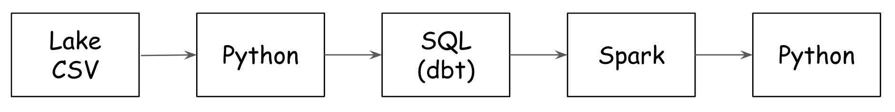

- Advantages:
  - Easy to manage. There are multiple tools to manage them (the technologies we already mentioned)
  - Re-executable. Jobs can be easily retried if they fail.
  - Scalable. Scripts can be executed in more capable machines; Spark can be run in bigger clusters, etc.
- Disadvantages:
  - Delay. Each task of the workflow in the previous section may take a few minutes; assuming the whole workflow takes
    20 minutes, we would need to wait those 20 minutes until the data is ready for work.

However, the advantages of batch jobs often compensate for its shortcomings, and as a result most companies that deal
with data tend to work with batch jobs most of the time. The majority of processing jobs (may be 80%) are still in
batch.

### 5.1.2 Introduction to Spark


[Apache Spark](https://spark.apache.org/) is a unified analytics engine for large-scale data processing.

Spark is a distributed data processing engine with its components working collaboratively on a cluster of machines. At a
high level in the Spark architecture, a Spark application consists of a driver program that is responsible for
orchestrating parallel operations on the Spark cluster. The driver accesses the distributed components in the
cluster—the Spark executors and cluster manager—through a `SparkSession`.

**Apache Spark components and architecture**


Source: <https://www.oreilly.com/library/view/learning-spark-2nd/9781492050032/ch01.html>

It provides high-level APIs in Java, Scala, Python ([PySpark](https://spark.apache.org/docs/latest/api/python/)) and R,
and an optimized engine that supports general execution graphs. It also supports a rich set of higher-level tools
including:

- [Spark SQL](https://spark.apache.org/docs/latest/sql-programming-guide.html) for SQL and structured data processing,
- [pandas API on Spark](https://spark.apache.org/docs/latest/api/python/getting_started/quickstart_ps.html) for pandas
  workloads,
- [MLlib](https://spark.apache.org/docs/latest/ml-guide.html) for machine learning,
- [GraphX](https://spark.apache.org/docs/latest/graphx-programming-guide.html) for graph processing,
- [Structured Streaming](https://spark.apache.org/docs/latest/structured-streaming-programming-guide.html) for
  incremental computation and stream processing.

See [Spark Overview](https://spark.apache.org/docs/latest/index.html) for more.

[Apache Spark](https://spark.apache.org/) is a multi-language engine for executing data engineering, data science, and
machine learning on single-node machines or clusters.

Spark is used for batch jobs but can be also used for streaming. In this week, we will focus on batch jobs.

**Where to use Spark**

There are tools such as Hive, Presto or Athena (a AWS managed Presto) that allow you to express jobs as SQL queries.
However, there are times where you need to apply more complex manipulation which are very difficult or even impossible
to express with SQL (such as ML models); in those instances, Spark is the tool to use.

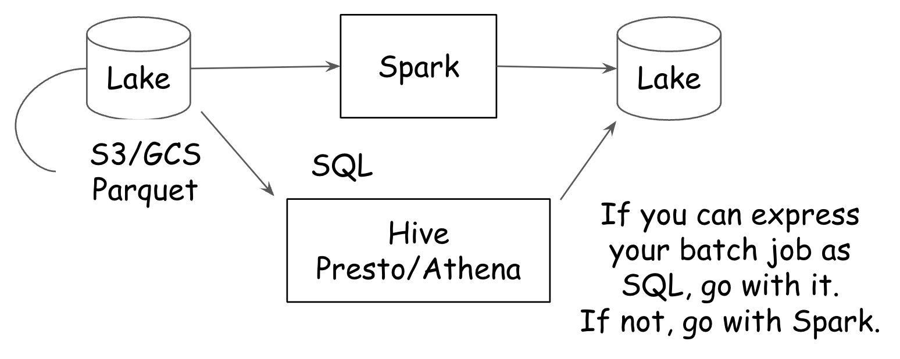

**Typical workflow for ML**

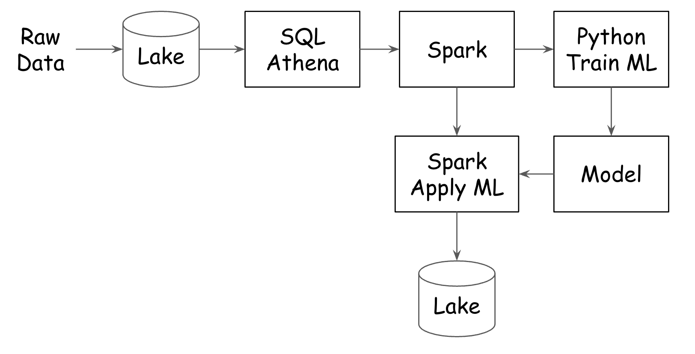

## 5.2 Installation

Follow [these
intructions](https://github.com/DataTalksClub/data-engineering-zoomcamp/tree/main/week_5_batch_processing/setup) to
install Spark.

- [Windows](https://github.com/DataTalksClub/data-engineering-zoomcamp/blob/main/week_5_batch_processing/setup/windows.md)
- [Linux](https://github.com/DataTalksClub/data-engineering-zoomcamp/blob/main/week_5_batch_processing/setup/linux.md)
- [MacOS](https://github.com/DataTalksClub/data-engineering-zoomcamp/blob/main/week_5_batch_processing/setup/macos.md)

And follow
[this](https://github.com/DataTalksClub/data-engineering-zoomcamp/blob/main/week_5_batch_processing/setup/pyspark.md) to
run PySpark in Jupyter.

### 5.2.1 Installing Spark on Linux

Here we will install Spark for Linux on Cloud VM.

In week 1, we created a VM instance on Google Cloud. We will use this VM here.

Go to **Google Cloud**, **Compute Engine**, **VM instances**. Start the `de-zoomcamp` virtual machine.

We get this.

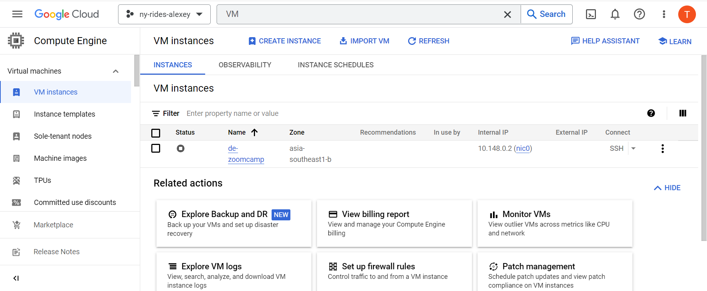

Copy the **External IP** (34.126.151.166) and adjust the HostName of the `C:/Users/LAP14062-local/.ssh/config` file.

**File `~/.ssh/config`**

``` bash
Host de-zoomcamp
    HostName 34.126.151.166
    User hauct
    IdentityFile C:/Users/LAP14062-local/.ssh/gcp
```

Then, run this command to enter to the server:

``` bash
ssh de-zoomcamp
```

You should see something like this:

``` bash
$ ssh de-zoomcamp
Welcome to Ubuntu 20.04.6 LTS (GNU/Linux 5.15.0-1040-gcp x86_64)

 * Documentation:  https://help.ubuntu.com
 * Management:     https://landscape.canonical.com
 * Support:        https://ubuntu.com/advantage

  System information as of Tue Sep 12 10:37:58 UTC 2023

  System load:  0.0                Users logged in:                  0
  Usage of /:   41.2% of 28.89GB   IPv4 address for br-64f7bafc5050: 172.18.0.1
  Memory usage: 1%                 IPv4 address for docker0:         172.17.0.1
  Swap usage:   0%                 IPv4 address for ens4:            10.148.0.2
  Processes:    121

 * Strictly confined Kubernetes makes edge and IoT secure. Learn how MicroK8s
   just raised the bar for easy, resilient and secure K8s cluster deployment.

   https://ubuntu.com/engage/secure-kubernetes-at-the-edge

Expanded Security Maintenance for Applications is not enabled.

2 updates can be applied immediately.
To see these additional updates run: apt list --upgradable

Enable ESM Apps to receive additional future security updates.
See https://ubuntu.com/esm or run: sudo pro status


The list of available updates is more than a week old.
To check for new updates run: sudo apt update
New release '22.04.3 LTS' available.
Run 'do-release-upgrade' to upgrade to it.


Last login: Tue Sep 12 10:34:37 2023 from 1.53.255.144
(base) hauct@de-zoomcamp:~$
```

#### Install Java

Download OpenJDK 11 or Oracle JDK 11. It’s important that the version is 11 because Spark requires 8 or 11.

Here, we will use OpenJDK. This [page](https://jdk.java.net/archive/) is an archive of previously released builds of the
OpenJDK.

To install Java, run the following commands.

``` bash
# Create directory.
> mkdir spark
> cd spark

# Download and unpack OpenJDK.
> wget https://download.java.net/java/GA/jdk11/9/GPL/openjdk-11.0.2_linux-x64_bin.tar.gz
> tar xzfv openjdk-11.0.2_linux-x64_bin.tar.gz
> ls
jdk-11.0.2
> pwd
/home/hauct/spark

# Setup Java.
> export JAVA_HOME="${HOME}/spark/jdk-11.0.2"
> export PATH="${JAVA_HOME}/bin:${PATH}"
> java --version
openjdk 11.0.2 2019-01-15
OpenJDK Runtime Environment 18.9 (build 11.0.2+9)
OpenJDK 64-Bit Server VM 18.9 (build 11.0.2+9, mixed mode)

# Remove the archive.
> rm openjdk-11.0.2_linux-x64_bin.tar.gz
```

#### Install Spark

Go to this [page](https://spark.apache.org/downloads.html) to download Apache Spark.

We will use Spark **3.4.1 (June 23 2023)** version and package type **Pre-built for Apache Hadoop 3.4 and later**.

To install Spark, run the following commands.

``` bash
# Download and unpack Spark 3.4.1.
> wget https://dlcdn.apache.org/spark/spark-3.4.1/spark-3.4.1-bin-hadoop3.tgz
> tar xzfv spark-3.4.1-bin-hadoop3.tgz

# Setup Spark.
> export SPARK_HOME="${HOME}/spark/spark-3.4.1-bin-hadoop3"
> export PATH="${SPARK_HOME}/bin:${PATH}"

# Remove the archive.
> rm spark-3.4.1-bin-hadoop3.tgz
```

Now let’s check if spark is working

Execute `spark-shell` and run the following in scala. You can ignore the warnings.

``` scala
val data = 1 to 10000
val distData = sc.parallelize(data)
distData.filter(_ < 10).collect()
```

You should see something like this

```bash
(base) hauct@de-zoomcamp:~/spark$ spark-shell
Setting default log level to "WARN".
To adjust logging level use sc.setLogLevel(newLevel). For SparkR, use setLogLevel(newLevel).
23/09/13 05:45:33 WARN NativeCodeLoader: Unable to load native-hadoop library for your platform... using builtin-java classes where applicable
Spark context Web UI available at http://de-zoomcamp.asia-southeast1-b.c.ny-rides-alexey-396910.internal:4040
Spark context available as 'sc' (master = local[*], app id = local-1694583934389).
Spark session available as 'spark'.
Welcome to
      ____              __
     / __/__  ___ _____/ /__
    _\ \/ _ \/ _ `/ __/  '_/
   /___/ .__/\_,_/_/ /_/\_\   version 3.4.1
      /_/

Using Scala version 2.12.17 (OpenJDK 64-Bit Server VM, Java 11.0.2)
Type in expressions to have them evaluated.
Type :help for more information.

scala>
```

To close Spark shell, you press `Ctrl+D` or type in `:quit` or `:q`.

#### Add PATH to `.bashrc` file

Add these lines to the bottom of the `.bashrc` file. Use `nano .bashrc`.

You will need to change to your home dir, for example: in my case, it will be `/home/hauct`

``` bash
export JAVA_HOME="${HOME}/spark/jdk-11.0.2"
export PATH="${JAVA_HOME}/bin:${PATH}"

export SPARK_HOME="${HOME}/spark/spark-3.4.1-bin-hadoop3"
export PATH="${SPARK_HOME}/bin:${PATH}"
```

Press `Ctrl+O` to save the file and `Ctrl+X` to exit.

Then run the following commands.

``` bash
> source .bashrc

# Quit the server.
> logout

# Connect to Ubuntu server.
> ssh de-zoomcamp
> which java
/home/hauct/spark/jdk-11.0.2/bin/java
> which pyspark
/home/hauct/spark/spark-3.4.1-bin-hadoop3/bin/pyspark
```

#### How to use PySpark

To run PySpark, we first need to add it to `PYTHONPATH`.

`PYTHONPATH` is a special environment variable that provides guidance to the Python interpreter about where to find
various libraries and applications. See [Understanding the Python Path Environment Variable in
Python](https://www.simplilearn.com/tutorials/python-tutorial/python-path) for more information.

So, I add these instructions to the bottom of cloud VM `~/.bashrc` file with `nano ~/.bashrc`.

``` bash
export PYTHONPATH="${SPARK_HOME}/python/:$PYTHONPATH"
export PYTHONPATH="${SPARK_HOME}/python/lib/py4j-0.10.9.5-src.zip:$PYTHONPATH"
```
Make sure that the version under `$SPARK_HOME/python/lib/` matches the filename of `py4j` or you will encounter
`ModuleNotFoundError: No module named 'py4j'` while executing `import pyspark`.

Press `Ctrl+O` to save and `Ctrl+X` to exit.

Then, run this command: `source ~/.bashrc`.

#### Connect with Visual Studio Code (VS Code)

Because this is a remote machine, we will connect to this machine with Visual Studio Code (VS Code).

In VS Code, find and install the **Remote - SSH extension**. Then go to the **Command Palette** (`Shift+Cmd+P`)
and select **Remote-SSH: Connect to Host…​** and **de-zoomcamp**. A new VS Code window should appear.

In VS Code, open the terminal, and open the port `8888`.

A **port** is basically an address on your computer. By default, Jupyter uses port `8888` to let you talk to it (you can
see this in the URL when you’re looking at a notebook: `localhost:8888`).

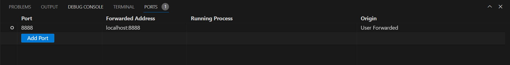

Start Jupyter notebook in a new folder on the cloud VM.

``` bash
> mkdir notebooks
> cd notebooks
> jupyter notebook
```

Copy and paste one of the URLs (I have <http://localhost:8888/?token=5554b767feff5ecefbb974795a8d5140867c80dc46852c00>)
to the browser.

In Jupyter, create a new notebook with the **Python 3 (ipykernel)**, name it `03_test.ipynb`

``` python
import pyspark
print(pyspark.__version__)
print(pyspark.__file__)
# 3.4.1
# /home/hauct/spark/spark-3.4.1-bin-hadoop3/python/pyspark/__init__.py
```

In Jupyter, download the taxi zone lookup file.

``` bash
!wget https://s3.amazonaws.com/nyc-tlc/misc/taxi+_zone_lookup.csv
!head taxi+_zone_lookup.csv
```

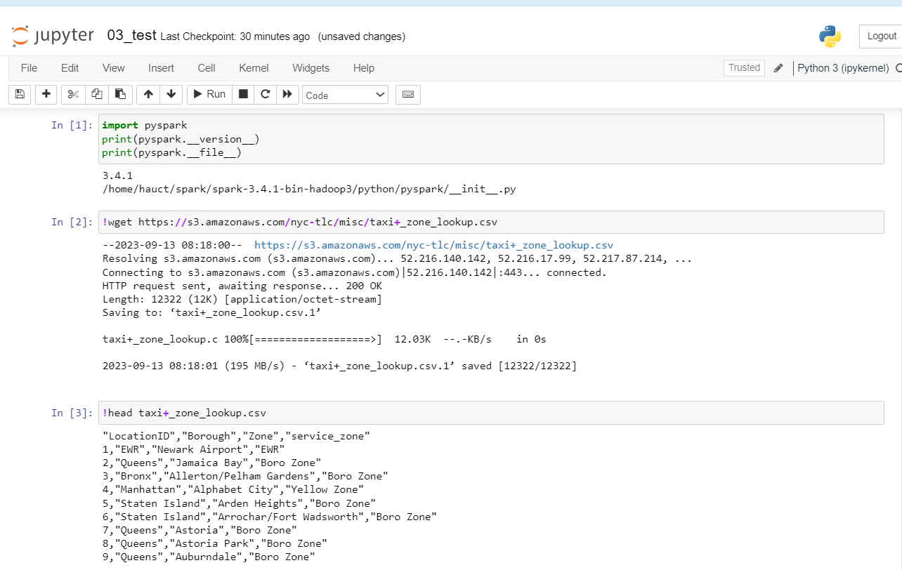

Now, read this file with Spark.

The entry point into all functionality in Spark is the
[SparkSession](https://spark.apache.org/docs/latest/api/python/reference/pyspark.sql/api/pyspark.sql.SparkSession.html)
class.

A SparkSession can be used create
[DataFrame](https://spark.apache.org/docs/latest/api/python/reference/pyspark.sql/api/pyspark.sql.DataFrame.html#pyspark.sql.DataFrame),
register DataFrame as tables, execute SQL over tables, cache tables, and read parquet files.

To create a basic SparkSession, just use `SparkSession.builder`.

Also, we need to set:

- the Spark `master` URL to connect to, such as `local` to run locally, `local[4]` to run locally with 4 cores, or
  `spark://master:7077` to run on a Spark standalone cluster;
- the `appName` for the application, which will be shown in the Spark Web UI. If no application name is set, a randomly
  generated name will be used;
- how to get an existing SparkSession or, if there is no existing one, create a new one based on the options set in this
  builder.

Run this PySpark script into Jupyter.

``` python
import pyspark
from pyspark.sql import SparkSession

spark.sparkContext.setLogLevel("ERROR")

spark = SparkSession.builder \
    .master("local[*]") \
    .appName('test') \
    .getOrCreate()

df = spark.read \
    .option("header", "true") \
    .csv('taxi+_zone_lookup.csv')

df.show()
```

You should see this

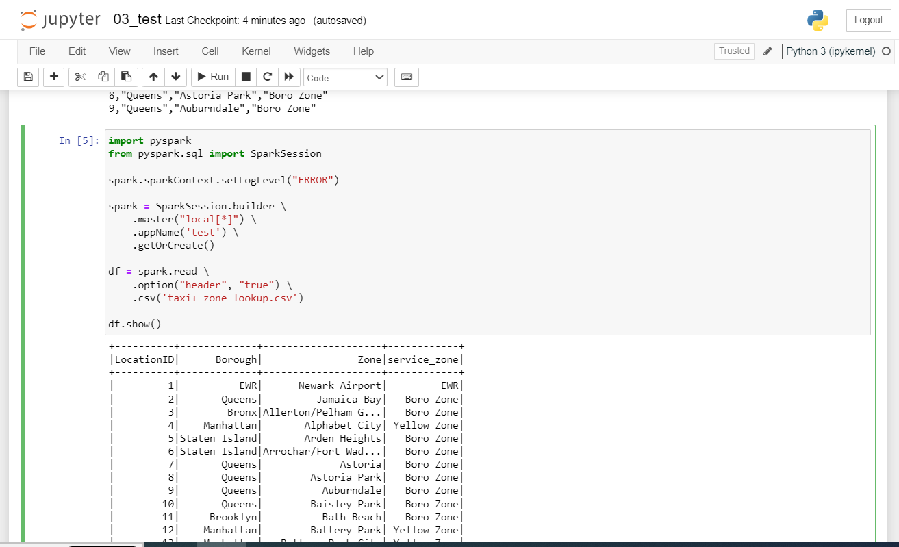

Test that writing works too.

``` python
df.write.parquet('zones')
!ls -lh
# total 44K
# -rw-rw-r-- 1 hauct hauct 5.3K Sep 13 08:21 03_test.ipynb
# -rw-rw-r-- 1 hauct hauct  13K Aug 17  2016 taxi+_zone_lookup.csv
# -rw-rw-r-- 1 hauct hauct  13K Aug 17  2016 taxi+_zone_lookup.csv.1
# drwxr-xr-x 2 hauct hauct 4.0K Sep 13 08:52 zones
!ls zones/
# _SUCCESS  part-00000-2146f15a-147e-405d-ae07-44d96194db7d-c000.snappy.parquet
# total 8.0K
# -rw-r--r-- 1 hauct hauct    0 Sep 13 08:52 _SUCCESS
# -rw-r--r-- 1 hauct hauct 5.8K Sep 13 08:52 part-00000-2146f15a-147e-405d-ae07-44d96194db7d-c000.snappy.parquet
```

One more thing… ​In VS Code, open the terminal, and open the port `4040`. Then open the web browser to `localhost:4040/jobs/`.

We should see this.

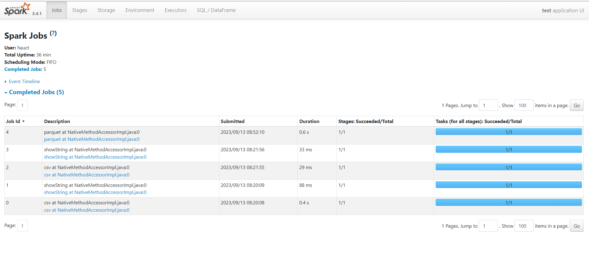

Every SparkContext launches a web UI, by default on port 4040, that displays useful information about the application.
This includes:

- A list of scheduler stages and tasks
- A summary of RDD sizes and memory usage
- Environmental information
- Information about the running executors

You can access this interface by simply opening `http://<driver-node>:4040` in a web browser. If multiple SparkContexts
are running on the same host, they will bind to successive ports beginning with 4040 (4041, 4042, etc).

See [Monitoring and Instrumentation](https://spark.apache.org/docs/2.2.3/monitoring.html) for more.

## 5.3 Spark SQL and DataFrames

### 5.3.1 First Look at Spark/PySpark

We will cover:

- Reading CSV files
- Partitions
- Saving data to Parquet for local experiments
- Spark master UI

#### Start Jupyter on remote machine

Run enter to the remote machine and clone a latest version of the de-zoomcamp repo.

``` bash
> ssh de-zoomcamp
> git clone https://github.com/hauct/de-zoomcamp.git
```

Start Jupyter notebook on the cloud VM.

``` bash
> cd
> cd data-engineering-zoomcamp/
> cd week_5_batch_processing/
> jupyter notebook
```

Copy and paste one of the URLs to the web browser.

Make sure ports `8888` and `4040` are open. If not, see instructions in previous section.

#### Read file with PySpark

Create a new notebook with the **Python 3 (ipykernel)**, or open `code/04_pyspark.ipynb` file directly.

Open a Spark session.

``` python
import pyspark
from pyspark.sql import SparkSession

spark = SparkSession.builder \
    .master("local[*]") \
    .appName('test') \
    .getOrCreate()
```

Download this file.

``` python
!wget https://github.com/DataTalksClub/nyc-tlc-data/releases/download/fhvhv/fhvhv_tripdata_2021-01.csv.gz
```

Unzip it.

``` bash
%%sh
gzip -d fhvhv_tripdata_2021-01.csv.gz
!ls -lh fhvhv_tripdata_2021-01.*
!wc -l fhvhv_tripdata_2021-01.csv
```

And read this file

``` python
df = spark.read \
    .option("header", "true") \
    .csv('fhvhv_tripdata_2021-01.csv')

df.show()
```

#### Define the structure of the DataFrame

Prints out the schema in the tree format.

``` python
>>> df.printSchema()
root
 |-- hvfhs_license_num: string (nullable = true)
 |-- dispatching_base_num: string (nullable = true)
 |-- pickup_datetime: string (nullable = true)
 |-- dropoff_datetime: string (nullable = true)
 |-- PULocationID: string (nullable = true)
 |-- DOLocationID: string (nullable = true)
 |-- SR_Flag: string (nullable = true)
```

We see that the columns are all in string. By default, Spark does not try to infer column types.

Prints the first 5 rows.

``` python
>>> df.head(5)
[Row(hvfhs_license_num='HV0003', dispatching_base_num='B02682', pickup_datetime='2021-01-01 00:33:44',
dropoff_datetime='2021-01-01 00:49:07', PULocationID='230', DOLocationID='166', SR_Flag=None),
 Row(hvfhs_license_num='HV0003', dispatching_base_num='B02682', pickup_datetime='2021-01-01 00:55:19',
 dropoff_datetime='2021-01-01 01:18:21', PULocationID='152', DOLocationID='167', SR_Flag=None),
 Row(hvfhs_license_num='HV0003', dispatching_base_num='B02764', pickup_datetime='2021-01-01 00:23:56',
 dropoff_datetime='2021-01-01 00:38:05', PULocationID='233', DOLocationID='142', SR_Flag=None),
 Row(hvfhs_license_num='HV0003', dispatching_base_num='B02764', pickup_datetime='2021-01-01 00:42:51',
 dropoff_datetime='2021-01-01 00:45:50', PULocationID='142', DOLocationID='143', SR_Flag=None),
 Row(hvfhs_license_num='HV0003', dispatching_base_num='B02764', pickup_datetime='2021-01-01 00:48:14',
 dropoff_datetime='2021-01-01 01:08:42', PULocationID='143', DOLocationID='78', SR_Flag=None)]
```

Create a file with only the first 1001 lines.

``` python
!head -n 1001 fhvhv_tripdata_2021-01.csv > head.csv
```

Read this small file in pandas.

``` python
>>> import pandas as pd
>>> df_pandas = pd.read_csv('head.csv')
>>> df_pandas.info()
<class 'pandas.core.frame.DataFrame'>
RangeIndex: 1000 entries, 0 to 999
Data columns (total 7 columns):
 #   Column                Non-Null Count  Dtype
---  ------                --------------  -----
 0   hvfhs_license_num     1000 non-null   object
 1   dispatching_base_num  1000 non-null   object
 2   pickup_datetime       1000 non-null   object
 3   dropoff_datetime      1000 non-null   object
 4   PULocationID          1000 non-null   int64
 5   DOLocationID          1000 non-null   int64
 6   SR_Flag               0 non-null      float64
dtypes: float64(1), int64(2), object(4)
memory usage: 54.8+ KB
```

Create a Spark
[DataFrame](https://spark.apache.org/docs/3.1.1/api/python/reference/api/pyspark.sql.DataFrame.html#pyspark.sql.DataFrame)

Spark provides `spark.sql.types.StructType` class to define the structure of the DataFrame and It is a collection or
list on StructField objects.

All of the data types shown below are supported in Spark and the DataType class is a base class for all them.

- StringType
- ArrayType
- MapType
- StructType
- DateType
- TimestampType
- BooleanType
- CalendarIntervalType
- BinaryType
- NumericType
- ShortType
- IntegerType
- LongType
- FloatType
- DoubleType
- DecimalType
- ByteType
- HiveStringType
- ObjectType
- NullType

See [Spark SQL Data Types with Examples](https://sparkbyexamples.com/spark/spark-sql-dataframe-data-types/) for more.

So, the preferred option while reading any file would be to enforce a custom schema, this ensures that the data types
are consistent and avoids any unexpected behavior.

In order to do that you first declare the schema to be enforced, and then read the data by setting `schema` option.

``` python
from pyspark.sql import types

schema = types.StructType([
    types.StructField('hvfhs_license_num', types.StringType(), True),
    types.StructField('dispatching_base_num', types.StringType(), True),
    types.StructField('pickup_datetime', types.TimestampType(), True),
    types.StructField('dropoff_datetime', types.TimestampType(), True),
    types.StructField('PULocationID', types.IntegerType(), True),
    types.StructField('DOLocationID', types.IntegerType(), True),
    types.StructField('SR_Flag', types.StringType(), True)
])

df = spark.read \
    .option("header", "true") \
    .schema(schema) \
    .csv('fhvhv_tripdata_2021-01.csv')

df.printSchema()
```

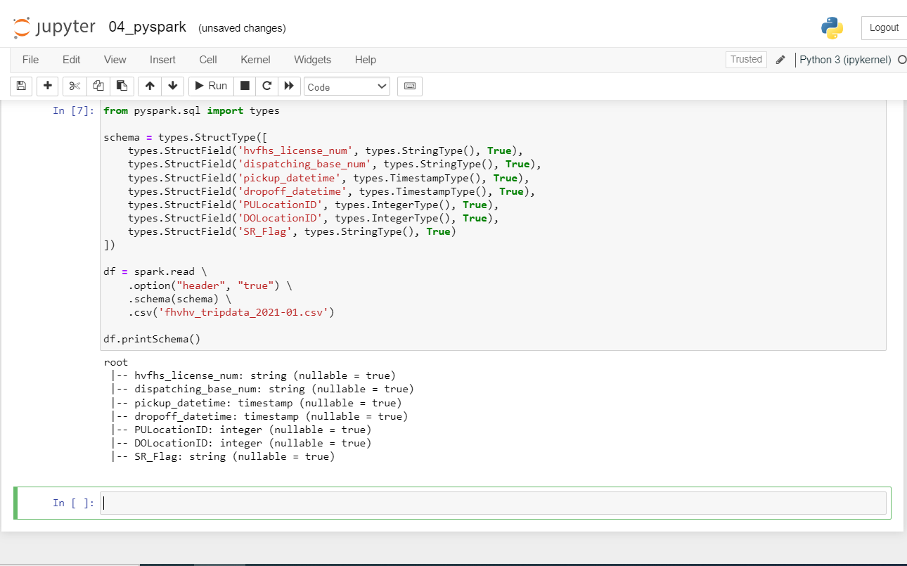

We should see this.

``` txt
root
 |-- hvfhs_license_num: string (nullable = true)
 |-- dispatching_base_num: string (nullable = true)
 |-- pickup_datetime: timestamp (nullable = true)
 |-- dropoff_datetime: timestamp (nullable = true)
 |-- PULocationID: integer (nullable = true)
 |-- DOLocationID: integer (nullable = true)
 |-- SR_Flag: string (nullable = true)
```

**Note**: The other way to infer the schema (apart from pandas) for the csv files, is to set the `inferSchema` option to
`true` while reading the files in Spark.

#### Save as partitioned parquet files

A **Spark cluster** is made up of multiple **executors**. Each executor can process data independently to parallelize
and speed up work.

In the previous example, we are reading a single large CSV file. A file can only be read by a single executor, which
means that the code we have written so far is not parallelized and will therefore only be executed by a single executor
rather than several at the same time.

In order to solve this problem, we can split a file into several parts so that each executor can take care of one part
and all executors work simultaneously. These splits are called **partitions**.

Spark/PySpark partitioning is a way to split the data into multiple partitions so that you can execute transformations
on multiple partitions in parallel which allows completing the job faster. See [Spark Partitioning & Partition
Understanding](https://sparkbyexamples.com/spark/spark-partitioning-understanding/) for more.

Spark DataFrame `repartition()` method is used to increase or decrease the partitions. This is very expensive operation
as it shuffle the data across many partitions hence try to minimize repartition as much as possible.

Let’s run this.

``` python
# Create 24 partitions in our dataframe.
df = df.repartition(24)
# Parquetize and write to fhvhv/2021/01/ folder.
df.write.parquet('fhvhv/2021/01/')
```

You can check out the Spark UI at any time and see the progress of the current task, which is divided into steps
containing tasks. Tasks in a stage will not start until all tasks in the previous stage are complete.

When creating a dataframe, Spark creates as many partitions as available CPU cores by default, and each partition
creates a task. So, assuming that the dataframe was initially partitioned into 6 partitions, the `write.parquet()`
method will have 2 stages: the first with 6 tasks and the second with 24 tasks.

Besides the 24 Parquet files, you should also see a `_SUCCESS` file which should be empty. This file is created when the
job completes successfully.

### 5.3.2 Spark DataFrames

We will cover:

- Actions vs tranfromations
- Functions and UDFs

We can read the parquet files that we created in the last section with this command.

``` python
>>> df = spark.read.parquet('fhvhv/2021/01/')
>>> df.printSchema()
root
 |-- hvfhs_license_num: string (nullable = true)
 |-- dispatching_base_num: string (nullable = true)
 |-- pickup_datetime: timestamp (nullable = true)
 |-- dropoff_datetime: timestamp (nullable = true)
 |-- PULocationID: integer (nullable = true)
 |-- DOLocationID: integer (nullable = true)
 |-- SR_Flag: string (nullable = true)
```

[DataFrame.select](https://spark.apache.org/docs/latest/api/python/reference/pyspark.sql/api/pyspark.sql.DataFrame.select.html)
DataFrame.select is a transformation function that returns a new DataFrame with the desired columns as specified in the
inputs.

[DataFrame.filter](https://spark.apache.org/docs/latest/api/python/reference/pyspark.sql/api/pyspark.sql.DataFrame.filter.html)
filters rows using the given condition.

For example…​

``` python
df.select('pickup_datetime', 'dropoff_datetime', 'PULocationID', 'DOLocationID') \
  .filter(df.hvfhs_license_num == 'HV0003')
```

I we run this code, nothing happens. The execution is Lazy by default for Spark. This means all the operations over an
RDD/DataFrame/Dataset are never computed until the action is called.

#### Actions vs Transformations

Spark support two types of operations: **transformations**, which create a new dataset from an existing one, and
**actions**, which return a value to the driver program after running a computation on the dataset.

All transformations in Spark are lazy, in that they do not compute their results right away. Instead, they just remember
the transformations applied to some base dataset (e.g. a file). The transformations are only computed when an action
requires a result to be returned to the driver program. This design enables Spark to run more efficiently.

- Transformations: Lazy (not executed immediatly)
  - Selecting columns
  - Filtering
  - Join, GroupBy
  - etc.
- Actions: Eager (executed immediatly)
  - Show, Take, Head
  - Write
  - etc.

See [RDD Programming Guide](https://spark.apache.org/docs/latest/rdd-programming-guide.html) for more information.

- [Transformations](https://spark.apache.org/docs/latest/rdd-programming-guide.html#transformations)
- [Actions](https://spark.apache.org/docs/latest/rdd-programming-guide.html#actions)

So, to make the computation happen, we must add instruction like `.show()`.

``` python
df.select('pickup_datetime', 'dropoff_datetime', 'PULocationID', 'DOLocationID') \
  .filter(df.hvfhs_license_num == 'HV0003')\
  .show()
```

#### Functions avalaible in Spark

Besides the SQL and Pandas-like commands we’ve seen so far, Spark provides additional built-in functions that allow for
more complex data manipulation. By convention, these functions are imported as follows:

``` python
from pyspark.sql import functions as F
```

In a new cell, insert `F.` and press on `Tab` to show completion options.

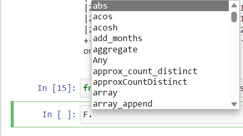


See [functions](https://spark.apache.org/docs/latest/api/python/reference/pyspark.sql/functions.html) for a list of
built-in functions.

Here’s an example of built-in function usage:

``` python
df \
    .withColumn('pickup_date', F.to_date(df.pickup_datetime)) \
    .withColumn('dropoff_date', F.to_date(df.dropoff_datetime)) \
    .select('pickup_date', 'dropoff_date', 'PULocationID', 'DOLocationID') \
    .show()
```

- `.withColumn()` is a transformation that adds a new column to the dataframe.
  - Adding a new column with the same name as a previously existing column will overwrite the existing column.
- `.select()` is another transformation that selects the stated columns.
- `F.to_date()` is a built-in Spark function that converts a timestamp to date format (year, month and day only, no hour
  and minute).
- `.show()` is an action.

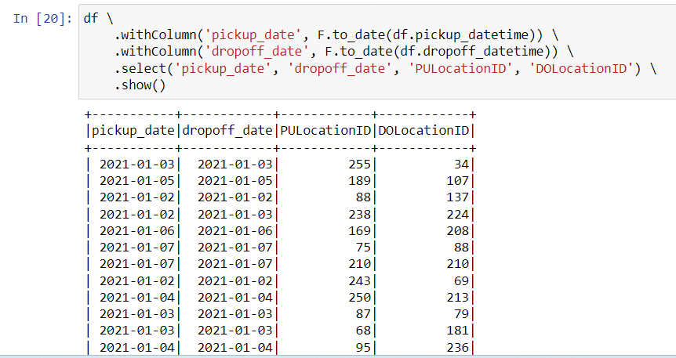

#### User defined functions (UDF)

> 9:23/14:09 (5.3.2) User defined functions

Besides these built-in functions, Spark allows us to create **User Defined Functions** (UDFs) with custom behavior for
those instances where creating SQL queries for that behaviour becomes difficult both to manage and test. In short, UDFs
are user-programmable routines that act on one row.

See [Scalar User Defined Functions (UDFs)](https://spark.apache.org/docs/latest/sql-ref-functions-udf-scalar.html) and
[functions.udf](https://spark.apache.org/docs/latest/api/python/reference/pyspark.sql/api/pyspark.sql.functions.udf.html#pyspark.sql.functions.udf)
for more information.

Here is an example using an UDF.

``` python
def crazy_stuff(base_num):
    num = int(base_num[1:])
    if num % 7 == 0:
        return f's/{num:03x}'
    elif num % 3 == 0:
        return f'a/{num:03x}'
    else:
        return f'e/{num:03x}'

crazy_stuff('B02884')  # Return 's/b44'

crazy_stuff_udf = F.udf(crazy_stuff, returnType=types.StringType())

df \
    .withColumn('pickup_date', F.to_date(df.pickup_datetime)) \
    .withColumn('dropoff_date', F.to_date(df.dropoff_datetime)) \
    .withColumn('base_id', crazy_stuff_udf(df.dispatching_base_num)) \
    .select('base_id', 'pickup_date', 'dropoff_date', 'PULocationID', 'DOLocationID') \
    .show(5)
```

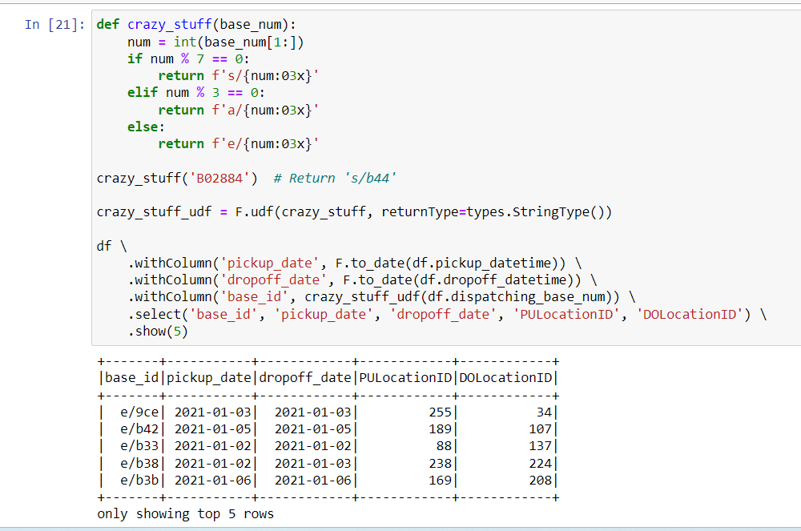

### 5.3.4 SQL with Spark

We will cover:

- Temporary tables
- Some simple queries from week 4

Spark can run SQL queries, which can come in handy if you already have a Spark cluster and setting up an additional tool
for sporadic use isn’t desirable.

Let’s now load all of the yellow and green taxi data for 2020 and 2021 to Spark dataframes.

#### Prepare the data

Edit and change the `URL_PREFIX` of the

Modify `code/download_data.sh` file like this.

**File `code/download_data.sh`**

``` bash
# Stop when counter any bugs
set -e

URL_PREFIX="https://github.com/DataTalksClub/nyc-tlc-data/releases/download"

for TAXI_TYPE in "yellow" "green"
do
    for YEAR in 2020 2021
    do
        for MONTH in {1..12}
        do

        if [ $YEAR == 2020 ] || [ $MONTH -lt 8 ]
        then
            FMONTH=`printf "%02d" ${MONTH}`

            URL="${URL_PREFIX}/${TAXI_TYPE}/${TAXI_TYPE}_tripdata_${YEAR}-${FMONTH}.csv.gz"

            LOCAL_PREFIX="data/raw/${TAXI_TYPE}/${YEAR}/${FMONTH}"
            LOCAL_FILE="${TAXI_TYPE}_tripdata_${YEAR}_${FMONTH}.csv.gz"
            LOCAL_PATH="${LOCAL_PREFIX}/${LOCAL_FILE}"

            echo "donwloading ${URL} to ${LOCAL_PATH}"
            mkdir -p ${LOCAL_PREFIX}
            wget ${URL} -O ${LOCAL_PATH}
        fi
        done
    done
done
```
Then run this script to grant the access

```bash
chmod +x download_data.sh
```

After that, run `./download_data.sh`.

In Jupyter, create a new note with **Python 3 (ipykernel)** and run the code below.

**File `05_taxi_schema.ipynb`**

``` python
import pyspark
from pyspark.sql import SparkSession

spark = SparkSession.builder \
    .master("local[*]") \
    .appName('test') \
    .getOrCreate()

import pandas as pd

from pyspark.sql import types

green_schema = types.StructType([
    types.StructField("VendorID", types.IntegerType(), True),
    types.StructField("lpep_pickup_datetime", types.TimestampType(), True),
    types.StructField("lpep_dropoff_datetime", types.TimestampType(), True),
    types.StructField("store_and_fwd_flag", types.StringType(), True),
    types.StructField("RatecodeID", types.IntegerType(), True),
    types.StructField("PULocationID", types.IntegerType(), True),
    types.StructField("DOLocationID", types.IntegerType(), True),
    types.StructField("passenger_count", types.IntegerType(), True),
    types.StructField("trip_distance", types.DoubleType(), True),
    types.StructField("fare_amount", types.DoubleType(), True),
    types.StructField("extra", types.DoubleType(), True),
    types.StructField("mta_tax", types.DoubleType(), True),
    types.StructField("tip_amount", types.DoubleType(), True),
    types.StructField("tolls_amount", types.DoubleType(), True),
    types.StructField("ehail_fee", types.DoubleType(), True),
    types.StructField("improvement_surcharge", types.DoubleType(), True),
    types.StructField("total_amount", types.DoubleType(), True),
    types.StructField("payment_type", types.IntegerType(), True),
    types.StructField("trip_type", types.IntegerType(), True),
    types.StructField("congestion_surcharge", types.DoubleType(), True)
])

yellow_schema = types.StructType([
    types.StructField("VendorID", types.IntegerType(), True),
    types.StructField("tpep_pickup_datetime", types.TimestampType(), True),
    types.StructField("tpep_dropoff_datetime", types.TimestampType(), True),
    types.StructField("passenger_count", types.IntegerType(), True),
    types.StructField("trip_distance", types.DoubleType(), True),
    types.StructField("RatecodeID", types.IntegerType(), True),
    types.StructField("store_and_fwd_flag", types.StringType(), True),
    types.StructField("PULocationID", types.IntegerType(), True),
    types.StructField("DOLocationID", types.IntegerType(), True),
    types.StructField("payment_type", types.IntegerType(), True),
    types.StructField("fare_amount", types.DoubleType(), True),
    types.StructField("extra", types.DoubleType(), True),
    types.StructField("mta_tax", types.DoubleType(), True),
    types.StructField("tip_amount", types.DoubleType(), True),
    types.StructField("tolls_amount", types.DoubleType(), True),
    types.StructField("improvement_surcharge", types.DoubleType(), True),
    types.StructField("total_amount", types.DoubleType(), True),
    types.StructField("congestion_surcharge", types.DoubleType(), True)
])

for taxi_type in ["yellow", "green"]:
    if taxi_type == "yellow":
        schema = yellow_schema
    else:
        schema = green_schema

    for year in [2020, 2021]:
        for month in range(1, 13):
            if year == 2020 or month < 8:
                print(f'processing data for {taxi_type}/{year}/{month}')

                input_path = f'data/raw/{taxi_type}/{year}/{month:02d}/'
                output_path = f'data/pq/{taxi_type}/{year}/{month:02d}/'

                df_green = spark.read \
                    .option("header", "true") \
                    .schema(schema) \
                    .csv(input_path)

                df_green \
                    .repartition(4) \
                    .write.parquet(output_path)
```

This code will take time to run.

#### Read parquet files with Spark

In Jupyter, create a new note with **Python 3 (ipykernel)** with this code (or simply open `06_spark.sql.ipynb`).

**File `06_spark_sql.ipynb`**

``` python
import pyspark
from pyspark.sql import SparkSession

spark = SparkSession.builder \
    .master("local[*]") \
    .appName('test') \
    .getOrCreate()

df_green = spark.read.parquet('data/pq/green/*/*')
df_yellow = spark.read.parquet('data/pq/yellow/*/*')
```

#### Combine two datasets into one

We will create `trips_data` which is the combination of files `df_green` and `df_yellow`.

``` python
# Rename some columns.
df_green = df_green \
    .withColumnRenamed('lpep_pickup_datetime', 'pickup_datetime') \
    .withColumnRenamed('lpep_dropoff_datetime', 'dropoff_datetime')
df_yellow = df_yellow \
    .withColumnRenamed('tpep_pickup_datetime', 'pickup_datetime') \
    .withColumnRenamed('tpep_dropoff_datetime', 'dropoff_datetime')

# Create the list of columns present in the two datasets
# while preserving the order of the columns of the green dataset.
common_colums = []
yellow_columns = set(df_yellow.columns)

for col in df_green.columns:
    if col in yellow_columns:
        common_colums.append(col)

# Create a column `service_type` indicating where the data comes from.
from pyspark.sql import functions as F

df_green_sel = df_green \
    .select(common_colums) \
    .withColumn('service_type', F.lit('green'))

df_yellow_sel = df_yellow \
    .select(common_colums) \
    .withColumn('service_type', F.lit('yellow'))

# Create a new DataFrame containing union of rows of green and yellow DataFrame.
df_trips_data = df_green_sel.unionAll(df_yellow_sel)
```

See
[DataFrame.unionAll](https://spark.apache.org/docs/latest/api/python/reference/pyspark.sql/api/pyspark.sql.DataFrame.unionAll.html)
for more information.

To check if the combination of the two files worked, run the following code

``` python
df_trips_data.groupBy('service_type').count().show()
```

We should see this.

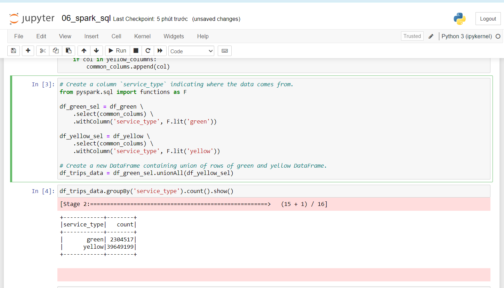

#### Querying this data with SQL

First, let’s get all column names as a list.

``` python
>>> df_trips_data.columns
['VendorID',
 'pickup_datetime',
 'dropoff_datetime',
 'store_and_fwd_flag',
 'RatecodeID',
 'PULocationID',
 'DOLocationID',
 'passenger_count',
 'trip_distance',
 'fare_amount',
 'extra',
 'mta_tax',
 'tip_amount',
 'tolls_amount',
 'improvement_surcharge',
 'total_amount',
 'payment_type',
 'congestion_surcharge',
 'service_type']
```

Write a query. We also need to create a local temporary view with the DataFrame. See
[DataFrame.createOrReplaceTempView](https://spark.apache.org/docs/3.1.3/api/python/reference/api/pyspark.sql.DataFrame.createOrReplaceTempView.html).

``` python
# df_trips_data.registerTempTable('trips_data') # Deprecated.
df_trips_data.createOrReplaceTempView("trips_data")

spark.sql("""
SELECT
    service_type,
    count(1)
FROM
    trips_data
GROUP BY
    service_type
""").show()
```

We should see this.

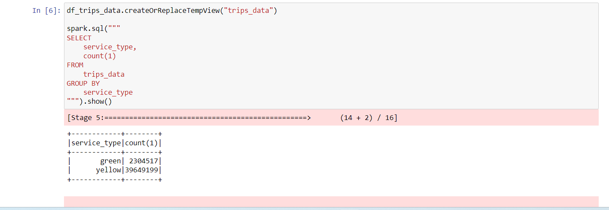

We can execute a more complicated query like this.

``` python
df_result = spark.sql("""
SELECT
    -- Reveneue grouping
    PULocationID AS revenue_zone,
    date_trunc('month', pickup_datetime) AS revenue_month,
    service_type,

    -- Revenue calculation
    SUM(fare_amount) AS revenue_monthly_fare,
    SUM(extra) AS revenue_monthly_extra,
    SUM(mta_tax) AS revenue_monthly_mta_tax,
    SUM(tip_amount) AS revenue_monthly_tip_amount,
    SUM(tolls_amount) AS revenue_monthly_tolls_amount,
    SUM(improvement_surcharge) AS revenue_monthly_improvement_surcharge,
    SUM(total_amount) AS revenue_monthly_total_amount,
    SUM(congestion_surcharge) AS revenue_monthly_congestion_surcharge,

    -- Additional calculations
    AVG(passenger_count) AS avg_montly_passenger_count,
    AVG(trip_distance) AS avg_montly_trip_distance
FROM
    trips_data
GROUP BY
    1, 2, 3
""")
```


