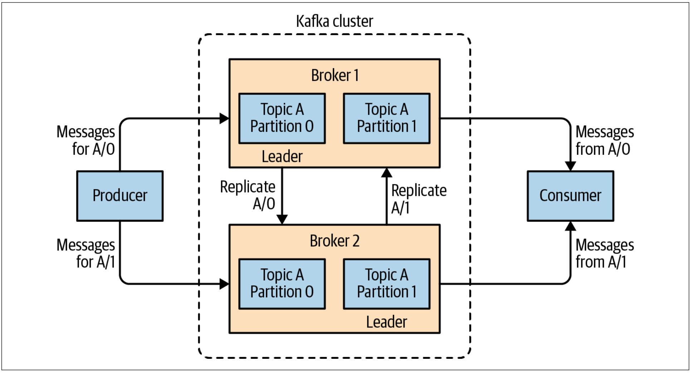
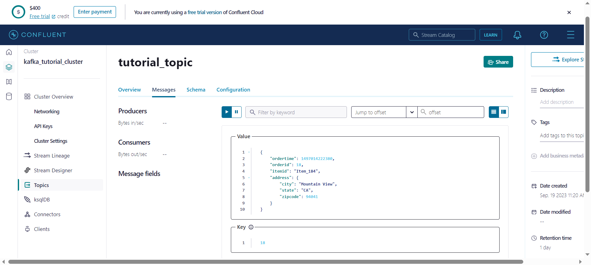

# Week 6: Stream Processing

## Materials

See [Week 6: Stream
Processing](https://github.com/DataTalksClub/data-engineering-zoomcamp/tree/main/week_6_stream_processing), particularly
this
[README](https://github.com/DataTalksClub/data-engineering-zoomcamp/blob/main/week_6_stream_processing/python/README.md)
on GitHub.

Youtube videos:

- [DE Zoomcamp 6.0.1 - Introduction](https://www.youtube.com/watch?v=hfvju3iOIP0)
- [DE Zoomcamp 6.0.2 - What is stream processing](https://www.youtube.com/watch?v=WxTxKGcfA-k)
- [DE Zoomcamp 6.3 - What is Kafka?](https://www.youtube.com/watch?v=zPLZUDPi4AY)
- [DE Zoomcamp 6.4 - Confluent cloud](https://www.youtube.com/watch?v=ZnEZFEYKppw)
- [DE Zoomcamp 6.5 - Kafka producer consumer](https://www.youtube.com/watch?v=aegTuyxX7Yg)
- [DE Zoomcamp 6.6 - Kafka configuration](https://www.youtube.com/watch?v=SXQtWyRpMKs)
- [DE Zoomcamp 6.7 - Kafka streams basics](https://www.youtube.com/watch?v=dUyA_63eRb0)
- [DE Zoomcamp 6.8 - Kafka stream join](https://www.youtube.com/watch?v=NcpKlujh34Y)
- [DE Zoomcamp 6.9 - Kafka stream testing](https://www.youtube.com/watch?v=TNx5rmLY8Pk)
- [DE Zoomcamp 6.10 - Kafka stream windowing](https://www.youtube.com/watch?v=r1OuLdwxbRc)
- [DE Zoomcamp 6.11 - Kafka ksqldb & Connect](https://www.youtube.com/watch?v=DziQ4a4tn9Y)
- [DE Zoomcamp 6.12 - Kafka Schema registry](https://www.youtube.com/watch?v=tBY_hBuyzwI)

## Notice

My notes below follow the sequence of the videos and topics presented in them.

## 6.0.1 Introduction to Stream Processing

We will cover in week 6 :

- What is stream processing?
- What is Kafka
- Stream processing message properties
- Kafka setup and configuration
- Time spanning in stream processing
- Kafka producer and Kafka consumer
- Partitions
- How to work with Kafka streams
- Schema and its role in flow processing
- Kafka Connect
- ksqlDB

## 6.0.2 What is stream processing?

**Stream processing** is a data management technique that involves ingesting a continuous data stream to quickly
analyze, filter, transform or enhance the data in real time.

I recommend reading [Introduction to streaming for data
scientists](https://huyenchip.com/2022/08/03/stream-processing-for-data-scientists.html) by Chip Huyen.

### Data exchange

Data exchange allows data to be shared between different computer programs.

### Producer and consumers

More generally, a producer can create messages that consumers can read. The consumers may be interested in certain topics. The producer indicates the topic of his messages. The consumer can subscribe to the topics of his choice.

### Data exchange in stream processing

When the producer posts a message on a particular topic, consumers who have subscribed to that topic receive the message
in real time.

Real time does not mean immediately, but rather a few seconds late, or more generally much faster than batch processing.

## 6.3 What is Kafka?


[Apache Kafka](https://kafka.apache.org/Kafka) Apache Kafka is an open-source distributed event streaming platform for
high-performance data pipelines, streaming analytics, data integration, and mission-critical applications. Kafka
provides a high-throughput and low-latency platform for handling real-time data feeds.

Kafka runs as a cluster in one or more servers. The Kafka cluster stores streams of records in categories called topics.
Each record has a key, value, and a timestamp.

It was originally developed at LinkedIn and was subsequently open-sourced under the Apache Software Foundation in 2011.
It’s widely used for high-performance use cases like streaming analytics and data integration.

See [org.apache.kafka](https://javadoc.io/doc/org.apache.kafka) Javadocs.

### Kafka

In this section, you will find my personal notes that I had taken before this course.

These notes come from:

- Effective Kafka, by Emil Koutanov
- Kafka: The Definitive Guide, 2nd Edition, by Gwen Shapira, Todd Palino, Rajini Sivaram, Krit Petty
- [Kafka: A map of traps for the enlightened dev and op](https://www.youtube.com/watch?v=paVdXL5vDzg&t=1s) by Emmanuel
  Bernard And Clement Escoffier on Youtube.

#### Overview

Kafka is a distributed system comprising several key components. These are four main parts in a Kafka system:

- **Broker**: Handles all requests from clients (produce, consume, and metadata) and keeps data replicated within the
  cluster. There can be one or more brokers in a cluster.
- **Zookeeper** (now **KRaft**): Keeps the state of the cluster (brokers, topics, users).
- **Producer**: Sends records to a broker.
- **Consumer**: Consumes batches of records from the broker.

A **record** is the most elemental unit of persistence in Kafka. In the context of event-driven architecture, a record
typically corresponds to some event of interest. It is characterised by the following attributes:

- **Key**: A record can be associated with an optional non-unique key, which acts as a king of classifier, grouping
  relatied records on the basis of their key.
- **Value**: A value is effectively the informational payload of a record.
- **Headers**: A set of free-form key-value pairs that can optionally annotate a record.
- **Partition number**: A zero-based index of the partition that the record appears in. A record must always be tied to
  exactly one partition.
- **Offset**: A 64-bit signed integer for locating a record within its encompassing partition.
- **Timestamp**: A millisecond-precise timestamp of the record.

A **partition** is a totally ordered, unbounded set of records. Published records are appended to the head-end of the
encompassing partition. Where a record can be seen as an elemental unit of persistence, a partition is an elemental unit
of record streaming. In the absence of producer synchronisation, causal order can only be achieved when a single
producer emits records to the same partition.

A **topic** is a logical aggregation of partitions. It comprises one or more partitions, and a partition must be a part
of exactly one topic. Earlier, it was said that partitions exhibit total order. Taking a set-theoretic perspective, a
topic is just a union of the individual underlying sets; since partitions within a topic are mutually independent, the
topic is said to exhibit partial order. In simple terms, this means that certain records may be ordered in relation to
one another, while being unordered with respect to certain other records.

A **cluster** hosts multiple topics, each having an assigned leader and zero or more follower replicas.


#### Main Concepts

See [Streams Concepts](https://docs.confluent.io/platform/current/streams/concepts.html#streams-concepts).

- **Publish/subscribe messaging** is a pattern that is characterized by the sender (publisher) of a piece of data
  (message) not specifically directing it to a receiver.
- These systems often have a **broker**, a central point where messages are published, to facilitate this pattern.
- The unit of data within Kafka is called a **message**.
- A message can have an optional piece of metadata, which is referred to as a **key**.
- While messages are opaque byte arrays to Kafka itself, it is recommended that additional structure, or **schema**, be
  imposed on the message content so that it can be easily understood.
- Messages in Kafka are categorized into **topics**. The closest analogies for a topic are a database table or a folder
  in a filesystem.
- Topics are additionally broken down into a number of **partitions**.
- A **stream** is considered to be a single topic of data, regardless of the number of partitions, moving from the
  producers to the consumers.
- **Producers** create new messages. In other publish/subscribe systems, these may be called **publishers** or
  **writers**.
- **Consumers** read messages. In other publish/subscribe systems, these clients may be called **subscribers** or
  **readers**.
- The consumer keeps track of which messages it has already consumed by keeping track of the **offset** of messages. The
  **offset**, an integer value that continually increases, is another piece of metadata that Kafka adds to each message
  as it is produced.
- Consumers work as part of a **consumer group**, which is one or more consumers that work together to consume a topic.
- A single Kafka server is called a **broker**. The broker receives messages from producers, assigns offsets to them,
  and writes the messages to storage on disk.
- Kafka brokers are designed to operate as part of a **cluster**.
- Within a **cluster of brokers**, one broker will also function as the cluster **controller** (elected automatically
  from the live members of the cluster).
- A partition is owned by a single broker in the cluster, and that broker is called the **leader** of the partition
- A replicated partition is assigned to additional brokers, called **followers** of the partition.

**Replication of partitions in a cluster**



#### Kafka is simple…​

**Kafka is simple**


This picture comes from [Kafka: A map of traps for the enlightened dev and
op](https://www.youtube.com/watch?v=paVdXL5vDzg&t=1s) by Emmanuel Bernard And Clement Escoffier on Youtube.

#### Installation

We can install Kafka locally.

If you have already installed Homebrew for macOS, you can use it to install Kafka in one step. This will ensure that you
have Java installed first, and it will then install Apache Kafka 2.8.0 (as of the time of writing).

``` bash
$ brew install kafka
```

Homebrew will install Kafka under `/opt/homebrew/Cellar/kafka/`.

But, in this course, we use [Confluent Cloud](https://www.confluent.io/confluent-cloud/). Confluent cloud provides a
free 30 days trial for, you can signup [here](https://www.confluent.io/confluent-cloud/tryfree/).

### Topic

Topic is a container stream of events. An event is a single data point in timestamp.

Multiple producers are able to publish to a topic, picking a partition at will. The partition may be selected directly —
by specifying a partition number, or indirectly — by way of a record key, which deterministically hashes to a partition
number.

Each topic can have one or many consumers which subscribe to the data written to the topic.

### Partition

A Kafka Topic is grouped into several partitions for scalability. Each partition is an sequence of records that are
continually added to a structured commit log. A sequential ID number called the offset is assigned to each record in the
partition.

### Logs

Kafka logs are a collection of various data segments present on your disk, having a name as that of a form-topic
partition or any specific topic-partition. Each Kafka log provides a logical representation of a unique topic-based
partitioning.

Logs are how data is actually stored in a topic.

### Event

Each event contains a number of messages. A message has properties.

### Message

The basic communication abstraction used by producers and consumers in order to share information in Kafka is called a
**message**.

Messages have 3 main components:

- **Key**: used to identify the message and for additional Kafka stuff such as partitions (covered later).
- **Value**: the actual information that producers push and consumers are interested in.
- **Timestamp**: used for logging.

### Why Kafka?

**Kafka brings robustness**: For example, when a server goes down, we can still access the data. Apache Kafka achieves a
certain level of resiliency through replication, both across machines in a cluster and across multiple clusters in
multiple data centers.

**Kafka offers a lot of flexibility**: The data exchange application can be small or very large. Kafka can be connected
to multiple databases with Kafka connect

**Kafka provides scalability**: Kafka has no problem handling a number of events that increases dramatically in a short time.

### Availability of messages

When a consumer reads a message, that message is not lost and is still available to other consumers. There is some kind of expiration date for messages.

### Need of stream processing

Before, we often had monolithic applications. Now, we can have several microservices talking to each other. Kafka helps
simplify data exchange between these microservices

See also [What is Apache Kafka](https://kafka.apache.org/intro) for more.

## 6.4 Confluent cloud

### Create a free account

Go to <https://confluent.cloud/signup> and create a free account. You do not need to enter your credit card number.

### Confluent Cloud Interface

The first page you should see is this:


Click on **Add Cluster** to create a cluster.

Click on **Begin configuration** button from the Free Basic option.

Select a **Region** near you (ideally offering low carbon intensity) and click on **Continue** button.


In my case, i choose the same setting as My GCS , `Singapore (asia-southeast1)` and `Single zone`

You do not need to enter your credit card number. So, we can click on **Skip payment** button.

In **Create cluster** form, enter the **Cluster name** `kafka_tutorial_cluster` and click on **Lauch cluster** button.


### Explore interface

After that you should see this:


Explore the different interfaces : Dashboard, Networking, API Keys, etc.

### API Keys

An API key consists of a key and a secret. Kafka API keys are required to interact with Kafka clusters in Confluent
Cloud. Each Kafka API key is valid for a specific Kafka cluster.

Click on **API Keys** and on **Create key** button.

Select **Global access** and click on **Next** button.

Enter the following description: `kafka_cluster_tutorial_api_key`.


### Create a topic

A Topic is a category/feed name to which records are stored and published. All Kafka records are organized into topics.
Producer applications write data to topics and consumer applications read from topics. Records published to the cluster
stay in the cluster until a configurable retention period has passed by.

Select **Topics** in the left menu, and click on **Create topic** button.

In the **New topic form**, enter :

- **Topic name** : tutorial_topic
- **Partitions** : 2
- Click on **Show advanced settings**
- **Retention time**: 1 day


Click on **Save & create** button.

We should see this:


### Produce a new message

Now, we can produce some new messages.

Select the **Messages** tab, click on **+ Produce a new message to this topic**.



Click on **Produce** button.

The message produced has a **Value**, an empty **Header** and a **Key**.

I notice that we do not see certain fields of the message such as the partition, offset, timestamp.

### Create a connector

Confluent Cloud offers pre-built, fully managed Kafka connectors that make it easy to instantly connect your clusters to
popular data sources and sinks. Connect to external data systems effortlessly with simple configuration and no ongoing
operational burden.

Select **Connectors** in the left menu, and click on **Datagen Source**.

Select **tutorial_topic**.


Click on **Continue** button.

Select **Global access** and click on **Continue** button.

Under **Select output record value format**, select **JSON**. Under **Select a template**, select **Orders**. Click on
**Continue** button.

The instructor says that the **Connector sizing** is fine. Click on **Continue** button.

Change the **Connector name** for `OrdersConnector_tutorial`


Click on **Continue** button.

We should see this.


The connector is being provisioned. This may take 2 or 3 minutes.

Click on the **OrderConnector_tutorial** connector. You should see that the connector is active.


Now that the connector is up and running, let’s navigate back to the topics view to inspect the incoming message.

Click on **Explore metrics** button. We should see some thing like this. Take the time to explore and learn the
available metrics.


### Return to the topic

Select the **tutorial_topic** that we just configured the connector to produce to, to view more details.

Under **Overview** tab, we see the production rate and consumption rate as bytes per second.

Under **Messages** tab, we see that a number of messages have been created.

<table>
<tr><td>

</td><td>

</td></tr>
</table>

### Shut down the connector

Select **Connectors** in the left menu, select our connector **OrdersConnector_tutorial**, and click on **Pause**
button.

We always have to stop processes at the end of a work session so we don’t burn our \$400 free credit dollars.

See also [Confluent Cloud](https://docs.confluent.io/cloud/current/overview.html) and [Confluent
Documentation](https://docs.confluent.io/home/overview.html).

## 6.5 Kafka producer consumer

### What we will cover

We will cover :

- Produce some messages programmaticaly
- Consume some data programmaticaly

We will use Java for this. If we want to use Python, there’s a Docker image to help us.


## 6.6 Streaming with python locally

### 6.6.1 Setup environment

We will install Kafka and Spark via Docker.

Open your Docker Desktop, if you don't have it, download it  [here](https://desktop.docker.com/win/main/amd64/Docker%20Desktop%20Installer.exe?utm_source=docker&utm_medium=webreferral&utm_campaign=dd-smartbutton&utm_location=module&_gl=1*afadrk*_ga*MTgwMjMyMjU4Ni4xNjkwMDM0NTg4*_ga_XJWPQMJYHQ*MTY5NTU3NzMyMC4yMC4xLjE2OTU1NzczMjMuNTcuMC4w).

#### 6.6.1.1 Create volume and network

Before we build and run Spark images, we need to create a network and volume to connect Spark and Kafka. You can read more [here](https://medium.com/m/global-identity-2?redirectUrl=https%3A%2F%2Faws.plainenglish.io%2Fultimate-guide-to-docker-volumes-and-networks-sharing-files-and-data-between-containers-eb7600fe0f6c#:~:text=Docker%2DVolume%20is%20a%20feature,stored%20inside%20the%20container%20itself.).

So here is two concepts you need to remember:

1. `Network`: basically a pathway that allows Docker containers to communicate with each other and with external networks. It's like a highway connecting different towns, where the towns are Docker containers and the highway is Docker network. For instance, if you have an application running in one Docker container and a database server running in another, they might communicate with each other through a Docker network.

2. `Volume` :serves the purpose of persisting data generated by and used by Docker containers. In simple terms, volume is like a USB stick for a Docker container. Whatever data you save to a volume will remain there, unaffected by the lifecycle of the container. For example, if you want to store customer data entered into a web application running in a Docker container, you would likely save it to a Docker volume. That way, even if the web application container is stopped and removed, the customer data still exist on the Docker volume and can be attached to a new container later

To do this, open your terminal and run

```bash
# Create Network
docker network  create kafka-spark-network

# Create Volume
docker volume create --name=hadoop-distributed-file-system
```

#### 6.6.1.2 Create Spark container

To install and run Spark via Docker, change to dir `local/docker/spark`, there are several Dockerfile here, let's take a look of each files

**File `cluster-base.Dockerfile`**

```python
# Reference from offical Apache Spark repository Dockerfile for Kubernetes
# https://github.com/apache/spark/blob/master/resource-managers/kubernetes/docker/src/main/dockerfiles/spark/Dockerfile

# Define an argument for the Java image tag, defaulting to "17-jre"
ARG java_image_tag=17-jre

# Use the specified Java image tag as the base image
FROM eclipse-temurin:${java_image_tag}

# -- Layer: OS + Python

# Define an argument for the shared workspace directory, defaulting to "/opt/workspace"
ARG shared_workspace=/opt/workspace

# Create the specified shared workspace directory and perform several commands in a single RUN instruction
RUN mkdir -p ${shared_workspace} && \
    apt-get update -y && \
    apt-get install -y python3 && \
    ln -s /usr/bin/python3 /usr/bin/python && \
    rm -rf /var/lib/apt/lists/*

# Set an environment variable SHARED_WORKSPACE to the value of the shared workspace directory
ENV SHARED_WORKSPACE=${shared_workspace}

# -- Runtime

# Create a volume from the shared workspace directory
VOLUME ${shared_workspace}

# Define the default command to run when a container is started, in this case, it opens a bash shell
CMD ["bash"]
```

This Dockerfile essentially does the following:

1. Sets an argument `java_image_tag` with a default value of `17-jre`` to specify the Java image tag to be used.

2. Uses the specified Java image (e.g., `eclipse-temurin:17-jre`) as the base image for the Docker container.

3. Defines another argument shared_workspace with a default value of `/opt/workspace` to specify the shared workspace directory.

4. Creates the specified shared workspace directory and performs a series of commands in a single RUN instruction. These commands include updating the package lists, installing Python 3, creating a symbolic link from `/usr/bin/python` to `/usr/bin/python3`, and cleaning up package lists to reduce image size.

5. Sets an environment variable `SHARED_WORKSPACE` to the value of the shared workspace directory.

6. Creates a Docker volume from the shared workspace directory, allowing data to be shared between the host and the container.

7. Defines the default command to run when a container is started, which is to open a bash shell inside the container for interactive use.

************************************

**File `jupyterlab.Dockerfile`**

```python
# Use the "cluster-base" image as the base image
FROM cluster-base

# -- Layer: JupyterLab

# Define arguments for Spark and JupyterLab versions, with default values
ARG spark_version=3.3.1
ARG jupyterlab_version=3.6.1

# Update package lists and install Python 3 pip, then install specific versions of PySpark and JupyterLab
RUN apt-get update -y && \
    apt-get install -y python3-pip && \
    pip3 install wget pyspark==${spark_version} jupyterlab==${jupyterlab_version}

# -- Runtime

# Expose port 8888 for JupyterLab
EXPOSE 8888

# Set the working directory to the shared workspace defined in the base image
WORKDIR ${SHARED_WORKSPACE}

# Define the default command to run when a container is started, which starts Jupyter Lab
CMD jupyter lab --ip=0.0.0.0 --port=8888 --no-browser --allow-root --NotebookApp.token=
```

This Dockerfile extends the previous Dockerfile (referred to as `cluster-base`) and adds the following functionality:

1. It uses the `cluster-base` image as the base image, which likely contains configurations and dependencies needed for Apache Spark and other components.

2. It defines two arguments, `spark_version` and `jupyterlab_version`, with default values. These arguments allow you to specify the versions of `PySpark` and `JupyterLab` to be installed.

3. Inside a `RUN` instruction, it updates the package lists, installs `Python 3` pip, and then uses pip to install specific versions of `PySpark` and `JupyterLab` based on the values of the previously defined arguments.

4. It exposes port 8888 using the EXPOSE instruction, indicating that the container will listen on port 8888.

5. It sets the working directory (WORKDIR) to the shared workspace directory, which was defined in the base image.

6. Finally, it defines the default command to run when a container is started. This command starts Jupyter Lab, configuring it to listen on all network interfaces (`--ip=0.0.0.0`) on port 8888 (`--port=8888`), without opening a web browser (`--no-browser`), allowing root access (`--allow-root`), and without requiring a token for authentication (`--NotebookApp.token=`). This allows you to access Jupyter Lab from your host machine's web browser.

************************************

**File `spark-base.Dockerfile`**

```python
# Use the "cluster-base" image as the base image
FROM cluster-base

# -- Layer: Apache Spark

# Define arguments for Spark and Hadoop versions, with default values
ARG spark_version=3.3.1
ARG hadoop_version=3

# Update package lists, install curl, download and extract Apache Spark, move it to /usr/bin/,
# create a logs directory, and then remove the downloaded archive
RUN apt-get update -y && \
    apt-get install -y curl && \
    curl https://archive.apache.org/dist/spark/spark-${spark_version}/spark-${spark_version}-bin-hadoop${hadoop_version}.tgz -o spark.tgz && \
    tar -xf spark.tgz && \
    mv spark-${spark_version}-bin-hadoop${hadoop_version} /usr/bin/ && \
    mkdir /usr/bin/spark-${spark_version}-bin-hadoop${hadoop_version}/logs && \
    rm spark.tgz

# Set environment variables for Spark, including SPARK_HOME, SPARK_MASTER_HOST, SPARK_MASTER_PORT, and PYSPARK_PYTHON
ENV SPARK_HOME /usr/bin/spark-${spark_version}-bin-hadoop${hadoop_version}
ENV SPARK_MASTER_HOST spark-master
ENV SPARK_MASTER_PORT 7077
ENV PYSPARK_PYTHON python3

# -- Runtime

# Set the working directory to the Spark home directory
WORKDIR ${SPARK_HOME}
```

This Dockerfile does the following:

1. It uses the `cluster-base` image as the base image.

2. It defines two arguments, `spark_version` and `hadoop_version`, with default values. These arguments allow you to specify the versions of Apache Spark and Hadoop to be installed.

3. Inside a RUN instruction, it performs several tasks:

 - Updates package lists using apt-get.
 - Installs the curl package, which is a command-line tool for transferring data.
 - Downloads the Apache Spark distribution for the specified versions using curl and saves it as spark.tgz.
 - Extracts the contents of spark.tgz.
 - Moves the extracted Spark directory to /usr/bin/.
 - Creates a logs directory inside the Spark directory.
 - Removes the downloaded spark.tgz archive to save space.

4. It sets several environment variables related to Spark, including SPARK_HOME, SPARK_MASTER_HOST, SPARK_MASTER_PORT, and PYSPARK_PYTHON.

6. Finally, it sets the working directory (WORKDIR) to the Spark home directory, which is where Spark will be located within the container.

************************************

**File `spark-master.Dockerfile`**

```python
# Use the "spark-base" image as the base image
FROM spark-base

# -- Runtime

# Define an argument for the Spark Master web UI port, with a default value of 8080
ARG spark_master_web_ui=8080

# Expose the ports specified by the Spark Master web UI port and SPARK_MASTER_PORT environment variable
EXPOSE ${spark_master_web_ui} ${SPARK_MASTER_PORT}

# Define the default command to run when a container is started, which starts the Spark Master
CMD bin/spark-class org.apache.spark.deploy.master.Master >> logs/spark-master.out
```

This Dockerfile does the following:

1. It uses the `spark-base` image as the base image.

2. Inside the `Runtime` section:

 - It defines an argument spark_master_web_ui for specifying the port of the Spark Master web UI, with a default value of `8080`.

 - It uses the `EXPOSE` instruction to expose two ports:

   - `${spark_master_web_ui}`: This is the port specified by the spark_master_web_ui argument, which is the port for the Spark Master web UI.
  
   - `${SPARK_MASTER_PORT}`: This is a dynamic port specified by the SPARK_MASTER_PORT environment variable. The actual port number will be determined at runtime.

 - It defines the default command to run when a container is started. This command starts the Spark Master using the spark-class script and directs the output to a log file (`logs/spark-master.out`). This command essentially starts the Spark Master and captures its logs.

************************************

**File `spark-worker.Dockerfile`**

```python
# Use the "spark-base" image as the base image
FROM spark-base

# -- Runtime

# Define an argument for the Spark Worker web UI port, with a default value of 8081
ARG spark_worker_web_ui=8081

# Expose the port specified by the Spark Worker web UI port
EXPOSE ${spark_worker_web_ui}

# Define the default command to run when a container is started, which starts the Spark Worker
CMD bin/spark-class org.apache.spark.deploy.worker.Worker spark://${SPARK_MASTER_HOST}:${SPARK_MASTER_PORT} >> logs/spark-worker.out
```

This Dockerfile does the following:

1. It uses the `spark-base` image as the base image.

2. Inside the `Runtime` section:

  - It defines an argument `spark_worker_web_ui` for specifying the port of the Spark Worker web UI, with a default value of 8081.

  - It uses the `EXPOSE` instruction to expose the port specified by the spark_worker_web_ui argument. This indicates that the Spark Worker web UI port should be made accessible from outside the container.

3. It defines the default command to run when a container is started. This command starts the Spark Worker using the spark-class script and specifies the Spark Master's address using the `${SPARK_MASTER_HOST}` and `${SPARK_MASTER_PORT}` environment variables. The output of the Spark Worker is redirected to a log file (`logs/spark-worker.out`) for monitoring and troubleshooting purposes.

************************************

In our now working dir `local/docker/spark` we run the script below to build all the necessary images of Spark.

```bash
./build.sh
```

After that, we need to run file `docker-compose.yml` in spark folder to configure the container

**File `docker-compose.yml`**

```python
version: "3.6"
volumes:
  shared-workspace:
    name: "hadoop-distributed-file-system"
    driver: local
networks:
  default:
    name: kafka-spark-network
    external: true

services:
  jupyterlab:
    image: jupyterlab
    container_name: jupyterlab
    ports:
      - 8888:8888
    volumes:
      - shared-workspace:/opt/workspace
  spark-master:
    image: spark-master
    container_name: spark-master
    environment:
      SPARK_LOCAL_IP: 'spark-master'
    ports:
      - 8080:8080
      - 7077:7077
    volumes:
      - shared-workspace:/opt/workspace
  spark-worker-1:
    image: spark-worker
    container_name: spark-worker-1
    environment:
      - SPARK_WORKER_CORES=1
      - SPARK_WORKER_MEMORY=4g
    ports:
      - 8083:8081
    volumes:
      - shared-workspace:/opt/workspace
    depends_on:
      - spark-master
  spark-worker-2:
    image: spark-worker
    container_name: spark-worker-2
    environment:
      - SPARK_WORKER_CORES=1
      - SPARK_WORKER_MEMORY=4g
    ports:
      - 8084:8081
    volumes:
      - shared-workspace:/opt/workspace
    depends_on:
      - spark-master
```

And then run

```bash
docker compose up -d
```

#### 6.6.1.3 Create Kafka container

To install and run Kafka via Docker, change to dir `local/docker/kafka`, take a look at the docker-compose file

**File `docker-compose.yml`**

```python
version: '3.6'
networks:
  default:
    name: kafka-spark-network
    external: true
services:
  broker:
    image: confluentinc/cp-kafka:7.2.0
    hostname: broker
    container_name: broker
    depends_on:
      - zookeeper
    ports:
      - '9092:9092'
    environment:
      KAFKA_BROKER_ID: 1
      KAFKA_ZOOKEEPER_CONNECT: 'zookeeper:2181'
      KAFKA_LISTENER_SECURITY_PROTOCOL_MAP: PLAINTEXT:PLAINTEXT,PLAINTEXT_HOST:PLAINTEXT
      KAFKA_LISTENERS: PLAINTEXT://broker:29092,PLAINTEXT_HOST://broker:9092
      KAFKA_ADVERTISED_LISTENERS: PLAINTEXT://broker:29092,PLAINTEXT_HOST://localhost:9092
      KAFKA_INTER_BROKER_LISTENER_NAME: PLAINTEXT
      KAFKA_OFFSETS_TOPIC_REPLICATION_FACTOR: 1
      KAFKA_GROUP_INITIAL_REBALANCE_DELAY_MS: 0
      KAFKA_TRANSACTION_STATE_LOG_MIN_ISR: 1
      KAFKA_TRANSACTION_STATE_LOG_REPLICATION_FACTOR: 1
  schema-registry:
    image: confluentinc/cp-schema-registry:7.2.0
    hostname: schema-registry
    container_name: schema-registry
    depends_on:
      - zookeeper
      - broker
    ports:
      - "8081:8081"
    environment:
      # SCHEMA_REGISTRY_KAFKASTORE_CONNECTION_URL: "zookeeper:2181" #(depreciated)
      SCHEMA_REGISTRY_KAFKASTORE_BOOTSTRAP_SERVERS: "broker:29092"
      SCHEMA_REGISTRY_HOST_NAME: "localhost"
      SCHEMA_REGISTRY_LISTENERS: "http://0.0.0.0:8081" #(default: http://0.0.0.0:8081)
  zookeeper:
    image: confluentinc/cp-zookeeper:7.2.0
    hostname: zookeeper
    container_name: zookeeper
    ports:
      - '2181:2181'
    environment:
      ZOOKEEPER_CLIENT_PORT: 2181
      ZOOKEEPER_TICK_TIME: 2000
  control-center:
    image: confluentinc/cp-enterprise-control-center:7.2.0
    hostname: control-center
    container_name: control-center
    depends_on:
      - zookeeper
      - broker
      - schema-registry
    ports:
      - "9021:9021"
    environment:
      CONTROL_CENTER_BOOTSTRAP_SERVERS: 'broker:29092'
      CONTROL_CENTER_ZOOKEEPER_CONNECT: 'zookeeper:2181'
      CONTROL_CENTER_SCHEMA_REGISTRY_URL: "http://localhost:8081"
      CONTROL_nmhhhhhhCENTER_REPLICATION_FACTOR: 1
      CONTROL_CENTER_INTERNAL_TOPICS_PARTITIONS: 1
      CONTROL_CENTER_MONITORING_INTERCEPTOR_TOPIC_PARTITIONS: 1
      CONFLUENT_METRICS_TOPIC_REPLICATION: 1
      PORT: 9021

  kafka-rest:
    image: confluentinc/cp-kafka-rest:7.2.0
    hostname: kafka-rest
    ports:
      - "8082:8082"
    depends_on:
      - schema-registry
      - broker
    environment:
      KAFKA_REST_BOOTSTRAP_SERVERS: 'broker:29092'
      KAFKA_REST_ZOOKEEPER_CONNECT: 'zookeeper:2181'
      KAFKA_REST_SCHEMA_REGISTRY_URL: 'http://localhost:8081'
      KAFKA_REST_HOST_NAME: localhost
      KAFKA_REST_LISTENERS: 'http://0.0.0.0:8082'
```

And then run

```bash
docker compose up -d
```

**Note**: You can run the `docker-compose.yml` in the directory `local/docker/` to run the container that include Spark and Kafka, instead of running individually `docker-compose.yml` on `kafka` and `spark` folder.
Remember before you run this, run the script `./build.sh` on `local/docker/spark` to build the image

### 6.6.2 Setup utils and setting file

#### 6.6.2.1 Create utils file

Before pushing data as a CSV file into Kafka, we need to transform the data format into a dictionary for each row. Here, I'm using a technique to create a class called `Ride` to represent our data. This class will take a list as input, where each list represents a row in the CSV file, and convert them into a data structure like a dictionary.

You can find more details in the following file.

**File `ride.py`**

```python
from typing import List, Dict
from decimal import Decimal
from datetime import datetime

# Define the Ride class
class Ride:
    # Initialize a Ride object from a list of input values
    def __init__(self, arr: List[str]):
        self.vendor_id = int(arr[0])  # Vendor ID
        self.tpep_pickup_datetime = datetime.strptime(arr[1], "%Y-%m-%d %H:%M:%S")  # Pickup datetime
        self.tpep_dropoff_datetime = datetime.strptime(arr[2], "%Y-%m-%d %H:%M:%S")  # Dropoff datetime
        self.passenger_count = int(arr[3])  # Passenger count
        self.trip_distance = Decimal(arr[4])  # Trip distance
        self.rate_code_id = int(arr[5])  # Rate code ID
        self.store_and_fwd_flag = arr[6]  # Store and forward flag
        self.pu_location_id = int(arr[7])  # Pickup location ID
        self.do_location_id = int(arr[8])  # Dropoff location ID
        self.payment_type = arr[9]  # Payment type
        self.fare_amount = Decimal(arr[10])  # Fare amount
        self.extra = Decimal(arr[11])  # Extra charges
        self.mta_tax = Decimal(arr[12])  # MTA tax
        self.tip_amount = Decimal(arr[13])  # Tip amount
        self.tolls_amount = Decimal(arr[14])  # Tolls amount
        self.improvement_surcharge = Decimal(arr[15])  # Improvement surcharge
        self.total_amount = Decimal(arr[16])  # Total amount
        self.congestion_surcharge = Decimal(arr[17])  # Congestion surcharge

    # Class method to create a Ride object from a dictionary
    @classmethod
    def from_dict(cls, d: Dict):
        return cls(arr=[
            d['vendor_id'],
            d['tpep_pickup_datetime'],
            d['tpep_dropoff_datetime'],
            d['passenger_count'],
            d['trip_distance'],
            d['rate_code_id'],
            d['store_and_fwd_flag'],
            d['pu_location_id'],
            d['do_location_id'],
            d['payment_type'],
            d['fare_amount'],
            d['extra'],
            d['mta_tax'],
            d['tip_amount'],
            d['tolls_amount'],
            d['improvement_surcharge'],
            d['total_amount'],
            d['congestion_surcharge'],
        ])
        
    # Method to represent the object as a string
    def __repr__(self):
        return f'{self.__class__.__name__}: {self.__dict__}'

# Function ride_to_dict to convert a Ride object to a dictionary
def ride_to_dict(ride: Ride, ctx):
    return ride.__dict__
```

I design a `utils.py` file to handle reading a CSV file, processing its data, and converting it into a list of `Ride` objects.

**File `utils.py`**

```python
import csv
from typing import List
from ride import Ride  
import os

# Define the path to the CSV file
CURRENT_FILE_PATH = os.getcwd()
INPUT_DATA_PATH = os.path.join(CURRENT_FILE_PATH, 'resources', 'data', 'rides.csv')

# Function to read and parse ride data from a CSV file
def read_rides(resource_path: str = INPUT_DATA_PATH) -> List[Ride]:
    rides = []  # Create an empty list to store Ride objects
    with open(resource_path, 'r') as f:
        reader = csv.reader(f)  # Create a CSV reader for the file
        header = next(reader)  # Skip the header row (assuming it contains column names)
        for row in reader:  # Iterate over each row in the CSV file
            rides.append(Ride(arr=row))  # Create a Ride object from the row and add it to the list
    return rides  # Return the list of Ride objects
```

#### 6.6.2.2 Create setting file

After we have prepared the data, we configure the parameters for the Kafka Producer and Consumer, specifically in the following code file.

**File `setting.py`**

```python
import json
from ride import Ride

# Kafka server configuration
BOOTSTRAP_SERVERS = ['localhost:9092']

# Kafka topic for sending and receiving JSON data
TOPIC = 'rides_json'

# Configuration for Kafka producer
PRODUCER_CONFIG = {
    'bootstrap_servers': BOOTSTRAP_SERVERS,
    'key_serializer': lambda key: str(key).encode(),
    'value_serializer': lambda value: json.dumps(value.__dict__, default=str).encode('utf-8')
}

# Configuration for Kafka consumer
CONSUMER_CONFIG = {
    'bootstrap_servers': BOOTSTRAP_SERVERS,
    'auto_offset_reset': 'earliest',
    'enable_auto_commit': True,
    'key_deserializer': lambda key: int(key.decode('utf-8')),
    'value_deserializer': lambda value: json.loads(value.decode('utf-8'), object_hook=lambda d: Ride.from_dict(d)),
    'group_id': 'simple.kafka.json.example',
}
```

### 6.6.3 Setup Producer and Consumer


